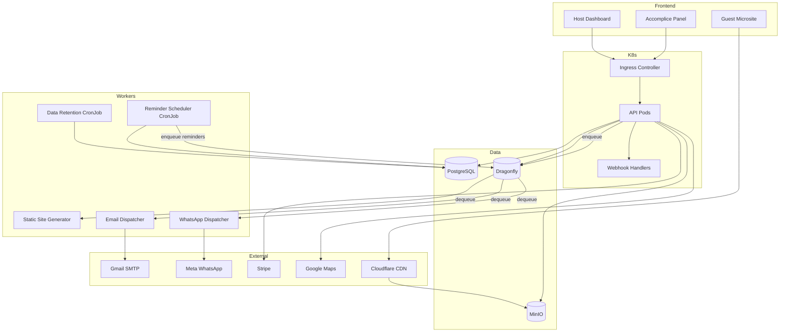

# 2.2. Descripción de Componentes Principales

## Vista General del Sistema

Aura Planning está compuesto por componentes distribuidos en un cluster Kubernetes: 3 componentes frontend, 1 API tier (multi-pod), 5 worker deployments/cronjobs, y 3 StatefulSets de datos (PostgreSQL, Dragonfly, MinIO). Cada componente se comunica mediante interfaces contractuales y service discovery nativo de K8s.

## Componentes Frontend

### Host Dashboard (Angular 22 SPA)

| Atributo | Detalle |
|----------|---------|
| **Tecnología** | Angular 22, Standalone Components, Signals |
| **Responsabilidad** | Panel de gestión completo para hosts: creación de eventos, edición de plantillas, gestión de invitados, tracking de RSVPs, flujo de pago |
| **Características Clave** | Template editor con preview en tiempo real, guest manager con importación CSV, control dashboard con estadísticas RSVP, Stripe Elements para pagos |
| **Estado Reactivo** | Angular Signals para estado local, servicios con BehaviorSubject para estado compartido |
| **Autenticación** | JWT en httpOnly cookie, guards de ruta con canActivate |
| **Rutas Principales** | `/dashboard`, `/dashboard/:slug/template`, `/dashboard/:slug/guests`, `/dashboard/:slug/accomplices` |
| **Despliegue** | Build estático servido por nginx en K8s Deployment, accesible vía Ingress |

**Dependencias:**
- API Backend (REST vía Ingress)
- Stripe Elements (pagos)
- Google Maps API (selección de venue)

### Guest Microsite (Static HTML/JS/CSS)

| Atributo | Detalle |
|----------|---------|
| **Tecnología** | HTML5, CSS3, Vanilla JavaScript |
| **Responsabilidad** | Página de invitación estática servida vía CDN: detalles del evento, mapa del venue, formulario RSVP, enlaces de calendario y direcciones |
| **Características Clave** | Mobile-first responsive, carga < 2s en 3G, Lighthouse > 90, Google Maps embed, add-to-calendar buttons, deep links a Google Maps/Waze |
| **Generación** | Pre-renderizado por Static Site Generator, subido a MinIO |
| **CDN** | Cloudflare con caché de 1 hora, origin = MinIO bucket |
| **URL** | `aura.planning/e/{event-slug}` |

**Dependencias:**
- API Backend (solo para RSVP submission)
- Google Maps Embed API
- Cloudflare CDN
- MinIO (origin de assets)

### Accomplice Panel (Angular 22 SPA)

| Atributo | Detalle |
|----------|---------|
| **Tecnología** | Angular 22, Touch Gestures (Angular CDK) |
| **Responsabilidad** | Interfaz simplificada para accomplices: envío de mensajes en vivo con swipe-to-send, resumen de RSVPs, historial de mensajes enviados |
| **Características Clave** | Swipe-to-confirm gesture (80% threshold), botones de plantillas pre-configuradas, delivery status tracking, mobile-first |
| **Autenticación** | Magic link token → JWT con claims de accomplice (role: "accomplice", permissions array) |
| **Expiración** | Acceso expira EventDate + 1 día |
| **Despliegue** | Incluido en el mismo build Angular que el Host Dashboard (rutas separadas) |

**Dependencias:**
- API Backend (REST vía Ingress)
- WhatsApp Business API (indirecto via backend)

## Componentes Kubernetes

### API Server (.NET 10 ASP.NET Core) — Deployment

| Atributo | Detalle |
|----------|---------|
| **Tecnología** | .NET 10, ASP.NET Core Web API, Minimal APIs |
| **Responsabilidad** | Puntos de entrada RESTful, autenticación/autorización, lógica de negocio, orquestación de servicios, handlers de webhooks |
| **Patrones** | Repository pattern, Unit of Work, Policy-based authorization, FluentValidation |
| **Replicas** | 2+ (escalado automático vía HPA basado en CPU/memoria) |
| **Probes** | Liveness (`/health/live`), Readiness (`/health/ready`), Startup (delay 30s) |
| **Resource Limits** | CPU: 500m request / 1000m limit, Memory: 256Mi request / 512Mi limit |
| **Service** | ClusterIP con selector de pods, expuesto vía Ingress |

**Controllers:**
| Controller | Endpoints | Auth |
|------------|-----------|------|
| Auth | `POST /api/auth/magic-link`, `GET /api/auth/verify` | None |
| Events | `POST/GET/PUT/DELETE /api/events`, `POST /api/events/{slug}/publish` | JWT (owner) |
| RSVP | `GET/POST /api/rsvp/{token}` | None (token-based) |
| Accomplices | `POST /api/accomplices/{slug}/grant`, `POST /api/live/{token}/send` | JWT (owner/accomplice) |
| Payments | `POST /api/payments/webhook` | Stripe signature |
| Webhooks | `POST /api/webhooks/whatsapp`, `POST /api/webhooks/ses` | Provider signature |

**Dependencias internas de K8s:**
- PostgreSQL (Service: `postgres.aura.svc.cluster.local:5432`)
- Dragonfly (Service: `dragonfly.aura.svc.cluster.local:6379`)
- MinIO (Service: `minio.aura.svc.cluster.local:9000`)

### Email Dispatcher — Deployment

| Atributo | Detalle |
|----------|---------|
| **Tecnología** | .NET 10 Worker Service, `System.Net.Mail.SmtpClient` |
| **Responsabilidad** | Procesamiento asíncrono de emails desde cola Dragonfly: magic links, invitaciones, recordatorios, thank you cards |
| **Queue** | Dragonfly list (`BRPOP email:queue`) |
| **SMTP** | Gmail SMTP (`smtp.gmail.com:587`, TLS) |
| **Replicas** | 1 (con distributed locking para evitar duplicados) |
| **Templates** | 6 plantillas HTML: magic-link, invitation-email, rsvp-reminder, thank-you-card, accomplice-invite, payment-receipt |

> **⚠️ Known Limitation — Gmail SMTP:** El uso de Gmail SMTP gratuito tiene un límite de 500 emails/día y no proporciona webhooks para bounce/complaint tracking. La interfaz `IEmailService` está abstraída para permitir un swap futuro a Mailgun, Brevo o SendGrid sin cambios en la lógica de negocio.

### WhatsApp Dispatcher — Deployment

| Atributo | Detalle |
|----------|---------|
| **Tecnología** | .NET 10 Worker Service, HttpClient (Meta Cloud API) |
| **Responsabilidad** | Procesamiento asíncrono de mensajes WhatsApp desde cola Dragonfly: invitaciones, live updates, recordatorios |
| **Queue** | Dragonfly list (`BRPOP whatsapp:queue`) con prioridad |
| **Retry Logic** | Attempt 1: immediate → Attempt 2: 5 min → Attempt 3: 30 min → Fallback: email |
| **Rate Limit** | 1,000 messages/hour per phone number |
| **Replicas** | 1 (con distributed locking) |
| **Templates** | 4 templates: invitation, reminder, live_update, thank_you |

### Static Site Generator — Deployment

| Atributo | Detalle |
|----------|---------|
| **Tecnología** | .NET 10 Worker Service, Razor Templates, MinIO SDK (AWSSDK.S3 compatible) |
| **Responsabilidad** | Generar HTML/CSS/JS estático por evento publicado, subir assets a bucket de MinIO |
| **Trigger** | Mensaje en cola Dragonfly (`event:published` o `event:updated`) |
| **Output** | MinIO bucket `static-sites/{slug}/`: `index.html`, `styles.css`, `app.js`, `assets/` |
| **Invalidación CDN** | API call a Cloudflare para purgar caché del path `/e/{slug}/*` |
| **Replicas** | 1 |

**Proceso de Generación:**
1. Fetch event data + template config from PostgreSQL
2. Render Razor template with event data
3. Generate CSS with custom colors/fonts
4. Generate JS with RSVP token embedded
5. Copy assets (cover image, template backgrounds)
6. Upload files to MinIO bucket via S3-compatible SDK
7. Trigger Cloudflare cache invalidation

### Data Retention Service — CronJob

| Atributo | Detalle |
|----------|---------|
| **Tecnología** | .NET 10 Worker Service, EF Core (PostgreSQL) |
| **Responsabilidad** | Eliminación hard de datos 30 días después de EventEndDate (GDPR compliance) |
| **Schedule** | Daily at 02:00 UTC (`schedule: "0 2 * * *"`) |
| **Query** | `DataRetentionJobs WHERE ScheduledDeleteAt <= NOW AND Status = 'scheduled'` |
| **Transaction** | All-or-nothing deletion per event (atomic) |
| **Concurrency** | Single pod execution (CronJob `concurrencyPolicy: Forbid`) |

**Orden de Eliminación (FK constraints):**
1. RSVPs → 2. LiveMessages → 3. MessageTemplates → 4. Accomplices → 5. Invitations → 6. Guests → 7. Payments → 8. Events → 9. DataRetentionJobs

### Reminder Scheduler — CronJob

| Atributo | Detalle |
|----------|---------|
| **Tecnología** | .NET 10 Worker Service, EF Core (PostgreSQL) |
| **Responsabilidad** | Enviar recordatorios RSVP a no-responders según schedule configurable |
| **Schedule** | Daily at 03:00 UTC (`schedule: "0 3 * * *"`) |
| **Query** | Guests with `InviteStatus = 'sent'` AND no RSVP AND `EventDate - RSVPDeadline <= reminderDays` |
| **Action** | Encolar mensajes en Dragonfly (email:queue o whatsapp:queue según canal original) |
| **Concurrency** | Single pod execution (CronJob `concurrencyPolicy: Forbid`) |

## Data Tier (StatefulSets)

### PostgreSQL

| Atributo | Detalle |
|----------|---------|
| **Tecnología** | PostgreSQL 16 |
| **Responsabilidad** | Base de datos relacional principal para todas las entidades |
| **Deployment** | StatefulSet con PersistentVolumeClaim |
| **Backup** | pg_dump CronJob diario a MinIO bucket `backups/` |
| **Conexión** | Connection string desde K8s Secret, pool de conexiones vía PgBouncer (opcional) |
| **Migraciones** | EF Core migrations ejecutadas como InitContainer del API Deployment |

### Dragonfly

| Atributo | Detalle |
|----------|---------|
| **Tecnología** | DragonflyDB (Redis-compatible, single-threaded, 25x más rápido) |
| **Responsabilidad** | Cola distribuida para workers, rate limiting distribuido, caché de sesiones, distributed locking |
| **Deployment** | StatefulSet con PersistentVolumeClaim |
| **API** | Compatible con Redis — mismo cliente `StackExchange.Redis` |
| **Estructuras Usadas** | Lists (`LPUSH`/`BRPOP` para colas), Strings (rate limiting con `INCR`/`EXPIRE`), Locks (`SET NX` para distributed locking) |
| **Memory** | 256Mi request / 512Mi limit (suficiente para MVP) |

### MinIO

| Atributo | Detalle |
|----------|---------|
| **Tecnología** | MinIO (S3-compatible object storage) |
| **Responsabilidad** | Almacenamiento de micrositios estáticos generados, backups de PostgreSQL, assets de plantillas |
| **Deployment** | StatefulSet con PersistentVolumeClaim |
| **Buckets** | `static-sites` (micrositios), `backups` (pg_dump), `templates` (template assets) |
| **Acceso** | S3-compatible SDK (`AWSSDK.S3`), credenciales desde K8s Secret |
| **CDN Origin** | Cloudflare apunta a MinIO vía endpoint público o Cloudflare Tunnel |

## Diagrama de Comunicación entre Componentes

---

[← Anterior: Diagrama de Arquitectura](./01-architecture-diagram.md) | [Siguiente: Estructura de Ficheros →](./03-project-structure.md)
