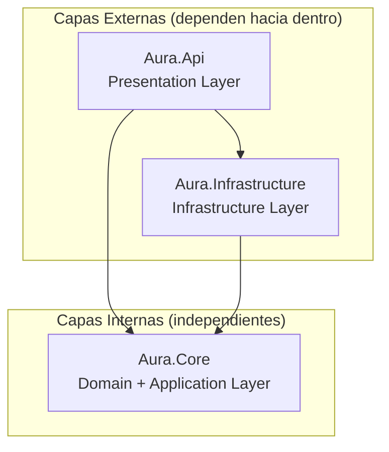

# 2.3. Descripción de Alto Nivel del Proyecto y Estructura de Ficheros

## Patrón Arquitectónico: Clean Architecture (Onion) + Cloud-Native Kubernetes

El proyecto combina dos patrones:

1. **Clean Architecture (Onion)** en el código .NET: separación en capas concéntricas donde las capas internas (Core) no dependen de las externas, y la dirección de dependencia siempre apunta hacia el centro.

2. **Cloud-Native Kubernetes** para despliegue: microservicios containerizados con orquestación K8s, Kustomize para gestión de entornos, y GitOps-ready.



### Beneficios

| Beneficio | Descripción |
|-----------|-------------|
| **Independencia de frameworks** | Core no depende de ASP.NET, EF Core, ni servicios externos |
| **Testabilidad** | Core se puede testear unitariamente sin mocks de infraestructura |
| **Portabilidad K8s** | Kustomize permite deploy en cualquier cluster (Rancher Desktop, GKE, EKS, DOKS) |
| **Escalabilidad** | HPA escala pods automáticamente; Dragonfly maneja miles de ops/sec |
| **Separación de responsabilidades** | Cada capa y cada componente K8s tiene un propósito claro |

## Estructura Completa del Proyecto

```
AI4Devs-finalproject/
├── backend/
│   ├── src/
│   │   ├── Aura.Api/                          # Presentation Layer
│   │   │   ├── Controllers/                   # API endpoints (Minimal APIs o Controllers)
│   │   │   │   ├── AuthController.cs          # Magic link + JWT authentication
│   │   │   │   ├── EventsController.cs        # Event CRUD + publish flow
│   │   │   │   ├── RsvpController.cs          # Public RSVP endpoints
│   │   │   │   ├── AccomplicesController.cs   # Accomplice management
│   │   │   │   ├── LiveMessagesController.cs  # Live message sending
│   │   │   │   ├── PaymentsController.cs      # Stripe payment flow
│   │   │   │   └── WebhooksController.cs      # External webhook handlers
│   │   │   ├── Middleware/                    # HTTP pipeline middleware
│   │   │   │   ├── ExceptionHandlingMiddleware.cs
│   │   │   │   ├── RateLimitingMiddleware.cs
│   │   │   │   └── CorsMiddleware.cs
│   │   │   ├── Filters/                       # Action filters
│   │   │   │   └── ValidationFilter.cs        # FluentValidation integration
│   │   │   ├── Health/                        # Kubernetes health probes
│   │   │   │   ├── HealthCheckController.cs   # /health/live, /health/ready
│   │   │   │   └── HealthChecksSetup.cs       # PostgreSQL, Dragonfly, MinIO checks
│   │   │   ├── Program.cs                     # DI setup, middleware pipeline
│   │   │   ├── appsettings.json               # Configuration (overridden by env vars)
│   │   │   └── Dockerfile                     # Multi-stage build for API
│   │   │
│   │   ├── Aura.Core/                         # Domain + Application Layer
│   │   │   ├── Models/                        # Domain entities (POCOs)
│   │   │   │   ├── User.cs
│   │   │   │   ├── Event.cs
│   │   │   │   ├── Guest.cs
│   │   │   │   ├── Invitation.cs
│   │   │   │   ├── Rsvp.cs
│   │   │   │   ├── Accomplice.cs
│   │   │   │   ├── MessageTemplate.cs
│   │   │   │   ├── LiveMessage.cs
│   │   │   │   ├── Payment.cs
│   │   │   │   ├── Template.cs
│   │   │   │   └── DataRetentionJob.cs
│   │   │   ├── DTOs/                          # Data Transfer Objects (records)
│   │   │   │   ├── Auth/
│   │   │   │   ├── Events/
│   │   │   │   ├── Guests/
│   │   │   │   ├── Rsvp/
│   │   │   │   └── Payments/
│   │   │   ├── Interfaces/                    # Abstractions (contracts)
│   │   │   │   ├── Repositories/
│   │   │   │   │   ├── IUserRepository.cs
│   │   │   │   │   ├── IEventRepository.cs
│   │   │   │   │   ├── IGuestRepository.cs
│   │   │   │   │   └── ...
│   │   │   │   └── Services/
│   │   │   │       ├── IEmailService.cs       # Abstraction (Gmail now, swappable)
│   │   │   │       ├── IWhatsAppService.cs
│   │   │   │       ├── IPaymentService.cs
│   │   │   │       ├── IStaticSiteGenerator.cs
│   │   │   │       ├── IMagicLinkService.cs
│   │   │   │       └── IQueueService.cs       # Dragonfly queue abstraction
│   │   │   └── Services/                      # Application services (business logic)
│   │   │       ├── AuthService.cs
│   │   │       ├── EventService.cs
│   │   │       ├── GuestService.cs
│   │   │       ├── RsvpService.cs
│   │   │       ├── AccompliceService.cs
│   │   │       ├── LiveMessageService.cs
│   │   │       └── PaymentService.cs
│   │   │
│   │   └── Aura.Infrastructure/               # Infrastructure Layer
│   │       ├── Data/                          # EF Core configuration
│   │       │   ├── ApplicationDbContext.cs    # DbContext (PostgreSQL)
│   │       │   └── Configurations/            # Entity type configurations
│   │       │       ├── UserConfiguration.cs
│   │       │       ├── EventConfiguration.cs
│   │       │       └── ...
│   │       ├── Migrations/                    # EF Core migrations
│   │       │   └── ...
│   │       ├── Repositories/                  # Repository implementations
│   │       │   ├── UserRepository.cs
│   │       │   ├── EventRepository.cs
│   │       │   └── ...
│   │       ├── Services/                      # External service implementations
│   │       │   ├── SmtpEmailService.cs        # Gmail SMTP implementation
│   │       │   ├── MetaWhatsAppService.cs     # Meta Cloud API implementation
│   │       │   ├── StripePaymentService.cs    # Stripe implementation
│   │       │   └── MinioStaticSiteGenerator.cs # MinIO S3 SDK implementation
│   │       ├── Queue/                         # Dragonfly queue implementation
│   │       │   ├── DragonflyQueueService.cs   # IQueueService via StackExchange.Redis
│   │       │   └── QueueNames.cs              # Queue name constants
│   │       └── BackgroundWorkers/             # Worker services (separate K8s Deployments)
│   │           ├── EmailDispatcherWorker.cs
│   │           ├── WhatsAppDispatcherWorker.cs
│   │           ├── StaticSiteGeneratorWorker.cs
│   │           ├── DataRetentionWorker.cs
│   │           └── ReminderSchedulerWorker.cs
│   │
│   ├── workers/                               # Worker entry points (separate projects)
│   │   ├── Aura.Workers.Email/
│   │   │   ├── Program.cs                     # HostBuilder for Email Dispatcher
│   │   │   └── Dockerfile
│   │   ├── Aura.Workers.WhatsApp/
│   │   │   ├── Program.cs                     # HostBuilder for WhatsApp Dispatcher
│   │   │   └── Dockerfile
│   │   └── Aura.Workers.SSG/
│   │       ├── Program.cs                     # HostBuilder for Static Site Generator
│   │       └── Dockerfile
│   │
│   ├── tests/
│   │   ├── Aura.Core.Tests/                   # Unit tests for Core layer
│   │   ├── Aura.Infrastructure.Tests/         # Integration tests
│   │   └── Aura.Api.Tests/                    # API endpoint tests
│   │
│   └── AuraPlanning.sln                       # Solution file
│
├── frontend/
│   ├── src/
│   │   ├── app/
│   │   │   ├── core/                          # Singleton services, guards, interceptors
│   │   │   │   ├── auth/
│   │   │   │   │   ├── auth.guard.ts
│   │   │   │   │   ├── auth.interceptor.ts
│   │   │   │   │   └── auth.service.ts
│   │   │   │   ├── services/
│   │   │   │   │   ├── event.service.ts
│   │   │   │   │   ├── guest.service.ts
│   │   │   │   │   ├── rsvp.service.ts
│   │   │   │   │   └── accomplice.service.ts
│   │   │   │   └── interceptors/
│   │   │   │       ├── error.interceptor.ts
│   │   │   │       └── loading.interceptor.ts
│   │   │   │
│   │   │   ├── features/                      # Feature modules (lazy-loaded)
│   │   │   │   ├── auth/                      # Registration + login
│   │   │   │   │   ├── pages/
│   │   │   │   │   │   ├── login.page.ts
│   │   │   │   │   │   └── verify.page.ts
│   │   │   │   │   └── components/
│   │   │   │   │       └── magic-link-form.component.ts
│   │   │   │   │
│   │   │   │   ├── dashboard/                 # Host dashboard
│   │   │   │   │   ├── pages/
│   │   │   │   │   │   ├── dashboard.page.ts
│   │   │   │   │   │   └── event-detail.page.ts
│   │   │   │   │   └── components/
│   │   │   │   │       ├── stats-card.component.ts
│   │   │   │   │       ├── guest-table.component.ts
│   │   │   │   │       └── rsvp-chart.component.ts
│   │   │   │   │
│   │   │   │   ├── events/                    # Event management
│   │   │   │   │   ├── pages/
│   │   │   │   │   │   ├── create-event.page.ts
│   │   │   │   │   │   └── edit-event.page.ts
│   │   │   │   │   └── components/
│   │   │   │   │       ├── template-editor.component.ts
│   │   │   │   │       ├── guest-import.component.ts
│   │   │   │   │       └── publish-dialog.component.ts
│   │   │   │   │
│   │   │   │   ├── accomplice/                # Accomplice panel
│   │   │   │   │   ├── pages/
│   │   │   │   │   │   └── accomplice-panel.page.ts
│   │   │   │   │   └── components/
│   │   │   │   │       ├── swipe-button.component.ts
│   │   │   │   │       └── message-history.component.ts
│   │   │   │   │
│   │   │   │   └── onboarding/                # Onboarding wizard
│   │   │   │       ├── pages/
│   │   │   │       │   └── onboarding-wizard.page.ts
│   │   │   │       └── steps/
│   │   │   │           ├── template-selection.step.ts
│   │   │   │           ├── event-basics.step.ts
│   │   │   │           └── guest-import.step.ts
│   │   │   │
│   │   │   ├── shared/                        # Shared components, pipes, directives
│   │   │   │   ├── components/
│   │   │   │   │   ├── navbar.component.ts
│   │   │   │   │   ├── button.component.ts
│   │   │   │   │   ├── input.component.ts
│   │   │   │   │   ├── card.component.ts
│   │   │   │   │   ├── badge.component.ts
│   │   │   │   │   └── empty-state.component.ts
│   │   │   │   ├── pipes/
│   │   │   │   └── directives/
│   │   │   │
│   │   │   ├── app.routes.ts                  # Route definitions
│   │   │   ├── app.config.ts                  # Application configuration
│   │   │   └── app.component.ts               # Root component
│   │   │
│   │   ├── assets/                            # Static assets
│   │   │   ├── images/
│   │   │   ├── icons/
│   │   │   └── templates/                     # Template previews
│   │   │
│   │   ├── environments/                      # Environment configs
│   │   │   ├── environment.ts
│   │   │   └── environment.prod.ts
│   │   │
│   │   ├── styles/                            # Global styles
│   │   │   ├── _variables.scss
│   │   │   ├── _mixins.scss
│   │   │   └── styles.scss
│   │   │
│   │   ├── index.html
│   │   └── nginx.conf                         # Nginx config for production build
│   │
│   ├── angular.json
│   ├── package.json
│   ├── tsconfig.json
│   ├── tailwind.config.js
│   └── Dockerfile                             # Multi-stage: Angular build + nginx
│
├── k8s/                                       # Kubernetes manifests (Kustomize)
│   ├── base/
│   │   ├── namespace.yaml                     # Namespace: aura
│   │   ├── kustomization.yaml                 # Base resources
│   │   ├── api/
│   │   │   ├── deployment.yaml                # .NET 10 API Deployment
│   │   │   ├── service.yaml                   # ClusterIP Service
│   │   │   ├── hpa.yaml                       # HorizontalPodAutoscaler
│   │   │   ├── configmap.yaml                 # appsettings overrides
│   │   │   └── ingress.yaml                   # Ingress rules
│   │   ├── workers/
│   │   │   ├── email-deployment.yaml          # Email Dispatcher Deployment
│   │   │   ├── whatsapp-deployment.yaml       # WhatsApp Dispatcher Deployment
│   │   │   └── ssg-deployment.yaml            # Static Site Generator Deployment
│   │   ├── cronjobs/
│   │   │   ├── retention-cronjob.yaml         # Data Retention CronJob
│   │   │   └── reminder-cronjob.yaml          # Reminder Scheduler CronJob
│   │   ├── database/
│   │   │   ├── postgres-statefulset.yaml      # PostgreSQL StatefulSet
│   │   │   ├── postgres-service.yaml          # Headless Service
│   │   │   ├── postgres-secret.yaml           # DB credentials
│   │   │   └── postgres-pvc.yaml              # PersistentVolumeClaim
│   │   ├── dragonfly/
│   │   │   ├── dragonfly-statefulset.yaml     # DragonflyDB StatefulSet
│   │   │   ├── dragonfly-service.yaml         # ClusterIP Service
│   │   │   └── dragonfly-pvc.yaml             # PersistentVolumeClaim
│   │   ├── minio/
│   │   │   ├── minio-statefulset.yaml         # MinIO StatefulSet
│   │   │   ├── minio-service.yaml             # ClusterIP Service
│   │   │   ├── minio-secret.yaml              # MinIO credentials
│   │   │   └── minio-pvc.yaml                 # PersistentVolumeClaim
│   │   └── frontend/
│   │       ├── deployment.yaml                # Angular + nginx Deployment
│   │       └── service.yaml                   # ClusterIP Service
│   │
│   └── overlays/
│       ├── local/                             # Rancher Desktop (k3s)
│       │   ├── kustomization.yaml             # Patches for local dev
│       │   ├── replicas-patch.yaml            # 1 replica each
│       │   └── resources-patch.yaml           # Lower resource requests
│       │
│       └── production/
│           ├── kustomization.yaml             # Patches for production
│           ├── replicas-patch.yaml            # 2+ API replicas
│           └── resources-patch.yaml           # Production resource limits
│
├── .github/                                   # GitHub configuration
│   └── workflows/                             # CI/CD pipelines
│       ├── build-and-test.yml                 # Build, test, push to GHCR
│       └── deploy.yml                         # kubectl apply to cluster
│
├── business-documentation/                    # Documentación de negocio
│   ├── prd/                                   # Product Requirements Document
│   └── ui-design/                             # Wireframes y diseño UI
│
├── technical-documentation/                   # Documentación técnica
│   └── architecture/                          # Documentación de arquitectura
│
├── conventions/                               # Convenciones del proyecto
│   ├── technical-conventions.md
│   └── git-conventions.md
│
├── .opencode/                                 # OpenCode AI agents
├── readme.md                                  # Documentación principal
└── opencode.json                              # OpenCode configuration
```

## Descripción de Carpetas Principales

### Backend

| Carpeta | Propósito |
|---------|-----------|
| `Aura.Api/` | **Presentation Layer** — Controllers, middleware, health checks para K8s probes. Punto de entrada de la aplicación API. |
| `Aura.Core/Models/` | **Domain Entities** — Clases POCO que representan las entidades del dominio. Sin dependencias externas. |
| `Aura.Core/DTOs/` | **Data Transfer Objects** — Records inmutables para transferencia de datos entre capas y API. |
| `Aura.Core/Interfaces/` | **Contracts** — Interfaces que definen los contratos de repositorios y servicios. Incluye `IEmailService` (abstraído para swap futuro), `IQueueService` (Dragonfly abstraction). |
| `Aura.Core/Services/` | **Application Services** — Lógica de negocio orquestando repositorios y servicios externos mediante interfaces. |
| `Aura.Infrastructure/Data/` | **Data Access** — DbContext configurado para PostgreSQL, configuraciones de entidades EF Core, migraciones. |
| `Aura.Infrastructure/Repositories/` | **Repository Implementations** — Implementaciones concretas de los repositorios usando EF Core con PostgreSQL. |
| `Aura.Infrastructure/Services/` | **External Services** — `SmtpEmailService.cs` (Gmail SMTP), `MetaWhatsAppService.cs`, `StripePaymentService.cs`, `MinioStaticSiteGenerator.cs` (MinIO S3 SDK). |
| `Aura.Infrastructure/Queue/` | **Queue Implementation** — `DragonflyQueueService.cs` usando `StackExchange.Redis` para colas distribuidas. |
| `Aura.Infrastructure/BackgroundWorkers/` | **Worker Classes** — Lógica de workers reutilizable por los proyectos de workers separados. |
| `workers/` | **Worker Projects** — Proyectos .NET separados para Email Dispatcher, WhatsApp Dispatcher, y SSG. Cada uno tiene su propio Dockerfile. |
| `tests/` | **Test Projects** — Tests unitarios (Core), integración (Infrastructure con Testcontainers para PostgreSQL + Dragonfly), y API. |

### Kubernetes (k8s/)

| Carpeta | Propósito |
|---------|-----------|
| `base/` | **Kustomize Base** — Manifests canónicos de todos los recursos K8s. Se personalizan mediante overlays. |
| `base/api/` | API Deployment, Service, HPA, ConfigMap, Ingress rules. |
| `base/workers/` | Deployments para Email Dispatcher, WhatsApp Dispatcher, SSG. |
| `base/cronjobs/` | CronJobs para Data Retention y Reminder Scheduler. |
| `base/database/` | PostgreSQL StatefulSet, Service, Secret, PVC. |
| `base/dragonfly/` | DragonflyDB StatefulSet, Service, PVC. |
| `base/minio/` | MinIO StatefulSet, Service, Secret, PVC. |
| `base/frontend/` | Angular + nginx Deployment y Service. |
| `overlays/local/` | **Rancher Desktop** — Patches para desarrollo local: 1 replica, recursos reducidos, imagePullPolicy: Never. |
| `overlays/production/` | **Producción** — Patches para producción: 2+ replicas API, recursos completos, resource limits. |

### Frontend

| Carpeta | Propósito |
|---------|-----------|
| `app/core/` | **Servicios Singleton** — Guards de autenticación, interceptores HTTP, servicios de datos. Se inyectan una vez y se comparten. |
| `app/features/` | **Feature Modules** — Componentes lazy-loaded por ruta. Cada feature encapsula sus páginas y componentes específicos. |
| `app/shared/` | **Componentes Reutilizables** — UI components genéricos (buttons, inputs, cards) usados en múltiples features. |
| `environments/` | **Configuración por Entorno** — Variables específicas de desarrollo/producción (API URL, feature flags). |
| `assets/` | **Recursos Estáticos** — Imágenes, iconos, previews de plantillas empaquetados con el build. |
| `nginx.conf` | Configuración de nginx para servir el build estático de Angular en producción (usado en Dockerfile). |

## Convenciones de Nomenclatura

### Backend (C#)
- **Archivos:** PascalCase (`EventService.cs`, `IUserRepository.cs`)
- **DTOs:** Sufijo `Dto` o `Request`/`Response` (`CreateEventRequest.cs`, `RsvpResponse.cs`)
- **Interfaces:** Prefijo `I` (`IEmailService.cs`)
- **Namespaces:** File-scoped, matching folder structure (`namespace Aura.Core.Services;`)

### Frontend (TypeScript/Angular)
- **Archivos:** kebab-case (`auth.guard.ts`, `event.service.ts`)
- **Componentes:** Sufijo `.component.ts`, `.page.ts` para páginas
- **Selectores:** Prefijo `app-` (`app-guest-table`)
- **Clases:** PascalCase (`AuthGuard`, `EventService`)

### Kubernetes (YAML)
- **Archivos:** kebab-case (`api-deployment.yaml`, `postgres-statefulset.yaml`)
- **Names:** kebab-case con prefijo de componente (`aura-api`, `aura-postgres`, `aura-dragonfly`)
- **Labels:** `app.kubernetes.io/name`, `app.kubernetes.io/component`, `app.kubernetes.io/part-of: aura`

---

[← Anterior: Componentes Principales](./02-components.md) | [Siguiente: Infraestructura y Despliegue →](./04-infrastructure-deployment.md)
