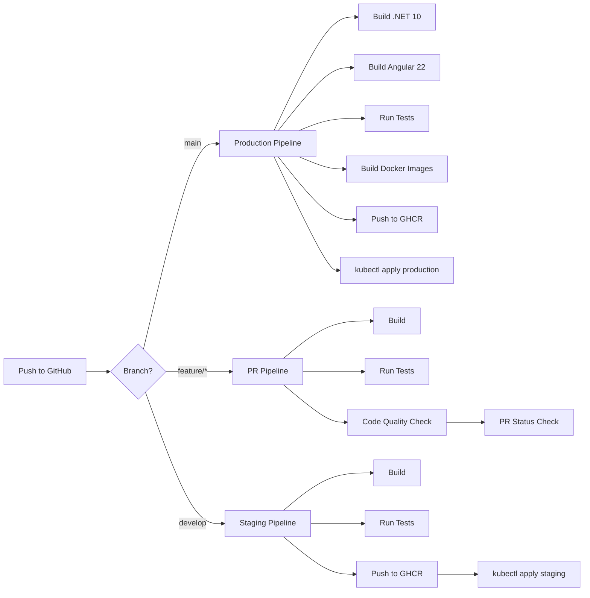

# 2.4. Infraestructura y Despliegue

## Arquitectura de Infraestructura Kubernetes

```mermaid
graph TB
    subgraph Users
        Host["Host Browser"]
        Guest["Guest Browser"]
        Accomplice["Accomplice Browser"]
    end

    subgraph CDN["Cloudflare CDN"]
        Edge1["Edge EU-West"]
        Edge2["Edge US-East"]
        Edge3["Edge LATAM"]
    end

    subgraph K8s["Kubernetes Cluster"]
        subgraph Ingress
            Ing["Ingress Controller<br/>(nginx/traefik)"]
        end

        subgraph API_Pods
            API1[".NET 10 API Pod 1"]
            API2[".NET 10 API Pod 2"]
        end

        subgraph Workers
            EmailW["Email Dispatcher"]
            WAW["WhatsApp Dispatcher"]
            SSGW["Static Site Generator"]
        end

        subgraph StatefulSets
            PG[("PostgreSQL")]
            DF[("Dragonfly")]
            MIO[("MinIO")]
        end
    end

    subgh External
        Gmail["Gmail SMTP"]
        WhatsApp["Meta WhatsApp API"]
        Stripe["Stripe"]
        GMaps["Google Maps"]
    end

    Host --> Ing
    Accomplice --> Ing
    Guest --> Edge1
    Guest --> Edge2
    Guest --> Edge3
    
    Edge1 --> MIO
    Edge2 --> MIO
    Edge3 --> MIO
    
    Ing --> API1
    Ing --> API2
    
    API1 --> PG
    API1 --> DF
    API1 --> MIO
    API2 --> PG
    API2 --> DF
    API2 --> MIO
    
    API1 --> EmailW
    API1 --> WAW
    API1 --> SSGW
    
    EmailW --> Gmail
    WAW --> WhatsApp
    API1 --> Stripe
    API1 --> GMaps
```

## Entornos

| Entorno | Cluster | Propósito | Base de Datos | Servicios Externos |
|---------|---------|-----------|---------------|-------------------|
| **Local** | Rancher Desktop (k3s) | Desarrollo | PostgreSQL en cluster | Gmail SMTP, Stripe test, Meta sandbox |
| **Staging** | TBD (GKE/EKS/DOKS) | QA / UAT | PostgreSQL en cluster | Gmail SMTP, Stripe test, Meta sandbox |
| **Production** | TBD (GKE/EKS/DOKS) | Usuarios reales | PostgreSQL con backups | Gmail SMTP (o Mailgun/Brevo), Stripe live, Meta production |

## Kustomize — Gestión de Configuración por Entorno

Aura Planning usa **Kustomize** (built into `kubectl`) para gestionar configuraciones por entorno sin duplicar manifests.

### Estructura de Overlays

```
k8s/
├── base/                    # Manifests canónicos
│   ├── kustomization.yaml
│   ├── api/deployment.yaml  # 2 replicas, 500m CPU
│   └── ...
└── overlays/
    ├── local/               # Rancher Desktop
    │   ├── kustomization.yaml
    │   ├── replicas-patch.yaml    # 1 replica
    │   └── resources-patch.yaml   # 250m CPU, 128Mi memory
    └── production/          # Producción
        ├── kustomization.yaml
        ├── replicas-patch.yaml    # 3 replicas
        └── resources-patch.yaml   # 1000m CPU, 512Mi memory
```

### Ejemplo: Patch de Recursos (local vs production)

**Base (`k8s/base/api/deployment.yaml`):**
```yaml
apiVersion: apps/v1
kind: Deployment
metadata:
  name: aura-api
  namespace: aura
spec:
  replicas: 2
  template:
    spec:
      containers:
      - name: api
        image: ghcr.io/pedrosrp/aura-api:latest
        resources:
          requests:
            cpu: 500m
            memory: 256Mi
          limits:
            cpu: 1000m
            memory: 512Mi
```

**Overlay local (`k8s/overlays/local/resources-patch.yaml`):**
```yaml
apiVersion: apps/v1
kind: Deployment
metadata:
  name: aura-api
spec:
  template:
    spec:
      containers:
      - name: api
        resources:
          requests:
            cpu: 250m
            memory: 128Mi
          limits:
            cpu: 500m
            memory: 256Mi
```

**Aplicación:**
```bash
# Local (Rancher Desktop)
kubectl apply -k k8s/overlays/local

# Production
kubectl apply -k k8s/overlays/production
```

## Container Registry: GitHub Container Registry (GHCR)

| Aspecto | Detalle |
|---------|---------|
| **Registry** | `ghcr.io/pedrosrp/` |
| **Plan Gratuito** | 500MB storage (GitHub Free), 2GB (Pro) |
| **Imágenes** | `aura-api`, `aura-frontend`, `aura-worker-email`, `aura-worker-whatsapp`, `aura-worker-ssg` |
| **Autenticación** | `GITHUB_TOKEN` en GitHub Actions |
| **Tagging** | `latest` + git SHA (`sha-abc1234`) + semver tags (`v1.0.0`) |

### Ejemplo de Push a GHCR

```yaml
# .github/workflows/build-and-test.yml
- name: Login to GHCR
  uses: docker/login-action@v3
  with:
    registry: ghcr.io
    username: ${{ github.actor }}
    password: ${{ secrets.GITHUB_TOKEN }}

- name: Build and push API image
  uses: docker/build-push-action@v5
  with:
    context: ./backend/src/Aura.Api
    push: true
    tags: |
      ghcr.io/${{ github.repository }}/aura-api:${{ github.sha }}
      ghcr.io/${{ github.repository }}/aura-api:latest
```

## CI/CD Pipeline — Tradicional



### Pipeline de Producción (GitHub Actions)

```yaml
# .github/workflows/deploy.yml
name: Deploy to Production

on:
  push:
    branches: [main]

jobs:
  build-and-deploy:
    runs-on: ubuntu-latest
    
    steps:
      - uses: actions/checkout@v4
      
      # Backend: Build & Test
      - name: Setup .NET 10
        uses: actions/setup-dotnet@v3
        with:
          dotnet-version: '10.0.x'
      
      - name: Restore & Build
        run: dotnet build backend/AuraPlanning.sln --configuration Release
      
      - name: Run Tests
        run: dotnet test backend/AuraPlanning.sln --no-build
      
      # Frontend: Build
      - name: Setup Node.js
        uses: actions/setup-node@v3
        with:
          node-version: '20'
      
      - name: Install & Build
        run: |
          cd frontend
          npm ci
          ng build --configuration production
      
      # Docker: Build & Push to GHCR
      - name: Login to GHCR
        uses: docker/login-action@v3
        with:
          registry: ghcr.io
          username: ${{ github.actor }}
          password: ${{ secrets.GITHUB_TOKEN }}
      
      - name: Build & Push API
        uses: docker/build-push-action@v5
        with:
          context: ./backend/src/Aura.Api
          push: true
          tags: ghcr.io/${{ github.repository }}/aura-api:${{ github.sha }}
      
      - name: Build & Push Frontend
        uses: docker/build-push-action@v5
        with:
          context: ./frontend
          push: true
          tags: ghcr.io/${{ github.repository }}/aura-frontend:${{ github.sha }}
      
      - name: Build & Push Workers
        run: |
          for worker in email whatsapp ssg; do
            docker build -t ghcr.io/${{ github.repository }}/aura-worker-$worker:${{ github.sha }} \
              -f backend/src/Aura.Workers.$worker/Dockerfile backend/src/
            docker push ghcr.io/${{ github.repository }}/aura-worker-$worker:${{ github.sha }}
          done
      
      # Deploy: kubectl apply
      - name: Update image tags in k8s manifests
        run: |
          cd k8s/overlays/production
          kustomize edit set image ghcr.io/${{ github.repository }}/aura-api=${{ github.sha }}
          kustomize edit set image ghcr.io/${{ github.repository }}/aura-frontend=${{ github.sha }}
      
      - name: Deploy to Kubernetes
        uses: azure/setup-kubectl@v3
        with:
          version: 'latest'
      
      - name: Apply K8s manifests
        run: |
          echo "${{ secrets.KUBE_CONFIG }}" | base64 -d > kubeconfig
          export KUBECONFIG=kubeconfig
          kubectl apply -k k8s/overlays/production
```

## Rancher Desktop — Desarrollo Local

### Setup

```bash
# 1. Instalar Rancher Desktop
# https://rancherdesktop.io/

# 2. Configurar k3s con containerd
# Rancher Desktop Settings → Kubernetes Settings → Container Runtime: containerd

# 3. Verificar cluster
kubectl cluster-info
kubectl get nodes

# 4. Crear namespace
kubectl create namespace aura

# 5. Cargar imágenes locales (sin registry)
docker build -t aura-api:local -f backend/src/Aura.Api/Dockerfile backend/src/
nerdctl -n k8s.io tag aura-api:local ghcr.io/pedrosrp/aura-api:local
nerdctl -n k8s.io push ghcr.io/pedrosrp/aura-api:local

# 6. Deploy local
kubectl apply -k k8s/overlays/local
```

### Kustomize Overlay Local

```yaml
# k8s/overlays/local/kustomization.yaml
apiVersion: kustomize.config.k8s.io/v1beta1
kind: Kustomization

namespace: aura

resources:
  - ../../base

patches:
  - path: replicas-patch.yaml
  - path: resources-patch.yaml

images:
  - name: ghcr.io/pedrosrp/aura-api
    newTag: local
  - name: ghcr.io/pedrosrp/aura-frontend
    newTag: local
```

## Ingress y Routing

### Ingress Controller

| Opción | Recomendación |
|--------|--------------|
| **nginx-ingress** | Más popular, amplia documentación |
| **traefik** | Cloud-native, auto-discovery, dashboard integrado |

### Reglas de Ingress

```yaml
# k8s/base/api/ingress.yaml
apiVersion: networking.k8s.io/v1
kind: Ingress
metadata:
  name: aura-ingress
  namespace: aura
  annotations:
    cert-manager.io/cluster-issuer: letsencrypt-prod
    nginx.ingress.kubernetes.io/ssl-redirect: "true"
spec:
  ingressClassName: nginx
  tls:
  - hosts:
    - aura.planning
    secretName: aura-tls
  rules:
  - host: aura.planning
    http:
      paths:
      - path: /api
        pathType: Prefix
        backend:
          service:
            name: aura-api
            port:
              number: 80
      - path: /dashboard
        pathType: Prefix
        backend:
          service:
            name: aura-frontend
            port:
              number: 80
      - path: /accomplice
        pathType: Prefix
        backend:
          service:
            name: aura-frontend
            port:
              number: 80
```

### TLS con Cert-Manager

```yaml
# ClusterIssuer para Let's Encrypt
apiVersion: cert-manager.io/v1
kind: ClusterIssuer
metadata:
  name: letsencrypt-prod
spec:
  acme:
    server: https://acme-v02.api.letsencrypt.org/directory
    email: admin@aura.planning
    privateKeySecretRef:
      name: letsencrypt-prod-key
    solvers:
    - http01:
        ingress:
          class: nginx
```

## CDN para Micrositios Estáticos

### Configuración de Cloudflare

| Parámetro | Valor |
|-----------|-------|
| **Proveedor** | Cloudflare |
| **Origin** | MinIO bucket `static-sites` (vía endpoint público o Cloudflare Tunnel) |
| **Cache TTL** | 1 hora (default) |
| **Invalidación** | API call a Cloudflare purge cache on event publish/update |
| **HTTPS** | Requerido (Cloudflare Universal SSL) |
| **Compresión** | Brotli + Gzip |
| **URL Pattern** | `aura.planning/e/{event-slug}/*` |

### Estructura de Buckets en MinIO

```
MinIO Buckets:
├── static-sites/
│   ├── {event-slug-1}/
│   │   ├── index.html
│   │   ├── styles.css
│   │   ├── app.js
│   │   └── assets/
│   │       ├── cover.jpg
│   │       └── template-bg.png
│   └── {event-slug-2}/
│       └── ...
├── backups/
│   └── postgres/
│       └── aura-db-2026-06-08.sql.gz
└── templates/
    ├── classic-elegance/
    └── modern-minimal/
```

## Observabilidad

| Aspecto | Herramienta | Implementación |
|---------|------------|----------------|
| **Logging** | Serilog → stdout → Loki | JSON structured logs, correlation IDs por request |
| **Metrics** | Prometheus (scrape `/metrics`) | Request rates, error rates, latency percentiles, HPA metrics |
| **Tracing** | OpenTelemetry → Tempo/Jaeger | Distributed tracing across API pods y workers |
| **Health Checks** | ASP.NET Core HealthChecks | `/health/live` (liveness), `/health/ready` (readiness) |
| **Error Tracking** | Sentry | Captura de excepciones no manejadas con stack traces |
| **Dashboards** | Grafana | Pre-built dashboards para API, PostgreSQL, Dragonfly, MinIO |
| **Alerting** | Prometheus Alertmanager | Alertas por Slack/email en thresholds críticos |

### Métricas Clave y Alertas

| Métrica | Umbral de Alerta | Acción |
|---------|-----------------|--------|
| API error rate | > 5% over 5 min | Page on-call |
| RSVP submission latency (p95) | > 2s | Investigar DB performance |
| WhatsApp delivery failure rate | > 10% over 1 hour | Check Meta API status |
| Email bounce rate | > 5% over 1 day | Review email list quality |
| PostgreSQL connection pool usage | > 80% | Scale PgBouncer o API pods |
| Dragonfly memory usage | > 80% | Investigar cache eviction |
| MinIO disk usage | > 80% | Expandir PVC o limpiar buckets |
| Pod restart count | > 3 en 10 min | Investigar crash loop |

## Estrategia de Backup

| Componente | Frecuencia | Retención | Método |
|------------|-----------|-----------|--------|
| **PostgreSQL** | Daily at 03:00 UTC | 30 días | `pg_dump` CronJob → MinIO bucket `backups/` |
| **MinIO (static sites)** | On publish | Until event deletion | Versioning habilitado en bucket |
| **MinIO (backups)** | Continuous | 30 días | Replicación a bucket secundario (opcional) |
| **K8s manifests** | On change | Ilimitado | Git version control |
| **ConfigMaps/Secrets** | On change | Ilimitado | Git + Sealed Secrets/SOPS |

### CronJob de Backup PostgreSQL

```yaml
apiVersion: batch/v1
kind: CronJob
metadata:
  name: postgres-backup
  namespace: aura
spec:
  schedule: "0 3 * * *"
  jobTemplate:
    spec:
      template:
        spec:
          containers:
          - name: pg-backup
            image: postgres:16
            command:
            - /bin/sh
            - -c
            - |
              pg_dump -h postgres -U $PG_USER aura_db | gzip > /backups/aura-db-$(date +%Y-%m-%d).sql.gz
              mc cp /backups/aura-db-$(date +%Y-%m-%d).sql.gz minio/backups/postgres/
            env:
            - name: PG_USER
              valueFrom:
                secretKeyRef:
                  name: postgres-secret
                  key: username
            - name: PGPASSWORD
              valueFrom:
                secretKeyRef:
                  name: postgres-secret
                  key: password
            volumeMounts:
            - name: backup-volume
              mountPath: /backups
          restartPolicy: OnFailure
          volumes:
          - name: backup-volume
            emptyDir: {}
```

## Escalabilidad

### Estado Actual (MVP)

| Componente | Replicas | Recursos |
|------------|----------|----------|
| **API** | 2 (HPA: 1-5) | 500m CPU / 256Mi memory |
| **Workers (email, whatsapp, ssg)** | 1 cada uno | 250m CPU / 128Mi memory |
| **PostgreSQL** | 1 (StatefulSet) | 500m CPU / 512Mi memory, 5Gi PVC |
| **Dragonfly** | 1 (StatefulSet) | 250m CPU / 256Mi memory, 1Gi PVC |
| **MinIO** | 1 (StatefulSet) | 250m CPU / 256Mi memory, 10Gi PVC |
| **Frontend** | 1 | 100m CPU / 64Mi memory |

### Plan de Escalabilidad (Post-MVP)

| Componente | Current | Future | Trigger |
|------------|---------|--------|---------|
| **API** | 2 pods, HPA 1-5 | 5+ pods, VPA | > 100 req/min sustained |
| **PostgreSQL** | Single instance | Read replicas + PgBouncer | > 500MB DB size or connection limits |
| **Dragonfly** | Single instance | Cluster mode | > 10K ops/sec |
| **MinIO** | Single instance | Distributed mode (4+ nodes) | > 50Gi storage |
| **Workers** | 1 replica cada uno | 2+ replicas con distributed locking | Queue backlog > 100 messages |
| **Cluster** | Single cluster | Multi-cluster (regional) | Latencia > 200ms en regiones target |

---

[← Anterior: Estructura de Ficheros](./03-project-structure.md) | [Siguiente: Seguridad →](./05-security.md)
