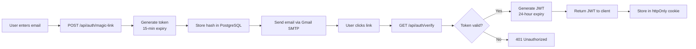
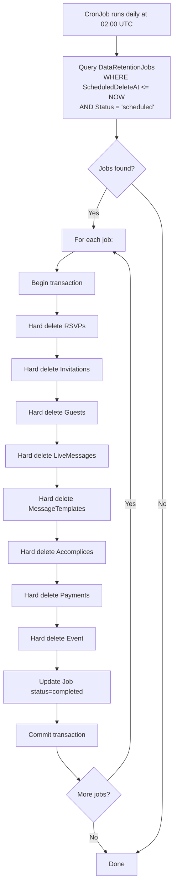

# 2.5. Seguridad

## Arquitectura de Autenticación

Aura Planning utiliza **autenticación passwordless** mediante magic links con tokens JWT, eliminando la superficie de ataque asociada a contraseñas.



### Especificación de Tokens

| Token Type | Expiry | Propósito | Storage | Hash |
|-----------|--------|-----------|---------|------|
| **Magic Link Token** | 15 minutos | Autenticación one-time | PostgreSQL (hashed con SHA-256) | Sí |
| **Session JWT** | 24 horas | Autenticación API | httpOnly, Secure, SameSite=Strict cookie | N/A |
| **Invitation Token** | Until event + 30 días | Guest RSVP access | PostgreSQL (hashed) | Sí |
| **Accomplice Token** | Until event + 1 día | Accomplice panel access | PostgreSQL (hashed) | Sí |

### JWT Claims

**Host JWT:**
```json
{
  "sub": "01J...",
  "email": "user@example.com",
  "role": "host",
  "eventId": "01J...",
  "iat": 1717830000,
  "exp": 1717916400
}
```

**Accomplice JWT:**
```json
{
  "sub": "01J...",
  "email": "bestman@example.com",
  "role": "accomplice",
  "eventId": "01J...",
  "permissions": ["send_messages", "view_rsvps"],
  "iat": 1717830000,
  "exp": 1717916400
}
```

### Gestión de Sesiones

| Aspecto | Implementación |
|---------|---------------|
| **Storage** | httpOnly, Secure, SameSite=Strict cookie |
| **Expiry** | 24 horas desde última actividad |
| **Refresh** | Silent refresh al 50% del expiry vía API call |
| **Revocation** | Token blacklist en Dragonfly (server-side) |
| **Single Session** | Nuevo login invalida sesión anterior (blacklist en Dragonfly) |
| **Inactive Timeout** | 30 minutos de inactividad requiere re-auth |

## Políticas de Autorización

| Política | Regla | Aplicado A |
|----------|-------|-----------|
| **EventOwner** | `User.Id == Event.UserId` | Todos los endpoints CRUD de eventos |
| **AccompliceScoped** | `Token.EventId` matches requested event | Endpoints de live messages |
| **PublishedEvent** | `Event.Status == 'published'` | Endpoints públicos de RSVP |
| **DraftGuestLimit** | Guest count <= 5 si draft | Endpoints de guest import |
| **ActiveAccomplice** | `Accomplice.IsActive && ExpiresAt > now` | Acceso al panel de accomplice |

### Implementación (.NET Policy-Based Authorization)

```csharp
// Program.cs
builder.Services.AddAuthorization(options =>
{
    options.AddPolicy("EventOwner", policy =>
        policy.RequireAssertion(context =>
            context.User.HasClaim(c => c.Type == "role" && c.Value == "host")));
    
    options.AddPolicy("AccompliceScoped", policy =>
        policy.RequireAssertion(context =>
            context.User.HasClaim(c => c.Type == "role" && c.Value == "accomplice")));
});
```

## Rate Limiting

| Endpoint | Límite | Ventana | Acción al Exceder |
|----------|--------|---------|-------------------|
| Magic link requests | 3 | Por email, 1 hora | 429 + `Retry-After` header |
| All API endpoints | 100 | Por IP, 1 minuto | 429 + `Retry-After` header |
| RSVP submissions | 5 | Por token, 1 hora | 429 (prevent spam) |
| Live message sends | 20 | Por accomplice, 1 hora | 429 (prevent abuse) |
| Guest import | 3 | Por evento, 1 hora | 429 |

### Implementación con Dragonfly

```csharp
// Dragonfly-based distributed rate limiting
public class DragonflyRateLimiter
{
    private readonly IDatabase _redis;
    
    public async Task<bool> IsAllowedAsync(string key, int limit, TimeSpan window)
    {
        var count = await _redis.StringIncrementAsync(key);
        if (count == 1)
        {
            await _redis.KeyExpireAsync(key, window);
        }
        return count <= limit;
    }
}
```

## Manejo de PII (Información Personal Identificable)

| Tipo de Dato | Encriptación | Retención | Acceso |
|-------------|-------------|-----------|--------|
| Email addresses | Application-level AES-256 | 30 días post-evento | Solo owner del evento |
| Phone numbers | Application-level AES-256 | 30 días post-evento | Solo owner del evento |
| Dietary restrictions | Application-level AES-256 | 30 días post-evento | Solo owner del evento |
| RSVP messages | Application-level AES-256 | 30 días post-evento | Solo owner del evento |
| Payment data | No almacenado (solo Stripe) | N/A | N/A |

### Enfoque de Encriptación

**MVP:** Application-level encryption con EF Core Value Converters

```csharp
// Example: Encrypted property configuration
modelBuilder.Entity<Guest>()
    .Property(g => g.Email)
    .HasConversion(
        v => AesEncryptor.Encrypt(v, encryptionKey),
        v => AesEncryptor.Decrypt(v, encryptionKey));
```

**Post-MVP:** PostgreSQL Transparent Data Encryption (TDE) o `pgcrypto` para encriptación a nivel de columna.

## Seguridad en Kubernetes

### K8s Secrets y ConfigMaps

| Tipo | Uso | Gestión |
|------|-----|---------|
| **Secrets** | DB credentials, JWT key, Gmail app password, Stripe keys, MinIO credentials | K8s Secrets (base64) → Sealed Secrets o SOPS para Git |
| **ConfigMaps** | appsettings overrides, feature flags, non-sensitive config | K8s ConfigMaps |

### Sealed Secrets (Bitnami)

```yaml
# Secrets cifrados que pueden almacenarse en Git
apiVersion: bitnami.com/v1alpha1
kind: SealedSecret
metadata:
  name: aura-secrets
  namespace: aura
spec:
  encryptedData:
    postgres-password: AgBy3i4OJSWK+PiTySYZZA...
    jwt-key: AgBx7j2MNSWK+PiTySYZZB...
    gmail-app-password: AgCz9k4ONSXK+PiTySYZZC...
    stripe-secret-key: AgDw1m6ONSYK+PiTySYZZD...
```

### NetworkPolicies

```yaml
# Solo API pods pueden acceder a PostgreSQL
apiVersion: networking.k8s.io/v1
kind: NetworkPolicy
metadata:
  name: postgres-network-policy
  namespace: aura
spec:
  podSelector:
    matchLabels:
      app.kubernetes.io/name: postgres
  ingress:
  - from:
    - podSelector:
        matchLabels:
          app.kubernetes.io/name: aura-api
    - podSelector:
        matchLabels:
          app.kubernetes.io/name: aura-worker-email
    - podSelector:
        matchLabels:
          app.kubernetes.io/name: aura-worker-whatsapp
    ports:
    - protocol: TCP
      port: 5432
```

```yaml
# Dragonfly: solo accesible desde API y workers
apiVersion: networking.k8s.io/v1
kind: NetworkPolicy
metadata:
  name: dragonfly-network-policy
  namespace: aura
spec:
  podSelector:
    matchLabels:
      app.kubernetes.io/name: dragonfly
  ingress:
  - from:
    - podSelector:
        matchLabels:
          app.kubernetes.io/component: api
    - podSelector:
        matchLabels:
          app.kubernetes.io/component: worker
    ports:
    - protocol: TCP
      port: 6379
```

### PodSecurityStandards

```yaml
# Restringir pods a non-root, read-only filesystem
apiVersion: v1
kind: Pod
metadata:
  name: aura-api
  namespace: aura
spec:
  securityContext:
    runAsNonRoot: true
    runAsUser: 1000
    fsGroup: 1000
    seccompProfile:
      type: RuntimeDefault
  containers:
  - name: api
    securityContext:
      allowPrivilegeEscalation: false
      readOnlyRootFilesystem: true
      capabilities:
        drop:
        - ALL
```

### RBAC (Role-Based Access Control)

```yaml
# ServiceAccount para API con permisos mínimos
apiVersion: v1
kind: ServiceAccount
metadata:
  name: aura-api
  namespace: aura

---
apiVersion: rbac.authorization.k8s.io/v1
kind: Role
metadata:
  name: aura-api-role
  namespace: aura
rules:
- apiGroups: [""]
  resources: ["configmaps", "secrets"]
  verbs: ["get", "list"]

---
apiVersion: rbac.authorization.k8s.io/v1
kind: RoleBinding
metadata:
  name: aura-api-binding
  namespace: aura
subjects:
- kind: ServiceAccount
  name: aura-api
roleRef:
  kind: Role
  name: aura-api-role
  apiGroup: rbac.authorization.k8s.io
```

## Cumplimiento GDPR

| Derecho | Implementación |
|---------|---------------|
| **Right to Access** | Exportar todos los datos de un usuario/evento vía endpoint API |
| **Right to Rectify** | Actualizar datos de guest/evento vía endpoints CRUD estándar |
| **Right to Erasure** | Endpoint de eliminación manual + eliminación automática a 30 días (CronJob) |
| **Right to Portability** | Export CSV de guest list y datos RSVP |
| **Consent** | Acceptance de términos trackeada con versión y timestamp |
| **Data Minimization** | Solo campos necesarios collectados (sin fotos en V1) |
| **Purpose Limitation** | Datos usados solo para gestión de eventos, no marketing |

## Eliminación Automática a 30 Días



### Orden de Eliminación (respetando foreign keys)

1. RSVPs (no dependents)
2. LiveMessages
3. MessageTemplates
4. Accomplices
5. Invitations
6. Guests
7. Payments
8. Events
9. DataRetentionJobs (self)

### Manejo de Fallos

- Si la eliminación falla: `status = 'failed'`, log reason, retry next day
- Alert admin si job falla 3 veces consecutivas
- Eliminaciones parciales se hacen rollback (transaccional)

## Seguridad de Infraestructura

| Medida | Implementación |
|--------|---------------|
| **CORS** | Whitelist: `aura.planning`, `*.aura.planning`, `localhost` (dev) |
| **CSRF** | Double-submit cookie pattern para state-changing endpoints |
| **Input Validation** | FluentValidation en todos los DTOs |
| **SQL Injection** | EF Core parameterized queries (no raw SQL) |
| **XSS** | Content Security Policy headers, output encoding |
| **TLS** | 1.3 para todas las conexiones, cert-manager (Let's Encrypt) |
| **Security Headers** | `X-Content-Type-Options`, `X-Frame-Options`, `Referrer-Policy`, HSTS |
| **API Key Rotation** | Rotación automatizada para keys de servicios externos |
| **Image Scanning** | Trivy en CI/CD pipeline para vulnerabilidades en Docker images |
| **Pod Security** | `runAsNonRoot`, `readOnlyRootFilesystem`, drop ALL capabilities |

### Security Headers (Middleware)

```csharp
app.Use(async (context, next) =>
{
    context.Response.Headers["X-Content-Type-Options"] = "nosniff";
    context.Response.Headers["X-Frame-Options"] = "DENY";
    context.Response.Headers["Referrer-Policy"] = "strict-origin-when-cross-origin";
    context.Response.Headers["Content-Security-Policy"] = "default-src 'self'; script-src 'self' 'unsafe-inline';";
    context.Response.Headers["Strict-Transport-Security"] = "max-age=31536000; includeSubDomains";
    await next();
});
```

## Hardening de APIs Externas

### Google Maps API Key Security
- Restricción por HTTP referrer (dominios de micrositios)
- Restricción por API (Maps JS, Geocoding only)
- Key separada para geocoding server-side (IP restriction)

### Stripe Webhook Verification
```csharp
var signatureHeader = Request.Headers["Stripe-Signature"];
var event = EventUtility.ConstructEvent(
    body, signatureHeader, _stripeOptions.WebhookSecret);
```

### Meta WhatsApp Webhook Verification
- Hub challenge verification on setup
- Signature validation on each webhook payload

### Gmail SMTP Security
- App Password (no contraseña principal de Google)
- TLS obligatorio (`EnableSsl = true`)
- Credenciales almacenadas en K8s Secrets
- Rate limiting a nivel de aplicación (max 100 emails/hora)

---

[← Anterior: Infraestructura y Despliegue](./04-infrastructure-deployment.md) | [Siguiente: Tests →](./06-testing.md)
