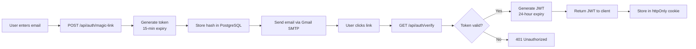
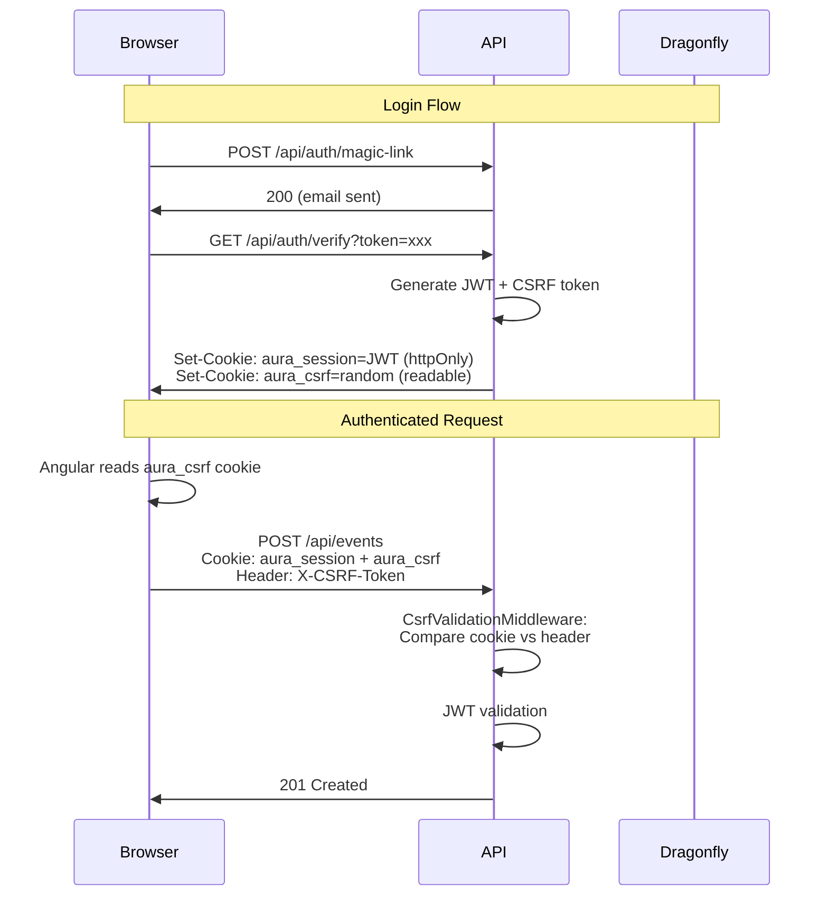
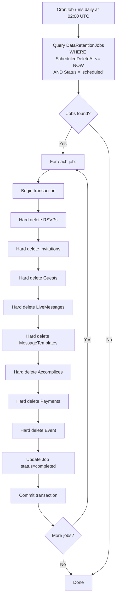

# 2.5. Seguridad

## Arquitectura de Autenticación

Aura Planning utiliza **autenticación passwordless** mediante magic links con tokens JWT, eliminando la superficie de ataque asociada a contraseñas.



### Especificación de Tokens

| Token Type | Expiry | Propósito | Storage | Hash |
|-----------|--------|-----------|---------|------|
| **Magic Link Token** | 15 minutos | Autenticación one-time | PostgreSQL (hashed con SHA-256) | Sí |
| **Session JWT** | 24 horas | Autenticación API | httpOnly, Secure, SameSite=Strict cookie | N/A |
| **Invitation Token** | Until event + 30 días | Guest RSVP access | PostgreSQL (hashed) | Sí |
| **Accomplice Token** | Until event + 1 día | Accomplice panel access | PostgreSQL (hashed) | Sí |

### JWT Claims

**Host JWT:**
```json
{
  "sub": "01J...",
  "email": "user@example.com",
  "role": "host",
  "eventId": "01J...",
  "iat": 1717830000,
  "exp": 1717916400
}
```

**Accomplice JWT:**
```json
{
  "sub": "01J...",
  "email": "bestman@example.com",
  "role": "accomplice",
  "eventId": "01J...",
  "permissions": ["send_messages", "view_rsvps"],
  "iat": 1717830000,
  "exp": 1717916400
}
```

### Gestión de Sesiones

| Aspecto | Implementación |
|---------|---------------|
| **Storage** | httpOnly, Secure, SameSite=Strict cookie |
| **Expiry** | 24 horas desde última actividad |
| **Refresh** | Silent refresh al 50% del expiry vía API call |
| **Revocation** | Token blacklist en Dragonfly (server-side) |
| **Single Session** | Nuevo login invalida sesión anterior (blacklist en Dragonfly) |
| **Inactive Timeout** | 30 minutos de inactividad requiere re-auth |

## Configuración de Autenticación JWT (Program.cs)

### JWT Bearer Authentication con Cookie Extraction

ASP.NET Core se configura para leer el JWT desde la cookie `aura_session` en lugar del header `Authorization`:

```csharp
// Program.cs
builder.Services.AddAuthentication(JwtBearerDefaults.AuthenticationScheme)
    .AddJwtBearer(options =>
    {
        options.TokenValidationParameters = new TokenValidationParameters
        {
            ValidateIssuer = true,
            ValidateAudience = true,
            ValidateLifetime = true,
            ValidateIssuerSigningKey = true,
            ValidIssuer = builder.Configuration["Jwt:Issuer"],
            ValidAudience = builder.Configuration["Jwt:Audience"],
            IssuerSigningKey = new SymmetricSecurityKey(
                Encoding.UTF8.GetBytes(builder.Configuration["Jwt:Key"]!)),
            ClockSkew = TimeSpan.Zero
        };

        // Extraer JWT de la cookie httpOnly en lugar del header Authorization
        options.Events = new JwtBearerEvents
        {
            OnMessageReceived = context =>
            {
                var token = context.Request.Cookies["aura_session"];
                if (!string.IsNullOrEmpty(token))
                {
                    context.Token = token;
                }
                return Task.CompletedTask;
            },
            OnTokenValidated = async context =>
            {
                // Verificar que el token no está en la blacklist (logout/revocación)
                var jwtString = context.SecurityToken as JwtSecurityToken;
                if (jwtString != null)
                {
                    var rawToken = context.Request.Cookies["aura_session"];
                    var tokenHash = Convert.ToBase64String(
                        SHA256.HashData(Encoding.UTF8.GetBytes(rawToken)));
                    var redis = context.HttpContext.RequestServices.GetRequiredService<IDatabase>();
                    if (await redis.KeyExistsAsync($"auth:blacklist:{tokenHash}"))
                    {
                        context.Fail("Token has been revoked");
                    }
                }
            }
        };
    });

builder.Services.AddAuthorization();
```

### Configuración de Cookies

**En AuthController después de generar JWT:**

```csharp
// Session cookie (httpOnly — no accesible por JavaScript)
var cookieOptions = new CookieOptions
{
    HttpOnly = true,
    Secure = !env.IsDevelopment(),
    SameSite = SameSiteMode.Strict,
    Expires = jwtExpiry,
    Path = "/"
};
response.Cookies.Append("aura_session", jwtToken, cookieOptions);

// CSRF token cookie (legible por JavaScript para Angular interceptor)
var csrfToken = Convert.ToBase64String(RandomNumberGenerator.GetBytes(32));
var csrfCookieOptions = new CookieOptions
{
    HttpOnly = false,
    Secure = !env.IsDevelopment(),
    SameSite = SameSiteMode.Strict,
    Expires = jwtExpiry,
    Path = "/"
};
response.Cookies.Append("aura_csrf", csrfToken, csrfCookieOptions);
```

## Protección CSRF (Double-Submit Cookie Pattern)

### Flujo Completo



### CsrfValidationMiddleware

```csharp
public class CsrfValidationMiddleware(RequestDelegate next)
{
    private static readonly HashSet<string> SafeMethods = ["GET", "HEAD", "OPTIONS"];

    public async Task InvokeAsync(HttpContext context)
    {
        if (!SafeMethods.Contains(context.Request.Method))
        {
            var cookieToken = context.Request.Cookies["aura_csrf"];
            var headerToken = context.Request.Headers["X-CSRF-Token"].ToString();

            if (string.IsNullOrEmpty(cookieToken) ||
                string.IsNullOrEmpty(headerToken) ||
                !CryptographicOperations.FixedTimeEquals(
                    Encoding.UTF8.GetBytes(cookieToken),
                    Encoding.UTF8.GetBytes(headerToken)))
            {
                context.Response.StatusCode = StatusCodes.Status403Forbidden;
                await context.Response.WriteAsJsonAsync(
                    new { error = "CSRF validation failed", code = "CSRF_INVALID" });
                return;
            }
        }
        await next(context);
    }
}
```

### Angular CSRF Interceptor

```typescript
// frontend/src/app/core/interceptors/csrf.interceptor.ts
import { HttpInterceptorFn } from '@angular/common/http';

const SAFE_METHODS = ['GET', 'HEAD', 'OPTIONS'];

function getCookie(name: string): string | null {
  const match = document.cookie.match(new RegExp(`(^| )${name}=([^;]+)`));
  return match?.[2] ?? null;
}

export const csrfInterceptor: HttpInterceptorFn = (req, next) => {
  if (!SAFE_METHODS.includes(req.method)) {
    const csrfToken = getCookie('aura_csrf');
    if (csrfToken) {
      req = req.clone({ setHeaders: { 'X-CSRF-Token': csrfToken } });
    }
  }
  return next(req);
};
```

## Orden del Middleware Pipeline

El orden es crítico. Cada middleware se ejecuta en secuencia:

```csharp
// Program.cs — orden exacto requerido
var app = builder.Build();

// 1. Exception Handling (primero para capturar todo)
app.UseMiddleware<ExceptionHandlingMiddleware>();

// 2. Security Headers (HSTS, CSP, X-Frame-Options)
app.UseMiddleware<SecurityHeadersMiddleware>();

// 3. Rate Limiting (Dragonfly-based, antes de CORS)
app.UseMiddleware<RateLimitingMiddleware>();

// 4. CORS (ASP.NET Core built-in)
app.UseCors("DefaultPolicy");

// 5. CSRF Validation (solo para métodos state-changing)
app.UseMiddleware<CsrfValidationMiddleware>();

// 6. Authentication (JWT from cookie)
app.UseAuthentication();

// 7. Authorization (policy-based)
app.UseAuthorization();

// 8. Routing
app.MapControllers();

app.Run();
```

| Orden | Middleware | Propósito | ¿Afecta públicos? |
|-------|-----------|-----------|-------------------|
| 1 | ExceptionHandling | Captura excepciones, mapea a HTTP status | Sí |
| 2 | SecurityHeaders | HSTS, CSP, X-Frame-Options | Sí |
| 3 | RateLimiting | 100 req/min por IP, 3 magic links/email/hora | Sí |
| 4 | CORS | Whitelist de orígenes permitidos | Sí (preflight) |
| 5 | CSRF Validation | Valida X-CSRF-Token en POST/PUT/PATCH/DELETE | No |
| 6 | Authentication | Extrae JWT de cookie, valida firma + expiración | No |
| 7 | Authorization | Evalúa políticas (EventOwner, etc.) | No |
| 8 | Routing | Dispatch al controller/endpoint | Sí |

## Silent Refresh Flow

### Endpoint: `POST /api/auth/refresh`

**Propósito:** Renovar el JWT antes de que expire sin requerir re-autenticación.

**Flujo:**
1. Frontend decodifica el JWT y extrae el `exp` claim
2. Al alcanzar el 50% del lifetime (12 horas), llama `POST /api/auth/refresh`
3. Backend valida que el JWT actual es válido (no expirado, no blacklisteado)
4. Backend genera nuevo JWT con fresh 24h expiry
5. Nuevo JWT + nuevo CSRF token se setean en cookies
6. Frontend continúa sin interrupción

**Implementación:**

```csharp
// AuthController.cs
[HttpPost("refresh")]
[Authorize]
public async Task<IActionResult> Refresh()
{
    var userId = User.FindFirstValue(ClaimTypes.NameIdentifier)!;
    var email = User.FindFirstValue(ClaimTypes.Email)!;
    var role = User.FindFirstValue("role")!;

    var newJwt = await _authService.GenerateJwtAsync(userId, email, role);
    var newCsrf = Convert.ToBase64String(RandomNumberGenerator.GetBytes(32));

    SetSessionCookie(newJwt);
    SetCsrfCookie(newCsrf);

    return Ok(new { refreshed = true });
}
```

## Token Blacklist (Logout / Revocación)

### Storage: Dragonfly (Redis-compatible)

**Key format:** `auth:blacklist:{jwt_hash}`
**TTL:** Tiempo restante hasta expiración natural del JWT (auto-cleanup)

| Operación | Comando Dragonfly | Descripción |
|-----------|-------------------|-------------|
| Blacklist on logout | `SET auth:blacklist:{hash} "1" EX {remaining_seconds}` | Marca token como revocado |
| Check on request | `EXISTS auth:blacklist:{hash}` | Verifica si token está revocado |
| Cleanup | Auto-expire via TTL | Entries se eliminan automáticamente |

**Implementación logout:**

```csharp
[HttpPost("logout")]
[Authorize]
public async Task<IActionResult> Logout()
{
    var token = HttpContext.Request.Cookies["aura_session"];
    if (!string.IsNullOrEmpty(token))
    {
        var tokenHash = Convert.ToBase64String(
            SHA256.HashData(Encoding.UTF8.GetBytes(token)));
        
        var jwt = new JwtSecurityTokenHandler().ReadJwtToken(token);
        var remaining = jwt.ValidTo - DateTime.UtcNow;
        if (remaining > TimeSpan.Zero)
        {
            await _db.StringSetAsync(
                $"auth:blacklist:{tokenHash}",
                "1",
                remaining);
        }
    }

    Response.Cookies.Delete("aura_session");
    Response.Cookies.Delete("aura_csrf");

    return Ok(new { loggedOut = true });
}
```

## Configuración de JWT Key

### appsettings.json

```json
{
  "Jwt": {
    "Key": "<256-bit base64 string, min 32 chars>",
    "Issuer": "aura.planning",
    "Audience": "aura.planning",
    "ExpiryMinutes": 1440
  }
}
```

### K8s override (environment variables)

```yaml
env:
  - name: Jwt__Key
    valueFrom:
      secretKeyRef:
        name: aura-secrets
        key: jwt-key
  - name: Jwt__Issuer
    value: "aura.planning"
  - name: Jwt__Audience
    value: "aura.planning"
  - name: Jwt__ExpiryMinutes
    value: "1440"
```

### Generación de JWT Key (producción)

```bash
openssl rand -base64 32
```

## Matriz Completa de Autenticación por Endpoint

| Endpoint Group | Path | Method | Auth | Policy | CSRF | Notes |
|---------------|------|--------|------|--------|------|-------|
| **Auth** | `/api/auth/magic-link` | POST | No | — | No | Anti-enumeración |
| **Auth** | `/api/auth/verify` | GET | No | — | No | Token en query param |
| **Auth** | `/api/auth/profile` | POST | Yes | JWT (any) | Yes | First-login only |
| **Auth** | `/api/auth/refresh` | POST | Yes | JWT (any) | Yes | Silent refresh |
| **Auth** | `/api/auth/logout` | POST | Yes | JWT (any) | Yes | Blacklists JWT |
| **Auth** | `/api/auth/me` | GET | Yes | JWT (any) | No | Current user info |
| **Events** | `POST /api/events` | POST | Yes | JWT (host) | Yes | Creates event |
| **Events** | `GET /api/events` | GET | Yes | JWT (host) | No | Lists user's events |
| **Events** | `GET /api/events/{slug}` | GET | Yes | EventOwner | No | Returns stats |
| **Events** | `PUT /api/events/{slug}` | PUT | Yes | EventOwner | Yes | Updates event |
| **Events** | `DELETE /api/events/{slug}` | DELETE | Yes | EventOwner | Yes | Soft delete |
| **Events** | `POST /api/events/{slug}/publish` | POST | Yes | EventOwner | Yes | Stripe checkout |
| **Events** | `GET /api/events/{slug}/dashboard` | GET | Yes | EventOwner | No | Real-time stats |
| **Events** | `GET /api/events/{slug}/guests/export` | GET | Yes | EventOwner | No | CSV download |
| **Events** | `POST /api/events/{slug}/guests/import` | POST | Yes | EventOwner | Yes | CSV import |
| **Events** | `GET /api/events/{slug}/guests` | GET | Yes | EventOwner | No | Guest list |
| **Templates** | `GET /api/templates` | GET | No | — | No | Public listing |
| **Accomplices** | `POST /api/accomplices/{slug}/grant` | POST | Yes | EventOwner | Yes | Grant access |
| **Accomplices** | `POST /api/accomplices/{slug}/revoke` | POST | Yes | EventOwner | Yes | Revoke access |
| **Accomplices** | `POST /api/accomplices/{slug}/resend` | POST | Yes | EventOwner | Yes | Resend magic link |
| **Accomplices** | `GET /api/accomplices/{slug}` | GET | Yes | EventOwner | No | List accomplices |
| **Accomplices** | `GET /api/accomplices/verify` | GET | No | — | No | Token en query param |
| **Accomplices** | `POST /api/accomplices/profile` | POST | Yes | JWT (accomplice) | Yes | First-login profile |
| **Live Messages** | `POST /api/live/{slug}/send` | POST | Yes | AccompliceScoped | Yes | Swipe-to-send |
| **Live Messages** | `GET /api/live/{slug}/history` | GET | Yes | AccompliceScoped | No | Message history |
| **RSVP** | `GET /api/rsvp/{token}` | GET | No | — | No | Token en path |
| **RSVP** | `POST /api/rsvp/{token}` | POST | No | — | No | Token en path, rate limited |
| **Payments** | `POST /api/payments/{slug}/create` | POST | Yes | EventOwner | Yes | Stripe checkout |
| **Payments** | `POST /api/payments/webhook` | POST | No | — | No | Stripe signature verification |
| **Webhooks** | `POST /api/webhooks/whatsapp` | POST | No | — | No | Meta signature verification |
| **Health** | `GET /health/live` | GET | No | — | No | K8s liveness probe |
| **Health** | `GET /health/ready` | GET | No | — | No | K8s readiness probe |

## Políticas de Autorización

| Política | Regla | Aplicado A |
|----------|-------|-----------|
| **EventOwner** | `User.Id == Event.UserId` | Todos los endpoints CRUD de eventos |
| **AccompliceScoped** | `Token.EventId` matches requested event | Endpoints de live messages |
| **PublishedEvent** | `Event.Status == 'published'` | Endpoints públicos de RSVP |
| **DraftGuestLimit** | Guest count <= 5 si draft | Endpoints de guest import |
| **ActiveAccomplice** | `Accomplice.IsActive && ExpiresAt > now` | Acceso al panel de accomplice |

### Implementación (.NET Policy-Based Authorization)

```csharp
// Program.cs
builder.Services.AddAuthorization(options =>
{
    options.AddPolicy("EventOwner", policy =>
        policy.RequireAssertion(context =>
        {
            var userId = context.User.FindFirstValue(ClaimTypes.NameIdentifier);
            var role = context.User.FindFirstValue("role");
            return role == "host";
        }));
    
    options.AddPolicy("AccompliceScoped", policy =>
        policy.RequireAssertion(context =>
        {
            var role = context.User.FindFirstValue("role");
            var eventId = context.User.FindFirstValue("eventId");
            return role == "accomplice" && !string.IsNullOrEmpty(eventId);
        }));
    
    options.AddPolicy("PublishedEvent", policy =>
        policy.RequireAssertion(context => true)); // Verified at service layer
    
    options.AddPolicy("DraftGuestLimit", policy =>
        policy.RequireAssertion(context => true)); // Verified at service layer
    
    options.AddPolicy("ActiveAccomplice", policy =>
        policy.RequireAssertion(context =>
        {
            var role = context.User.FindFirstValue("role");
            return role == "accomplice";
        }));
});
```

## Rate Limiting

| Endpoint | Límite | Ventana | Acción al Exceder |
|----------|--------|---------|-------------------|
| Magic link requests | 3 | Por email, 1 hora | 429 + `Retry-After` header |
| All API endpoints | 100 | Por IP, 1 minuto | 429 + `Retry-After` header |
| RSVP submissions | 5 | Por token, 1 hora | 429 (prevent spam) |
| Live message sends | 20 | Por accomplice, 1 hora | 429 (prevent abuse) |
| Guest import | 3 | Por evento, 1 hora | 429 |

### Implementación con Dragonfly

```csharp
// Dragonfly-based distributed rate limiting
public class DragonflyRateLimiter
{
    private readonly IDatabase _redis;
    
    public async Task<bool> IsAllowedAsync(string key, int limit, TimeSpan window)
    {
        var count = await _redis.StringIncrementAsync(key);
        if (count == 1)
        {
            await _redis.KeyExpireAsync(key, window);
        }
        return count <= limit;
    }
}
```

## Manejo de PII (Información Personal Identificable)

| Tipo de Dato | Encriptación | Retención | Acceso |
|-------------|-------------|-----------|--------|
| Email addresses | Application-level AES-256 | 30 días post-evento | Solo owner del evento |
| Phone numbers | Application-level AES-256 | 30 días post-evento | Solo owner del evento |
| Dietary restrictions | Application-level AES-256 | 30 días post-evento | Solo owner del evento |
| RSVP messages | Application-level AES-256 | 30 días post-evento | Solo owner del evento |
| Payment data | No almacenado (solo Stripe) | N/A | N/A |

### Enfoque de Encriptación

**MVP:** Application-level encryption con EF Core Value Converters

```csharp
// Example: Encrypted property configuration
modelBuilder.Entity<Guest>()
    .Property(g => g.Email)
    .HasConversion(
        v => AesEncryptor.Encrypt(v, encryptionKey),
        v => AesEncryptor.Decrypt(v, encryptionKey));
```

**Post-MVP:** PostgreSQL Transparent Data Encryption (TDE) o `pgcrypto` para encriptación a nivel de columna.

## Seguridad en Kubernetes

### K8s Secrets y ConfigMaps

| Tipo | Uso | Gestión |
|------|-----|---------|
| **Secrets** | DB credentials, JWT key, Gmail app password, Stripe keys, MinIO credentials | K8s Secrets (base64) → Sealed Secrets o SOPS para Git |
| **ConfigMaps** | appsettings overrides, feature flags, non-sensitive config | K8s ConfigMaps |

### Sealed Secrets (Bitnami)

```yaml
# Secrets cifrados que pueden almacenarse en Git
apiVersion: bitnami.com/v1alpha1
kind: SealedSecret
metadata:
  name: aura-secrets
  namespace: aura
spec:
  encryptedData:
    postgres-password: AgBy3i4OJSWK+PiTySYZZA...
    jwt-key: AgBx7j2MNSWK+PiTySYZZB...
    gmail-app-password: AgCz9k4ONSXK+PiTySYZZC...
    stripe-secret-key: AgDw1m6ONSYK+PiTySYZZD...
```

### NetworkPolicies

```yaml
# Solo API pods pueden acceder a PostgreSQL
apiVersion: networking.k8s.io/v1
kind: NetworkPolicy
metadata:
  name: postgres-network-policy
  namespace: aura
spec:
  podSelector:
    matchLabels:
      app.kubernetes.io/name: postgres
  ingress:
  - from:
    - podSelector:
        matchLabels:
          app.kubernetes.io/name: aura-api
    - podSelector:
        matchLabels:
          app.kubernetes.io/name: aura-worker-email
    - podSelector:
        matchLabels:
          app.kubernetes.io/name: aura-worker-whatsapp
    ports:
    - protocol: TCP
      port: 5432
```

```yaml
# Dragonfly: solo accesible desde API y workers
apiVersion: networking.k8s.io/v1
kind: NetworkPolicy
metadata:
  name: dragonfly-network-policy
  namespace: aura
spec:
  podSelector:
    matchLabels:
      app.kubernetes.io/name: dragonfly
  ingress:
  - from:
    - podSelector:
        matchLabels:
          app.kubernetes.io/component: api
    - podSelector:
        matchLabels:
          app.kubernetes.io/component: worker
    ports:
    - protocol: TCP
      port: 6379
```

### PodSecurityStandards

```yaml
# Restringir pods a non-root, read-only filesystem
apiVersion: v1
kind: Pod
metadata:
  name: aura-api
  namespace: aura
spec:
  securityContext:
    runAsNonRoot: true
    runAsUser: 1000
    fsGroup: 1000
    seccompProfile:
      type: RuntimeDefault
  containers:
  - name: api
    securityContext:
      allowPrivilegeEscalation: false
      readOnlyRootFilesystem: true
      capabilities:
        drop:
        - ALL
```

### RBAC (Role-Based Access Control)

```yaml
# ServiceAccount para API con permisos mínimos
apiVersion: v1
kind: ServiceAccount
metadata:
  name: aura-api
  namespace: aura

---
apiVersion: rbac.authorization.k8s.io/v1
kind: Role
metadata:
  name: aura-api-role
  namespace: aura
rules:
- apiGroups: [""]
  resources: ["configmaps", "secrets"]
  verbs: ["get", "list"]

---
apiVersion: rbac.authorization.k8s.io/v1
kind: RoleBinding
metadata:
  name: aura-api-binding
  namespace: aura
subjects:
- kind: ServiceAccount
  name: aura-api
roleRef:
  kind: Role
  name: aura-api-role
  apiGroup: rbac.authorization.k8s.io
```

## Cumplimiento GDPR

| Derecho | Implementación |
|---------|---------------|
| **Right to Access** | Exportar todos los datos de un usuario/evento vía endpoint API |
| **Right to Rectify** | Actualizar datos de guest/evento vía endpoints CRUD estándar |
| **Right to Erasure** | Endpoint de eliminación manual + eliminación automática a 30 días (CronJob) |
| **Right to Portability** | Export CSV de guest list y datos RSVP |
| **Consent** | Acceptance de términos trackeada con versión y timestamp |
| **Data Minimization** | Solo campos necesarios collectados (sin fotos en V1) |
| **Purpose Limitation** | Datos usados solo para gestión de eventos, no marketing |

## Eliminación Automática a 30 Días



### Orden de Eliminación (respetando foreign keys)

1. RSVPs (no dependents)
2. LiveMessages
3. MessageTemplates
4. Accomplices
5. Invitations
6. Guests
7. Payments
8. Events
9. DataRetentionJobs (self)

### Manejo de Fallos

- Si la eliminación falla: `status = 'failed'`, log reason, retry next day
- Alert admin si job falla 3 veces consecutivas
- Eliminaciones parciales se hacen rollback (transaccional)

## Seguridad de Infraestructura

| Medida | Implementación |
|--------|---------------|
| **CORS** | Whitelist: `aura.planning`, `*.aura.planning`, `localhost` (dev) |
| **CSRF** | Double-submit cookie pattern para state-changing endpoints |
| **Input Validation** | FluentValidation en todos los DTOs |
| **SQL Injection** | EF Core parameterized queries (no raw SQL) |
| **XSS** | Content Security Policy headers, output encoding |
| **TLS** | 1.3 para todas las conexiones, cert-manager (Let's Encrypt) |
| **Security Headers** | `X-Content-Type-Options`, `X-Frame-Options`, `Referrer-Policy`, HSTS |
| **API Key Rotation** | Rotación automatizada para keys de servicios externos |
| **Image Scanning** | Trivy en CI/CD pipeline para vulnerabilidades en Docker images |
| **Pod Security** | `runAsNonRoot`, `readOnlyRootFilesystem`, drop ALL capabilities |

### Security Headers (Middleware)

```csharp
app.Use(async (context, next) =>
{
    context.Response.Headers["X-Content-Type-Options"] = "nosniff";
    context.Response.Headers["X-Frame-Options"] = "DENY";
    context.Response.Headers["Referrer-Policy"] = "strict-origin-when-cross-origin";
    context.Response.Headers["Content-Security-Policy"] = "default-src 'self'; script-src 'self' 'unsafe-inline';";
    context.Response.Headers["Strict-Transport-Security"] = "max-age=31536000; includeSubDomains";
    await next();
});
```

## Hardening de APIs Externas

### Google Maps API Key Security
- Restricción por HTTP referrer (dominios de micrositios)
- Restricción por API (Maps JS, Geocoding only)
- Key separada para geocoding server-side (IP restriction)

### Stripe Webhook Verification
```csharp
var signatureHeader = Request.Headers["Stripe-Signature"];
var event = EventUtility.ConstructEvent(
    body, signatureHeader, _stripeOptions.WebhookSecret);
```

### Meta WhatsApp Webhook Verification
- Hub challenge verification on setup
- Signature validation on each webhook payload

### Gmail SMTP Security
- App Password (no contraseña principal de Google)
- TLS obligatorio (`EnableSsl = true`)
- Credenciales almacenadas en K8s Secrets
- Rate limiting a nivel de aplicación (max 100 emails/hora)

---

[← Anterior: Infraestructura y Despliegue](./04-infrastructure-deployment.md) | [Siguiente: Tests →](./06-testing.md)
