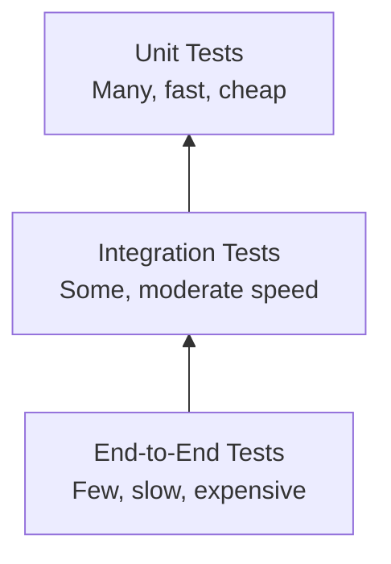

# 2.6. Tests

## Estrategia de Testing

Aura Planning sigue la **Testing Pyramid**, priorizando tests unitarios rápidos y aislados, complementados con tests de integración usando Testcontainers (PostgreSQL + Dragonfly) y un número limitado de tests end-to-end.



| Nivel | Cantidad | Velocidad | Cobertura | Herramientas |
|-------|----------|-----------|-----------|-------------|
| **Unit Tests** | ~80% de tests | Milisegundos | Lógica de negocio, servicios, validaciones | xUnit, NSubstitute, AwesomeAssertions |
| **Integration Tests** | ~15% de tests | Segundos | Repositorios (PostgreSQL real), Dragonfly queue, API endpoints | xUnit, WebApplicationFactory, Testcontainers |
| **End-to-End Tests** | ~5% de tests | Minutos | Flujos críticos completos (registro, RSVP, pago) | Playwright, Cypress |

## Tests Unitarios (Backend)

### Framework
- **xUnit** como test runner
- **NSubstitute** para substituir dependencias
- **AwesomeAssertions** para assertions legibles

### Qué se Testea

| Categoría | Ejemplos |
|-----------|----------|
| **Domain Entities** | Validación de propiedades, métodos de negocio |
| **Application Services** | Lógica de orquestación, reglas de negocio |
| **DTOs** | Validación con FluentValidation |
| **Utilities** | Slug generation, token generation, encryption |

### Ejemplo: Test de AuthService

```csharp
public class AuthServiceTests
{
    private readonly IUserRepository _userRepository = Substitute.For<IUserRepository>();
    private readonly IMagicLinkService _magicLinkService = Substitute.For<IMagicLinkService>();
    private readonly AuthService _sut;

    public AuthServiceTests()
    {
        _sut = new AuthService(_userRepository, _magicLinkService);
    }

    [Fact]
    public async Task RequestMagicLink_NewUser_CreatesUserAndSendsLink()
    {
        // Arrange
        var email = "newuser@example.com";
        _userRepository.GetByEmailAsync(email).Returns((User?)null);

        // Act
        var result = await _sut.RequestMagicLinkAsync(email);

        // Assert
        result.IsNewUser.Should().BeTrue();
        result.Message.Should().Be("Magic link sent. Check your email.");
        await _userRepository.Received(1).CreateAsync(Arg.Any<User>());
        await _magicLinkService.Received(1).SendMagicLinkAsync(email);
    }

    [Fact]
    public async Task RequestMagicLink_RateLimited_ThrowsException()
    {
        // Arrange
        var email = "user@example.com";
        _magicLinkService.IsRateLimited(email).Returns(true);

        // Act & Assert
        await Assert.ThrowsAsync<RateLimitExceededException>(
            () => _sut.RequestMagicLinkAsync(email));
    }
}
```

### Ejemplo: Test de Validación FluentValidation

```csharp
public class CreateEventRequestValidatorTests
{
    private readonly CreateEventRequestValidator _validator = new();

    [Fact]
    public async Task Validate_ValidRequest_NoErrors()
    {
        // Arrange
        var request = new CreateEventRequest
        {
            Name = "Sarah & Miguel's Wedding",
            EventDate = DateTime.UtcNow.AddMonths(3),
            Venue = "Hacienda El Roble",
            TemplateId = "01J..."
        };

        // Act
        var result = await _validator.ValidateAsync(request);

        // Assert
        result.IsValid.Should().BeTrue();
    }

    [Theory]
    [InlineData("")]
    [InlineData(" ")]
    [InlineData(null)]
    public async Task Validate_EmName_HasError(string? name)
    {
        // Arrange
        var request = new CreateEventRequest { Name = name! };

        // Act
        var result = await _validator.ValidateAsync(request);

        // Assert
        result.IsValid.Should().BeFalse();
        result.Errors.Should().Contain(e => e.PropertyName == "Name");
    }
}
```

### Ejemplo: Test de Queue Service (NSubstitute)

```csharp
public class LiveMessageServiceTests
{
    private readonly IQueueService _queue = Substitute.For<IQueueService>();
    private readonly ILiveMessageRepository _repo = Substitute.For<ILiveMessageRepository>();
    private readonly LiveMessageService _sut;

    public LiveMessageServiceTests()
    {
        _sut = new LiveMessageService(_queue, _repo);
    }

    [Fact]
    public async Task SendAsync_EnqueuesMessageAndSavesToDb()
    {
        // Arrange
        var message = new LiveMessage { EventId = "01J...", CustomMessage = "Test" };

        // Act
        await _sut.SendAsync(message);

        // Assert
        await _queue.Received(1).EnqueueAsync(QueueNames.WhatsApp, Arg.Any<string>());
        await _repo.Received(1).CreateAsync(Arg.Is<LiveMessage>(m => m.Status == "pending"));
    }
}
```

## Tests de Integración con Testcontainers

### Framework
- **xUnit** como test runner
- **Testcontainers** para PostgreSQL y Dragonfly reales en Docker
- **WebApplicationFactory<T>** para API in-memory con infraestructura real
- **NSubstitute** para servicios externos (Gmail SMTP, WhatsApp API, Stripe)
- **AwesomeAssertions** para assertions

### Qué se Testea

| Categoría | Ejemplos |
|-----------|----------|
| **Repository Implementations** | CRUD operations, query filters, soft delete (PostgreSQL real) |
| **API Endpoints** | Request/response, status codes, validation errors |
| **Queue Operations** | Enqueue/dequeue con Dragonfly real |
| **Service Integrations** | Email dispatch, WhatsApp dispatch (con NSubstitute para HTTP) |

### PostgreSQL Testcontainer

```csharp
public class GuestRepositoryTests : IAsyncLifetime
{
    private readonly PostgreSqlContainer _postgresContainer = 
        new PostgreSqlBuilder()
            .WithDatabase("aura_test")
            .WithUsername("postgres")
            .WithPassword("postgres")
            .Build();

    private ApplicationDbContext _context = null!;
    private GuestRepository _sut = null!;

    public async Task InitializeAsync()
    {
        await _postgresContainer.StartAsync();
        
        var options = new DbContextOptionsBuilder<ApplicationDbContext>()
            .UseNpgsql(_postgresContainer.GetConnectionString())
            .Options;

        _context = new ApplicationDbContext(options);
        await _context.Database.MigrateAsync();
        _sut = new GuestRepository(_context);
    }

    [Fact]
    public async Task GetByEventIdAsync_ReturnsOnlyNonDeletedGuests()
    {
        // Arrange
        var eventId = "01J...";
        _context.Guests.AddRange(
            new Guest { Id = "1", EventId = eventId, Name = "Active", IsDeleted = false },
            new Guest { Id = "2", EventId = eventId, Name = "Deleted", IsDeleted = true });
        await _context.SaveChangesAsync();

        // Act
        var guests = await _sut.GetByEventIdAsync(eventId);

        // Assert
        guests.Should().HaveCount(1);
        guests.First().Name.Should().Be("Active");
    }

    public async Task DisposeAsync()
    {
        await _postgresContainer.DisposeAsync();
    }
}
```

### Dragonfly Testcontainer

```csharp
public class DragonflyQueueServiceTests : IAsyncLifetime
{
    private readonly RedisContainer _dragonflyContainer =
        new RedisBuilder()
            .WithImage("docker.dragonflydb.io/dragonflydb/dragonfly:v1.25.0")
            .Build();

    private IDatabase _db = null!;
    private DragonflyQueueService _sut = null!;

    public async Task InitializeAsync()
    {
        await _dragonflyContainer.StartAsync();
        
        var connection = await ConnectionMultiplexer.ConnectAsync(
            _dragonflyContainer.GetConnectionString());
        _db = connection.GetDatabase();
        _sut = new DragonflyQueueService(_db);
    }

    [Fact]
    public async Task EnqueueAndDequeue_RoundTrip_Success()
    {
        // Arrange
        var queueName = "test:queue";
        var message = "{\"eventId\":\"01J...\",\"type\":\"test\"}";

        // Act
        await _sut.EnqueueAsync(queueName, message);
        var result = await _sut.DequeueAsync(queueName);

        // Assert
        result.Should().Be(message);
    }

    public async Task DisposeAsync()
    {
        await _dragonflyContainer.DisposeAsync();
    }
}
```

### API Integration Test con WebApplicationFactory

```csharp
public class EventsControllerTests : IClassFixture<WebApplicationFactory<Program>>
{
    private readonly WebApplicationFactory<Program> _factory;
    private readonly HttpClient _client;

    public EventsControllerTests(WebApplicationFactory<Program> factory)
    {
        _factory = factory.WithWebHostBuilder(builder =>
        {
            builder.ConfigureTestServices(services =>
            {
                // Replace external services with NSubstitute mocks
                var emailService = Substitute.For<IEmailService>();
                services.AddSingleton(emailService);
                
                var whatsappService = Substitute.For<IWhatsAppService>();
                services.AddSingleton(whatsappService);
            });
        });
        _client = _factory.CreateClient();
    }

    [Fact]
    public async Task PostEvent_ValidRequest_Returns201()
    {
        // Arrange
        var request = new CreateEventRequest
        {
            Name = "Test Event",
            EventDate = DateTime.UtcNow.AddMonths(3),
            TemplateId = "01J..."
        };
        var authHeader = GenerateAuthHeader("host");
        _client.DefaultRequestHeaders.Authorization = authHeader;

        // Act
        var response = await _client.PostAsJsonAsync("/api/events", request);

        // Assert
        response.StatusCode.Should().Be(HttpStatusCode.Created);
        var event = await response.Content.ReadFromJsonAsync<EventResponse>();
        event.Should().NotBeNull();
        event!.Slug.Should().NotBeNullOrEmpty();
        event.Status.Should().Be("draft");
    }

    [Fact]
    public async Task PostEvent_Unauthorized_Returns401()
    {
        // Arrange
        var request = new CreateEventRequest { Name = "Test" };

        // Act
        var response = await _client.PostAsJsonAsync("/api/events", request);

        // Assert
        response.StatusCode.Should().Be(HttpStatusCode.Unauthorized);
    }
}
```

## Tests de Frontend (Angular)

### Framework
- **Jasmine** como test runner
- **Karma** como test runner launcher
- **Angular Testing Library** o **TestBed** para component testing

### Qué se Testea

| Categoría | Ejemplos |
|-----------|----------|
| **Components** | Template rendering, user interactions, input/output |
| **Services** | HTTP calls (mocked), state management |
| **Guards** | Route protection logic |
| **Pipes** | Data transformation |

### Ejemplo: Test de Componente

```typescript
describe('GuestTableComponent', () => {
  let component: GuestTableComponent;
  let fixture: ComponentFixture<GuestTableComponent>;

  beforeEach(async () => {
    await TestBed.configureTestingModule({
      imports: [GuestTableComponent],
      providers: [
        { provide: GuestService, useValue: mockGuestService }
      ]
    }).compileComponents();

    fixture = TestBed.createComponent(GuestTableComponent);
    component = fixture.componentInstance;
  });

  it('should display guest list', () => {
    // Arrange
    mockGuestService.getGuests.and.returnValue(of(mockGuests));

    // Act
    fixture.detectChanges();

    // Assert
    const rows = fixture.nativeElement.querySelectorAll('tr.guest-row');
    expect(rows.length).toBe(mockGuests.length);
  });

  it('should filter guests by category', () => {
    // Arrange
    component.guests = mockGuests;

    // Act
    component.filterByCategory('family');
    fixture.detectChanges();

    // Assert
    const rows = fixture.nativeElement.querySelectorAll('tr.guest-row');
    expect(rows.length).toBe(2); // Only family guests
  });
});
```

### Ejemplo: Test de Servicio

```typescript
describe('EventService', () => {
  let service: EventService;
  let httpMock: HttpTestingController;

  beforeEach(() => {
    TestBed.configureTestingModule({
      providers: [EventService, provideHttpClientTesting()]
    });
    service = TestBed.inject(EventService);
    httpMock = TestBed.inject(HttpTestingController);
  });

  afterEach(() => {
    httpMock.verify();
  });

  it('should create event', () => {
    // Arrange
    const eventData = { name: 'Test Event', eventDate: '2026-09-15' };
    const mockResponse = { id: '01J...', slug: 'test-event', status: 'draft' };

    // Act
    service.createEvent(eventData).subscribe(response => {
      expect(response).toEqual(mockResponse);
    });

    // Assert
    const req = httpMock.expectOne('/api/events');
    expect(req.request.method).toBe('POST');
    expect(req.request.body).toEqual(eventData);
    req.flush(mockResponse);
  });
});
```

## Tests End-to-End (Playwright)

### Framework
- **Playwright** para browser automation
- Tests ejecutados en CI/CD pipeline

### Flujos Críticos Testeados

| Flujo | Descripción |
|-------|-------------|
| **Registration Flow** | Enter email → Receive magic link → Click → Profile setup → Dashboard |
| **RSVP Flow** | Open invitation link → Fill form → Submit → Confirmation |
| **Payment Flow** | Click publish → Stripe checkout → Payment success → Event published |

### Ejemplo: Test E2E de RSVP

```typescript
test('guest can submit RSVP', async ({ page }) => {
  // Navigate to RSVP page
  await page.goto('/api/rsvp/valid-token-123');
  
  // Fill form
  await page.getByLabel('Will you attend?').check({ label: 'Yes' });
  await page.getByLabel('Dietary restrictions').fill('Vegetarian');
  await page.getByLabel('Needs transportation').check();
  
  // Submit
  await page.getByRole('button', { name: 'Submit RSVP' }).click();
  
  // Verify confirmation
  await expect(page.getByText('Thank you! Your RSVP has been recorded.')).toBeVisible();
});
```

## Cobertura de Tests

### Métricas Objetivo

| Métrica | Objetivo | Actual |
|---------|----------|--------|
| **Code Coverage (Core)** | > 80% | TBD |
| **Code Coverage (Infrastructure)** | > 60% | TBD |
| **Code Coverage (Api)** | > 50% | TBD |
| **Code Coverage (Frontend)** | > 70% | TBD |
| **Critical Path Coverage** | 100% | TBD |

### Critical Paths (100% coverage requerida)

1. Magic link generation and verification
2. RSVP submission and validation
3. Payment processing and webhook handling
4. Data retention job execution
5. WhatsApp message dispatch with retry logic
6. Queue enqueue/dequeue operations (Dragonfly)

## Ejecución de Tests

### Local

```bash
# Backend unit tests
dotnet test backend/AuraPlanning.sln

# Backend integration tests (requires container runtime for Testcontainers)
dotnet test backend/AuraPlanning.sln --filter "Category=Integration"

# Backend tests con coverage
dotnet test backend/AuraPlanning.sln --collect:"XPlat Code Coverage"

# Frontend tests
cd frontend && npm test

# Frontend tests (watch mode)
cd frontend && npm test -- --watch
```

### CI/CD

```yaml
# .github/workflows/build-and-test.yml
- name: Run Backend Unit Tests
  run: dotnet test backend/AuraPlanning.sln --no-build --filter "Category!=Integration"

- name: Run Backend Integration Tests
  run: dotnet test backend/AuraPlanning.sln --no-build --filter "Category=Integration"
  env:
    TESTCONTAINERS_RYUK_DISABLED: true

- name: Run Frontend Tests
  run: cd frontend && npm test -- --watch=false --browsers=ChromeHeadless

- name: Upload Coverage
  uses: codecov/codecov-action@v3
  with:
    files: ./backend/TestResults/coverage.xml,./frontend/coverage/lcov.info
```

---

[← Anterior: Seguridad](./05-security.md) | [← Volver a readme.md](../../readme.md)
