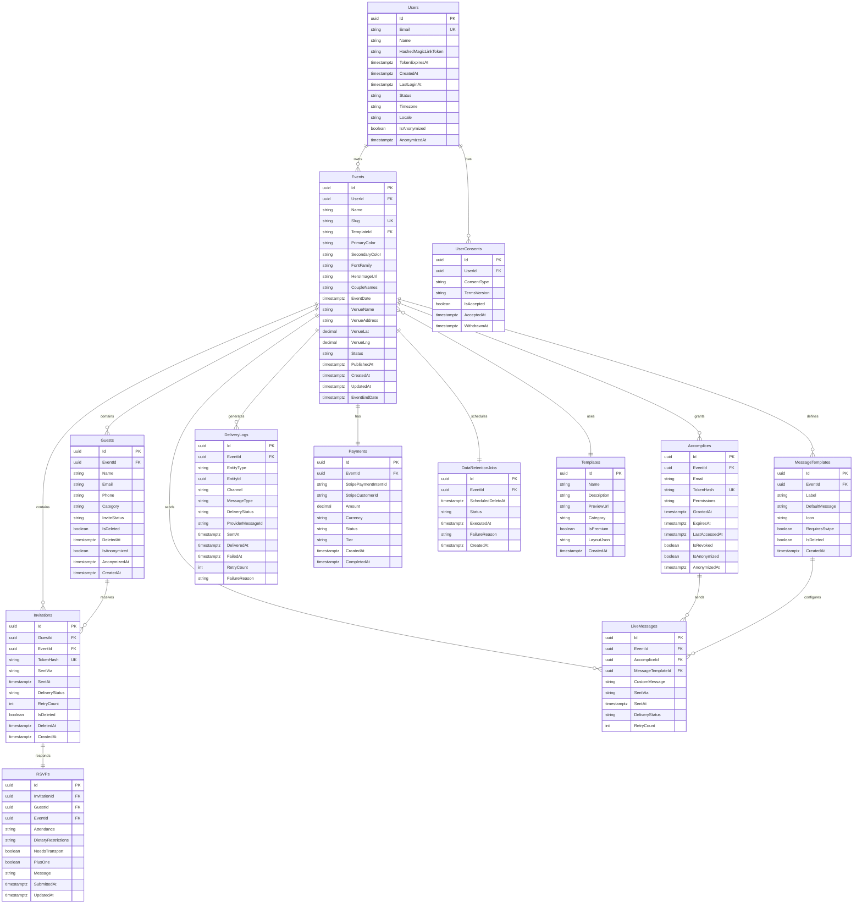
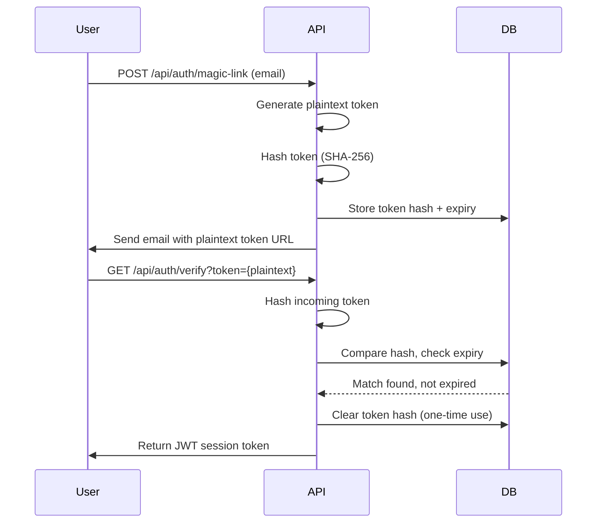

# 3. Data Model

> [Back to Architecture Index](../architecture/01-architecture-diagram.md) | [Next: Project Structure →](../architecture/03-project-structure.md)

---

## 3.1 Entity Relationship Diagram



## 3.2 Entity Definitions

### Users

| Column | Type | Nullable | Default | Constraints | GDPR |
|--------|------|----------|---------|-------------|------|
| Id | uuid | No | gen_random_uuid() | PK | Reference |
| Email | varchar(320) | No | — | UNIQUE, indexed | PII |
| Name | varchar(200) | No | — | — | PII |
| HashedMagicLinkToken | varchar(256) | Yes | NULL | — | Reference |
| TokenExpiresAt | timestamptz | Yes | NULL | — | Reference |
| CreatedAt | timestamptz | No | NOW() | — | Audit |
| LastLoginAt | timestamptz | Yes | NULL | — | Audit |
| Status | varchar(20) | No | 'pending' | CHECK IN ('pending','active','suspended','anonymized') | Reference |
| Timezone | varchar(64) | No | 'Europe/Madrid' | — | Reference |
| Locale | varchar(10) | No | 'es-ES' | — | Reference |
| IsAnonymized | boolean | No | false | — | Reference |
| AnonymizedAt | timestamptz | Yes | NULL | — | Audit |

### UserConsents

| Column | Type | Nullable | Default | Constraints | GDPR |
|--------|------|----------|---------|-------------|------|
| Id | uuid | No | gen_random_uuid() | PK | Reference |
| UserId | uuid | No | — | FK → Users(Id), indexed | Reference |
| ConsentType | varchar(50) | No | — | CHECK IN ('terms','marketing','data_processing') | Reference |
| TermsVersion | varchar(20) | No | — | — | Audit |
| IsAccepted | boolean | No | false | — | Reference |
| AcceptedAt | timestamptz | No | NOW() | — | Audit |
| WithdrawnAt | timestamptz | Yes | NULL | — | Audit |

### Events

| Column | Type | Nullable | Default | Constraints | GDPR |
|--------|------|----------|---------|-------------|------|
| Id | uuid | No | gen_random_uuid() | PK | Reference |
| UserId | uuid | No | — | FK → Users(Id), indexed | Reference |
| Name | varchar(200) | No | — | — | PII |
| Slug | varchar(200) | No | — | UNIQUE, indexed | Reference |
| TemplateId | uuid | Yes | NULL | FK → Templates(Id) | Reference |
| PrimaryColor | varchar(7) | No | '#4F46E5' | — | Reference |
| SecondaryColor | varchar(7) | No | '#7C3AED' | — | Reference |
| FontFamily | varchar(100) | No | 'Inter' | — | Reference |
| HeroImageUrl | varchar(500) | Yes | NULL | — | Reference |
| CoupleNames | varchar(200) | No | — | — | PII |
| EventDate | timestamptz | No | — | — | Reference |
| VenueName | varchar(200) | No | — | — | PII |
| VenueAddress | varchar(500) | No | — | — | PII |
| VenueLat | decimal(9,6) | Yes | NULL | — | Reference |
| VenueLng | decimal(9,6) | Yes | NULL | — | Reference |
| Status | varchar(20) | No | 'draft' | CHECK IN ('draft','published','completed','archived') | Reference |
| PublishedAt | timestamptz | Yes | NULL | — | Audit |
| CreatedAt | timestamptz | No | NOW() | — | Audit |
| UpdatedAt | timestamptz | No | NOW() | — | Audit |
| EventEndDate | timestamptz | No | EventDate + 1 day | Generated column | Reference |

### Templates

| Column | Type | Nullable | Default | Constraints | GDPR |
|--------|------|----------|---------|-------------|------|
| Id | uuid | No | gen_random_uuid() | PK | Reference |
| Name | varchar(100) | No | — | — | Reference |
| Description | text | Yes | NULL | — | Reference |
| PreviewUrl | varchar(500) | No | — | — | Reference |
| Category | varchar(50) | No | 'wedding' | indexed | Reference |
| IsPremium | boolean | No | false | — | Reference |
| LayoutJson | jsonb | No | '{}' | — | Reference |
| CreatedAt | timestamptz | No | NOW() | — | Audit |

### Guests

| Column | Type | Nullable | Default | Constraints | GDPR |
|--------|------|----------|---------|-------------|------|
| Id | uuid | No | gen_random_uuid() | PK | Reference |
| EventId | uuid | No | — | FK → Events(Id), indexed | Reference |
| Name | varchar(200) | No | — | — | PII |
| Email | varchar(320) | Yes | NULL | — | PII |
| Phone | varchar(30) | Yes | NULL | — | PII |
| Category | varchar(30) | No | 'other' | CHECK IN ('family','friends','colleagues','other') | Reference |
| InviteStatus | varchar(20) | No | 'pending' | CHECK IN ('pending','sent','delivered','opened','failed','bounced') | Audit |
| IsDeleted | boolean | No | false | — | Reference |
| DeletedAt | timestamptz | Yes | NULL | — | Audit |
| IsAnonymized | boolean | No | false | — | Reference |
| AnonymizedAt | timestamptz | Yes | NULL | — | Audit |
| CreatedAt | timestamptz | No | NOW() | — | Audit |

### Invitations

| Column | Type | Nullable | Default | Constraints | GDPR |
|--------|------|----------|---------|-------------|------|
| Id | uuid | No | gen_random_uuid() | PK | Reference |
| GuestId | uuid | No | — | FK → Guests(Id), indexed | Reference |
| EventId | uuid | No | — | FK → Events(Id), indexed | Reference |
| TokenHash | varchar(256) | No | — | UNIQUE, indexed | Reference |
| SentVia | varchar(20) | Yes | NULL | CHECK IN ('email','whatsapp','both') | Audit |
| SentAt | timestamptz | Yes | NULL | — | Audit |
| DeliveryStatus | varchar(20) | No | 'pending' | CHECK IN ('pending','sent','delivered','failed','bounced') | Audit |
| RetryCount | int | No | 0 | DEFAULT 0 | Audit |
| IsDeleted | boolean | No | false | — | Reference |
| DeletedAt | timestamptz | Yes | NULL | — | Audit |
| CreatedAt | timestamptz | No | NOW() | — | Audit |

### RSVPs

| Column | Type | Nullable | Default | Constraints | GDPR |
|--------|------|----------|---------|-------------|------|
| Id | uuid | No | gen_random_uuid() | PK | Reference |
| InvitationId | uuid | No | — | FK → Invitations(Id), UNIQUE, indexed | Reference |
| GuestId | uuid | No | — | FK → Guests(Id), indexed | Reference |
| EventId | uuid | No | — | FK → Events(Id), indexed | Reference |
| Attendance | varchar(10) | No | — | CHECK IN ('yes','no','maybe') | Audit |
| DietaryRestrictions | text | Yes | NULL | — | PII |
| NeedsTransport | boolean | No | false | — | Audit |
| PlusOne | boolean | No | false | — | Audit |
| Message | text | Yes | NULL | — | PII |
| SubmittedAt | timestamptz | No | NOW() | — | Audit |
| UpdatedAt | timestamptz | No | NOW() | — | Audit |

### Accomplices

| Column | Type | Nullable | Default | Constraints | GDPR |
|--------|------|----------|---------|-------------|------|
| Id | uuid | No | gen_random_uuid() | PK | Reference |
| EventId | uuid | No | — | FK → Events(Id), indexed | Reference |
| Email | varchar(320) | No | — | — | PII |
| TokenHash | varchar(256) | No | — | UNIQUE, indexed | Reference |
| Permissions | jsonb | No | '["send_messages","view_rsvps"]' | — | Reference |
| GrantedAt | timestamptz | No | NOW() | — | Audit |
| ExpiresAt | timestamptz | No | — | — | Reference |
| LastAccessedAt | timestamptz | Yes | NULL | — | Audit |
| IsRevoked | boolean | No | false | — | Reference |
| IsAnonymized | boolean | No | false | — | Reference |
| AnonymizedAt | timestamptz | Yes | NULL | — | Audit |

### MessageTemplates

| Column | Type | Nullable | Default | Constraints | GDPR |
|--------|------|----------|---------|-------------|------|
| Id | uuid | No | gen_random_uuid() | PK | Reference |
| EventId | uuid | No | — | FK → Events(Id), indexed | Reference |
| Label | varchar(100) | No | — | — | Reference |
| DefaultMessage | text | No | — | — | PII |
| Icon | varchar(50) | No | — | — | Reference |
| RequiresSwipe | boolean | No | true | — | Reference |
| IsDeleted | boolean | No | false | — | Reference |
| CreatedAt | timestamptz | No | NOW() | — | Audit |

### LiveMessages

| Column | Type | Nullable | Default | Constraints | GDPR |
|--------|------|----------|---------|-------------|------|
| Id | uuid | No | gen_random_uuid() | PK | Reference |
| EventId | uuid | No | — | FK → Events(Id), indexed | Reference |
| AccompliceId | uuid | No | — | FK → Accomplices(Id), indexed | Reference |
| MessageTemplateId | uuid | No | — | FK → MessageTemplates(Id) | Reference |
| CustomMessage | text | Yes | NULL | — | PII |
| SentVia | varchar(20) | No | 'whatsapp' | CHECK IN ('email','whatsapp','both') | Audit |
| SentAt | timestamptz | No | NOW() | — | Audit |
| DeliveryStatus | varchar(20) | No | 'pending' | CHECK IN ('pending','queued','sent','delivered','failed') | Audit |
| RetryCount | int | No | 0 | DEFAULT 0 | Audit |

### Payments

| Column | Type | Nullable | Default | Constraints | GDPR |
|--------|------|----------|---------|-------------|------|
| Id | uuid | No | gen_random_uuid() | PK | Reference |
| EventId | uuid | No | — | FK → Events(Id), UNIQUE, indexed | Reference |
| StripePaymentIntentId | varchar(255) | Yes | NULL | UNIQUE | Reference |
| StripeCustomerId | varchar(255) | Yes | NULL | — | Reference |
| Amount | decimal(10,2) | No | — | CHECK > 0 | Audit |
| Currency | varchar(3) | No | 'EUR' | — | Reference |
| Status | varchar(20) | No | 'pending' | CHECK IN ('pending','succeeded','failed','refunded') | Audit |
| Tier | varchar(20) | No | — | CHECK IN ('standard','premium') | Reference |
| CreatedAt | timestamptz | No | NOW() | — | Audit |
| CompletedAt | timestamptz | Yes | NULL | — | Audit |

### DataRetentionJobs

| Column | Type | Nullable | Default | Constraints | GDPR |
|--------|------|----------|---------|-------------|------|
| Id | uuid | No | gen_random_uuid() | PK | Reference |
| EventId | uuid | No | — | FK → Events(Id), UNIQUE, indexed | Reference |
| ScheduledDeleteAt | timestamptz | No | — | — | Reference |
| Status | varchar(20) | No | 'scheduled' | CHECK IN ('scheduled','running','completed','failed') | Reference |
| ExecutedAt | timestamptz | Yes | NULL | — | Audit |
| FailureReason | text | Yes | NULL | — | Audit |
| CreatedAt | timestamptz | No | NOW() | — | Audit |

### DeliveryLogs

| Column | Type | Nullable | Default | Constraints | GDPR |
|--------|------|----------|---------|-------------|------|
| Id | uuid | No | gen_random_uuid() | PK | Reference |
| EventId | uuid | No | — | FK → Events(Id), indexed | Reference |
| EntityType | varchar(30) | No | — | CHECK IN ('invitation','live_message','reminder','thank_you','magic_link') | Reference |
| EntityId | uuid | No | — | — | Reference |
| Channel | varchar(20) | No | — | CHECK IN ('email','whatsapp') | Reference |
| MessageType | varchar(50) | No | — | — | Reference |
| DeliveryStatus | varchar(20) | No | 'pending' | CHECK IN ('pending','sent','delivered','opened','failed','bounced') | Audit |
| ProviderMessageId | varchar(255) | Yes | NULL | — | Reference |
| SentAt | timestamptz | Yes | NULL | — | Audit |
| DeliveredAt | timestamptz | Yes | NULL | — | Audit |
| FailedAt | timestamptz | Yes | NULL | — | Audit |
| RetryCount | int | No | 0 | DEFAULT 0 | Audit |
| FailureReason | text | Yes | NULL | — | Audit |

## 3.3 Key Relationships

| Parent | Child | Cardinality | Cascade Delete | Notes |
|--------|-------|-------------|----------------|-------|
| Users | Events | 1:N | No (orphan prevention) | User deletion triggers anonymization, not cascade |
| Users | UserConsents | 1:N | Yes | Consents deleted with user |
| Events | Guests | 1:N | Yes (soft) | Guests soft-deleted when event deleted |
| Events | Invitations | 1:N | Yes (soft) | Invitations soft-deleted when event deleted |
| Events | Accomplices | 1:N | Yes | Accomplices deleted when event deleted |
| Events | MessageTemplates | 1:N | Yes | Templates deleted when event deleted |
| Events | LiveMessages | 1:N | Yes | Messages deleted when event deleted |
| Events | Payments | 1:1 | No | Payment retained for audit after event deletion |
| Events | DataRetentionJobs | 1:1 | Yes | Job deleted after execution |
| Events | DeliveryLogs | 1:N | No | Logs retained for audit |
| Guests | Invitations | 1:N | Yes (soft) | Invitations soft-deleted when guest deleted |
| Invitations | RSVPs | 1:1 | Yes | RSVP deleted when invitation deleted |
| Accomplices | LiveMessages | 1:N | No | LiveMessages retained after accomplice anonymization |
| MessageTemplates | LiveMessages | 1:N | No | LiveMessages retained after template deletion |
| Templates | Events | 1:N | No | Template deletion does not affect events |

### Cascade Strategy

- **Hard cascade**: UserConsents (tied to user lifecycle)
- **Soft cascade**: Guests → Invitations → RSVPs (preserves audit trail until retention job)
- **No cascade**: Payments, DeliveryLogs, LiveMessages (retained for financial/operational audit)
- **Retention job cascade**: All event-scoped data hard-deleted 30 days after EventEndDate in FK-safe order

## 3.4 GDPR Strategy

### Classification Legend

| Classification | Definition | Erasure Action |
|----------------|------------|----------------|
| **PII** | Directly identifies a person (name, email, phone, dietary info, personal messages) | Anonymized or deleted on request |
| **Audit** | Business facts (timestamps, status, counts, delivery results, payment amounts) | Retained for audit, never contains personal data |
| **Reference** | Internal IDs, foreign keys, configuration, tokens | Retained for referential integrity |

### Erasure Request Flow

```mermaid
graph TD
    A[User/Guest requests erasure] --> B{Is User or Guest?}
    B -->|User| C[Anonymize Users table]
    B -->|Guest| D[Anonymize Guests table]
    C --> E[Hash Email → 'deleted-{ulid}@anonymous.invalid']
    C --> F[Set Name → '[Deleted User]']
    C --> G[Clear HashedMagicLinkToken]
    D --> H[Hash Email → 'deleted-{ulid}@anonymous.invalid']
    D --> I[Set Name → '[Deleted Guest]']
    D --> J[Clear Phone]
    E --> K[Set IsAnonymized = true, AnonymizedAt = NOW()]
    F --> K
    G --> K
    H --> L[Set IsAnonymized = true, AnonymizedAt = NOW()]
    I --> L
    J --> L
    K --> M[Audit log entry created]
    L --> M
    M --> N[RSVPs, Payments, DeliveryLogs retained with anonymized references]
```

### Per-Entity Erasure Actions

| Entity | PII Fields | Erasure Action | Audit Fields Retained |
|--------|-----------|----------------|----------------------|
| **Users** | Email, Name | Email → hashed anonymous, Name → '[Deleted User]', clear tokens | Id, CreatedAt, LastLoginAt, Status → 'anonymized', Timezone, Locale |
| **UserConsents** | None (all reference/audit) | WithdrawnAt set, no deletion | All fields retained for consent proof |
| **Events** | Name, CoupleNames, VenueName, VenueAddress | Name → '[Deleted Event]', CoupleNames → '[Redacted]', VenueName → '[Redacted]', VenueAddress → '[Redacted]' | Id, UserId, Slug, dates, Status, colors, TemplateId |
| **Guests** | Name, Email, Phone | Name → '[Deleted Guest]', Email → hashed anonymous, Phone → NULL | Id, EventId, Category, InviteStatus, CreatedAt, IsDeleted |
| **Invitations** | TokenHash (indirect PII) | TokenHash → re-hashed with random salt (invalidates link) | Id, GuestId, EventId, SentVia, SentAt, DeliveryStatus, RetryCount |
| **RSVPs** | DietaryRestrictions, Message | DietaryRestrictions → '[Redacted]', Message → '[Redacted]' | Id, InvitationId, GuestId, EventId, Attendance, NeedsTransport, PlusOne, timestamps |
| **Accomplices** | Email | Email → hashed anonymous, TokenHash → re-hashed | Id, EventId, Permissions, GrantedAt, ExpiresAt, IsRevoked |
| **MessageTemplates** | DefaultMessage | DefaultMessage → '[Redacted]' | Id, EventId, Label, Icon, RequiresSwipe |
| **LiveMessages** | CustomMessage | CustomMessage → '[Redacted]' | Id, EventId, AccompliceId, MessageTemplateId, SentVia, SentAt, DeliveryStatus |
| **Payments** | None (Stripe IDs are reference) | No action — no PII stored | All fields retained for financial audit |
| **DeliveryLogs** | None (no PII stored) | No action — audit-only table | All fields retained |
| **DataRetentionJobs** | None | No action | All fields retained |

### Audit Integrity Guarantees

1. **RSVP counts remain valid**: Attendance, NeedsTransport, PlusOne are audit fields — anonymizing guest PII does not change dashboard statistics
2. **Payment records immutable**: Payments table contains no PII (Stripe IDs are opaque references), retained indefinitely for financial compliance
3. **Delivery metrics preserved**: DeliveryLogs track channel performance without storing personal data
4. **Referential integrity maintained**: Foreign keys are Reference classification — they point to anonymized records, not broken references
5. **Consent proof retained**: UserConsents records are never deleted, only marked withdrawn, providing legal proof of consent history

### Automated Retention (30-Day Hard Delete)

All event data is hard-deleted 30 days after EventEndDate via `DataRetentionWorker`:

**Deletion order (FK-safe):**
1. RSVPs
2. LiveMessages
3. MessageTemplates
4. Accomplices
5. Invitations
6. Guests
7. Payments (retained — financial audit)
8. DeliveryLogs (retained — operational audit)
9. Events
10. DataRetentionJobs

**Exception**: Payments and DeliveryLogs are NOT deleted — they contain no PII and are required for financial/operational audit. If GDPR "right to erasure" is invoked before the 30-day window, the retention job handles full cleanup.

## 3.5 Soft Delete Pattern

### Entities Using Soft Delete

| Entity | Flag Column | Timestamp Column | Reason |
|--------|-------------|------------------|--------|
| **Guests** | IsDeleted | DeletedAt | Hosts delete guests to correct mistakes; data needed for audit until retention job |
| **Invitations** | IsDeleted | DeletedAt | Tied to guest lifecycle; invitation history needed for delivery metrics |
| **MessageTemplates** | IsDeleted | DeletedAt | Hosts may remove templates; sent LiveMessages must retain reference |

### EF Core Global Query Filters

```csharp
// ApplicationDbContext.cs
protected override void OnModelCreating(ModelBuilder modelBuilder)
{
    modelBuilder.Entity<Guest>()
        .HasQueryFilter(g => !g.IsDeleted);

    modelBuilder.Entity<Invitation>()
        .HasQueryFilter(i => !i.IsDeleted);

    modelBuilder.Entity<MessageTemplate>()
        .HasQueryFilter(m => !m.IsDeleted);
}
```

To include soft-deleted records (admin/audit queries):
```csharp
context.Guests.IgnoreQueryFilters().Where(g => g.EventId == eventId)
```

### Soft Delete Cascade Rules

| Parent Deleted | Child Action |
|----------------|-------------|
| Guest soft-deleted | Related Invitations soft-deleted automatically |
| Event soft-deleted (future V2) | All Guests, Invitations, Accomplices, MessageTemplates soft-deleted |
| Event hard-deleted (retention job) | All child entities hard-deleted in FK-safe order |

## 3.6 Token Security

### Token Types

| Token Type | Used By | Expiry | Storage | Validation |
|------------|---------|--------|---------|------------|
| **Magic Link Token** | Users (login), Accomplices (panel access) | 15 min (login), EventDate+1d (accomplice) | SHA-256 hash in `HashedMagicLinkToken` or `TokenHash` | Hash incoming token, compare to stored hash |
| **Invitation Token** | Guests (RSVP access) | Until RSVP deadline (7 days before event) | SHA-256 hash in `Invitations.TokenHash` | Hash incoming token, compare to stored hash |
| **Session JWT** | Authenticated users, accomplices | 24 hours | Not stored (stateless) | Signature verification + expiry check |

### Storage Strategy

**Never store plaintext tokens.** All tokens are:
1. Generated as cryptographically secure random strings (256-bit entropy)
2. Hashed with SHA-256 before storage
3. The plaintext token is only included in the URL sent to the user
4. On verification, the incoming token is hashed and compared to the stored hash

```csharp
// Token generation
var plaintextToken = Convert.ToBase64String(RandomNumberGenerator.GetBytes(32));
var tokenHash = Convert.ToBase64String(SHA256.HashData(Encoding.UTF8.GetBytes(plaintextToken)));

// Token verification
var incomingHash = Convert.ToBase64String(SHA256.HashData(Encoding.UTF8.GetBytes(incomingToken)));
var isValid = incomingHash == storedTokenHash;
```

### Token Lifecycle



### Security Measures

- **One-time use**: Token hash cleared after successful verification
- **Rate limiting**: 3 magic link requests per email per hour (tracked in Dragonfly)
- **Timing-safe comparison**: Use `CryptographicOperations.FixedTimeEquals` to prevent timing attacks
- **Anti-enumeration**: Same response for new and existing users (prevents email enumeration)
- **Token invalidation**: Requesting a new magic link invalidates all previous tokens for that user

## 3.7 Indexing Strategy

### Index Registry

| Index Name | Table | Columns | Type | Purpose | Query Pattern |
|------------|-------|---------|------|---------|---------------|
| `ix_users_email` | Users | Email | UNIQUE B-tree | Login lookup | `WHERE Email = @email` |
| `ix_users_token` | Users | HashedMagicLinkToken | B-tree (nullable) | Magic link verification | `WHERE HashedMagicLinkToken = @hash` |
| `ix_users_status` | Users | Status | B-tree | Filter active users | `WHERE Status = 'active'` |
| `ix_events_user` | Events | UserId | B-tree | User's events list | `WHERE UserId = @userId` |
| `ix_events_slug` | Events | Slug | UNIQUE B-tree | Public event lookup | `WHERE Slug = @slug` |
| `ix_events_status` | Events | Status | B-tree | Filter by status | `WHERE Status = 'published'` |
| `ix_events_date` | Events | EventDate | B-tree | Upcoming events, retention | `WHERE EventDate <= @date` |
| `ix_events_enddate` | Events | EventEndDate | B-tree | Retention job query | `WHERE EventEndDate + 30d <= NOW()` |
| `ix_guests_event` | Guests | EventId | B-tree | Event guest list | `WHERE EventId = @eventId AND IsDeleted = false` |
| `ix_guests_event_category` | Guests | EventId, Category | Composite B-tree | Filter by category | `WHERE EventId = @eventId AND Category = @cat` |
| `ix_guests_event_email` | Guests | EventId, Email | Composite B-tree | Duplicate check | `WHERE EventId = @eventId AND Email = @email` |
| `ix_guests_anonymized` | Guests | IsAnonymized | Partial (WHERE IsAnonymized = true) | GDPR audit queries | `WHERE IsAnonymized = true` |
| `ix_invitations_guest` | Invitations | GuestId | B-tree | Guest's invitations | `WHERE GuestId = @guestId` |
| `ix_invitations_event` | Invitations | EventId | B-tree | Event invitations | `WHERE EventId = @eventId` |
| `ix_invitations_token` | Invitations | TokenHash | UNIQUE B-tree | RSVP lookup | `WHERE TokenHash = @hash` |
| `ix_invitations_delivery` | Invitations | DeliveryStatus, SentVia | Composite B-tree | Delivery tracking | `WHERE DeliveryStatus = 'failed' AND SentVia = 'whatsapp'` |
| `ix_rsvp_invitation` | RSVPs | InvitationId | UNIQUE B-tree | RSVP per invitation | `WHERE InvitationId = @invitationId` |
| `ix_rsvp_event` | RSVPs | EventId | B-tree | Event RSVP stats | `WHERE EventId = @eventId` |
| `ix_rsvp_guest` | RSVPs | GuestId | B-tree | Guest's RSVP | `WHERE GuestId = @guestId` |
| `ix_rsvp_attendance` | RSVPs | EventId, Attendance | Composite B-tree | RSVP statistics | `WHERE EventId = @eventId GROUP BY Attendance` |
| `ix_accomplices_event` | Accomplices | EventId | B-tree | Event accomplices | `WHERE EventId = @eventId AND IsRevoked = false` |
| `ix_accomplices_token` | Accomplices | TokenHash | UNIQUE B-tree | Accomplice verification | `WHERE TokenHash = @hash` |
| `ix_accomplices_expires` | Accomplices | ExpiresAt | B-tree | Expired access cleanup | `WHERE ExpiresAt < NOW()` |
| `ix_msgtemplates_event` | MessageTemplates | EventId | B-tree | Event templates | `WHERE EventId = @eventId AND IsDeleted = false` |
| `ix_livemessages_event` | LiveMessages | EventId | B-tree | Event live messages | `WHERE EventId = @eventId` |
| `ix_livemessages_accomplice` | LiveMessages | AccompliceId | B-tree | Accomplice send history | `WHERE AccompliceId = @accompliceId` |
| `ix_payments_event` | Payments | EventId | UNIQUE B-tree | Event payment | `WHERE EventId = @eventId` |
| `ix_payments_stripe` | Payments | StripePaymentIntentId | UNIQUE B-tree | Webhook lookup | `WHERE StripePaymentIntentId = @intentId` |
| `ix_retention_scheduled` | DataRetentionJobs | ScheduledDeleteAt, Status | Composite B-tree | Retention job query | `WHERE ScheduledDeleteAt <= NOW() AND Status = 'scheduled'` |
| `ix_deliverylogs_event` | DeliveryLogs | EventId | B-tree | Event delivery metrics | `WHERE EventId = @eventId` |
| `ix_deliverylogs_entity` | DeliveryLogs | EntityType, EntityId | Composite B-tree | Entity delivery history | `WHERE EntityType = 'invitation' AND EntityId = @id` |
| `ix_deliverylogs_status` | DeliveryLogs | DeliveryStatus, Channel | Composite B-tree | Failed delivery retry | `WHERE DeliveryStatus = 'failed' AND Channel = 'whatsapp'` |
| `ix_consents_user` | UserConsents | UserId, ConsentType | Composite B-tree | User consent lookup | `WHERE UserId = @userId AND ConsentType = 'terms'` |

### Index Design Principles

1. **Foreign keys always indexed**: Every FK column has a B-tree index for JOIN performance
2. **Unique constraints create implicit indexes**: `Slug`, `TokenHash`, `StripePaymentIntentId` are UNIQUE
3. **Composite indexes follow query patterns**: Multi-column indexes match the most common WHERE clauses
4. **Partial indexes for soft deletes**: `WHERE IsDeleted = false` reduces index size for active record queries
5. **No over-indexing**: Each index serves a documented query pattern; no speculative indexes
6. **PostgreSQL-specific**: Use `timestamptz` for timezone-aware timestamps; `uuid` uses 16 bytes (efficient)

## 3.8 Migration Notes

### EF Core Migration Strategy

| Aspect | Approach |
|--------|----------|
| **Migration creation** | Manual review required — no automatic migrations in CI/CD |
| **Migration naming** | `YYYYMMDD_HHMM_DescriptiveName` (e.g., `20260101_1200_InitialSchema`) |
| **Reversibility** | All migrations must have working `Down()` methods |
| **Execution** | Run as InitContainer before API pod starts |
| **Environment sync** | Migrations tested on local → staging → production in order |

### Seed Data

| Table | Seed Content | Method |
|-------|-------------|--------|
| **Templates** | 3 preset wedding templates (Classic, Modern, Rustic) | EF Core `HasData()` with JSON layout |
| **Users** | None — no default users | — |
| **Events** | None — created by users | — |

Template seed data:
```csharp
modelBuilder.Entity<Template>().HasData(
    new Template {
        Id = Guid.Parse("..."),
        Name = "Classic Elegance",
        Description = "Timeless design with serif typography",
        Category = "wedding",
        IsPremium = false,
        LayoutJson = "{\"sections\":[\"hero\",\"details\",\"rsvp\"],\"colors\":{\"primary\":\"#4F46E5\",\"secondary\":\"#7C3AED\"},\"font\":\"Playfair Display\"}",
        PreviewUrl = "/templates/classic-preview.png",
        CreatedAt = new DateTime(2026, 1, 1)
    },
    // ... Modern, Rustic
);
```

### Computed Columns

| Column | Table | Expression | Notes |
|--------|-------|------------|-------|
| `EventEndDate` | Events | `EventDate + INTERVAL '1 day'` | Generated always as stored; used by retention job |

```csharp
entity.Property(e => e.EventEndDate)
    .HasComputedColumnSql("\"EventDate\" + INTERVAL '1 day'", stored: true);
```

### PostgreSQL-Specific Considerations

| Feature | Usage |
|---------|-------|
| **uuid-ossp extension** | `gen_random_uuid()` for PK generation (PostgreSQL 13+) |
| **jsonb** | `Permissions` (Accomplices), `LayoutJson` (Templates) — indexed with GIN if needed later |
| **timestamptz** | All timestamps — timezone-aware, stored as UTC |
| **CHECK constraints** | Status enums, category enums — enforced at DB level |
| **Partial indexes** | `WHERE IsDeleted = false` for soft-deleted tables |
| **Decimal precision** | `decimal(10,2)` for payments, `decimal(9,6)` for coordinates |

### Migration Order (Initial Schema)

1. Create extensions (`uuid-ossp`)
2. Create Templates table (seed 3 templates)
3. Create Users table
4. Create UserConsents table
5. Create Events table
6. Create Guests table
7. Create Invitations table
8. Create RSVPs table
9. Create Accomplices table
10. Create MessageTemplates table
11. Create LiveMessages table
12. Create Payments table
13. Create DataRetentionJobs table
14. Create DeliveryLogs table
15. Create all indexes
16. Create all foreign key constraints
17. Seed template data

### Future Migration Considerations

| Change | When | Notes |
|--------|------|-------|
| **GIN index on jsonb** | V2+ | If querying inside `Permissions` or `LayoutJson` becomes common |
| **Partitioning by EventDate** | V2+ | If Events table grows beyond 100K rows |
| **Read replicas** | V2+ | Separate read/write connections for dashboard vs. public RSVP |
| **Audit table** | V2+ | Separate `AuditLog` table for GDPR compliance proof |

---

> [Back to Architecture Index](../architecture/01-architecture-diagram.md) | [Next: Project Structure →](../architecture/03-project-structure.md)
