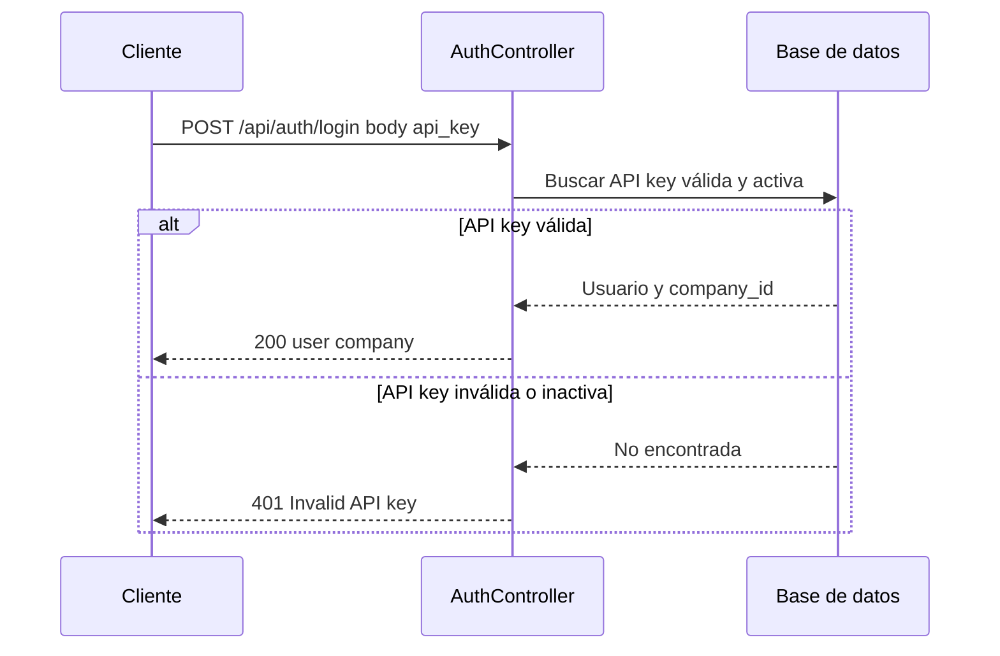

# T3 — API: Auth login y middleware API key

| Campo | Valor |
|-------|--------|
| **ID** | T3 |
| **Título** | API: Auth login y middleware API key |
| **Historia(s)** | [MH1](../historias-usuario/MH1.md) |
| **Área** | API |

## Descripción

Implementar el endpoint de login que valide la API key (o email/contraseña) y devuelva la información del usuario y la empresa. El middleware (T2) ya valida la key en rutas protegidas; aquí se expone el contrato HTTP: `POST /api/auth/login` y la respuesta que el frontend necesita para guardar sesión.

## Criterios de aceptación

- **AC1**: Existe `POST /api/auth/login` que acepta API key (o email/password) y devuelve respuesta JSON con datos de usuario/empresa necesarios para el frontend (sin exponer datos sensibles).
- **AC2**: Las API keys están almacenadas y asociadas a una empresa (tabla `api_keys` o equivalente); la validación comprueba que la key sea válida y esté activa.
- **AC3**: Tras validar la API key, el `company_id` está disponible para el resto de la app (middleware T2).
- **AC4**: Endpoints públicos (p. ej. `/api/health`, `/api/auth/login`, `/api/gas-stations/nearby`) no pasan por el middleware de API key.
- **AC5**: Documentación o OpenAPI actualizado con el contrato de login y el uso de Authorization header.

## Request / Response (ejemplo)

Especificación OpenAPI completa disponible en el repositorio del backend cuando se publique.

**POST** `/api/auth/login`

Request (body):

```json
{
  "api_key": "flk_xxxxxxxxxxxxxxxxxxxxxxxx"
}
```

Response **200** (éxito):

```json
{
  "user": {
    "id": 1,
    "name": "Juan Pérez",
    "email": "juan@empresa.com",
    "company_id": 1
  },
  "company": {
    "id": 1,
    "name": "Mi Empresa S.L."
  }
}
```

Response **401** (API key inválida o inactiva):

```json
{
  "message": "Invalid API key"
}
```

## Secuencia



## Notas técnicas

- Rutas en routes/api.php del backend: login fuera del grupo protegido por API key. Controlador: AuthController.

---

[Índice de tickets](../tickets.md)
