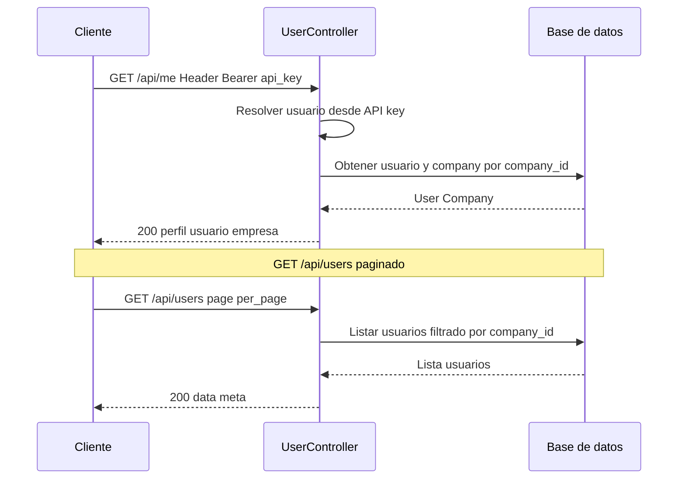

# T4 — API: CRUD usuarios (listar, perfil)

| Campo | Valor |
|-------|--------|
| **ID** | T4 |
| **Título** | API: CRUD usuarios (listar, perfil) |
| **Historia(s)** | [MH1](../historias-usuario/MH1.md) (login/perfil) |
| **Área** | API |

## Descripción

Exponer endpoints para gestionar usuarios desde la API: listar usuarios de la empresa (para administradores o para asignar repostajes/actividad) y obtener/actualizar el perfil del usuario actual. Sin este recurso, el frontend no puede mostrar datos de usuario ni gestionar quién ha creado cada registro. Los usuarios están asociados a una empresa (`company_id`); el listado debe filtrarse por empresa según la API key.

## Criterios de aceptación

- **AC1**: `GET /api/users` devuelve listado paginado de usuarios de la empresa (solo si la API key tiene permiso; p. ej. admin). Query params: `page`, `per_page`, opcional `search` por nombre/email.
- **AC2**: `GET /api/users/{id}` devuelve un usuario por ID solo si pertenece a la misma empresa que la API key; incluye nombre, email, rol (sin datos sensibles como password).
- **AC3**: `GET /api/me` o equivalente (perfil del usuario asociado a la API key) devuelve los datos del usuario actual y de la empresa para mostrar en la app (nombre, email, company_id, rol). Puede reutilizar la lógica del login.
- **AC4**: `PUT /api/users/{id}` (o `PATCH`) permite actualizar perfil (nombre, idioma, etc.) solo del usuario propio o con permisos de admin; validación de campos editables; nunca exponer ni actualizar password por este endpoint sin flujo específico.
- **AC5**: Creación/eliminación de usuarios (POST/DELETE) puede quedar restringida al panel Filament; si se exponen en API, solo para roles admin y con validación de empresa.
- **AC6**: Todas las respuestas filtradas por `company_id`; un usuario de una empresa no puede ver ni editar usuarios de otra.

## Request / Response (ejemplo)

Especificación completa: [api-spec.yml](../../flotiko_backend/ai-specs/specs/api-spec.yml).

**GET** `/api/me` (perfil del usuario asociado a la API key). Header: `Authorization: Bearer {api_key}`.

Response **200**:

```json
{
  "id": 1,
  "name": "Juan Pérez",
  "email": "juan@empresa.com",
  "company_id": 1,
  "company": {
    "id": 1,
    "name": "Mi Empresa S.L."
  }
}
```

**GET** `/api/users?page=1&per_page=15`

Response **200** (listado paginado):

```json
{
  "data": [
    {
      "id": 1,
      "name": "Juan Pérez",
      "email": "juan@empresa.com",
      "company_id": 1
    }
  ],
  "meta": {
    "current_page": 1,
    "per_page": 15,
    "total": 1
  }
}
```

**GET** `/api/users/999` (ID de otra empresa): Response **404**.

## Secuencia



## Notas técnicas

- Controlador: `UserController` o extender recurso de Auth (perfil en `AuthController`). Modelo: `User` con scope por empresa. Rutas en `api.php` dentro del grupo protegido. Políticas: solo ver/editar usuarios de la misma empresa.

---

[Índice de tickets](../tickets.md)
