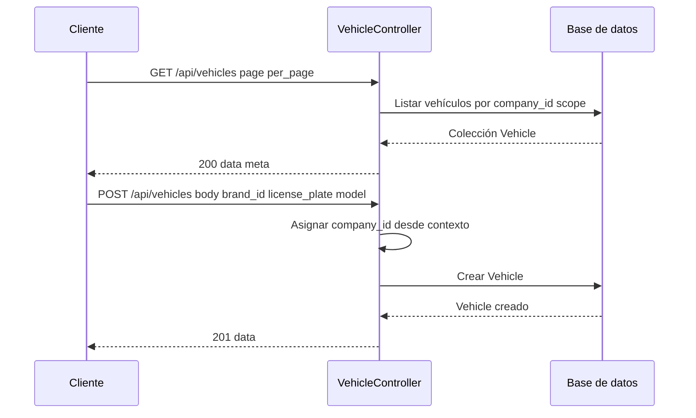

# T5 — API: CRUD vehículos y brands

| Campo | Valor |
|-------|--------|
| **ID** | T5 |
| **Título** | API: CRUD vehículos y brands |
| **Historia(s)** | [MH2](../historias-usuario/MH2.md) |
| **Área** | API |

## Descripción

Exponer endpoints REST para listar, crear, leer, actualizar y eliminar vehículos, y para listar marcas (brands) de la empresa. Los vehículos deben estar paginados y filtrables por marca y búsqueda (matrícula, modelo). Todos los datos deben estar filtrados por `company_id` según la API key.

## Criterios de aceptación

- **AC1**: `GET /api/vehicles` devuelve listado paginado de vehículos de la empresa; acepta query params `page`, `per_page`, `brand_id`, `search`.
- **AC2**: `GET /api/vehicles/{id}` devuelve un vehículo por ID solo si pertenece a la empresa; incluye relaciones útiles (brand, lastFuelRefill, etc.) si está definido en el recurso.
- **AC3**: `POST /api/vehicles` y `POST /api/vehicles/{id}` (update) crean/actualizan vehículo asignando `company_id` desde el contexto de la API key; validación de campos obligatorios (marca, matrícula, etc.).
- **AC4**: `DELETE /api/vehicles/{id}` elimina el vehículo solo si pertenece a la empresa; considerar política de borrado (soft delete o cascade según modelo).
- **AC5**: `GET /api/brands` devuelve las marcas de la empresa para rellenar desplegables en el frontend.
- **AC6**: Respuestas con formato consistente (ej. `{ "data": ... }`, códigos HTTP correctos, mensajes de error en JSON).

## Request / Response (ejemplo)

Especificación OpenAPI completa disponible en el repositorio del backend cuando se publique.

**GET** `/api/vehicles?page=1&per_page=10`

Response **200**:

```json
{
  "data": [
    {
      "id": 1,
      "brand_id": 1,
      "brand": { "id": 1, "name": "Toyota" },
      "license_plate": "1234 ABC",
      "model": "Corolla",
      "year": 2020,
      "current_kms": 45000,
      "fuel_type_id": 1
    }
  ],
  "meta": { "current_page": 1, "per_page": 10, "total": 1 }
}
```

**POST** `/api/vehicles` (crear vehículo). Header: `Authorization: Bearer {api_key}`.

Request (body):

```json
{
  "brand_id": 1,
  "license_plate": "5678 XYZ",
  "model": "Yaris",
  "year": 2022,
  "current_kms": 0,
  "fuel_type_id": 1
}
```

Response **201**:

```json
{
  "data": {
    "id": 2,
    "brand_id": 1,
    "license_plate": "5678 XYZ",
    "model": "Yaris",
    "year": 2022,
    "current_kms": 0,
    "company_id": 1
  }
}
```

**GET** `/api/vehicles/999` (ID inexistente o de otra empresa): Response **404**.

## Secuencia



## Notas técnicas

- Controladores: `VehicleController`, `BrandController`. Recursos: `VehicleResource`, etc. Rutas en `api.php`.

---

[Índice de tickets](../tickets.md)
