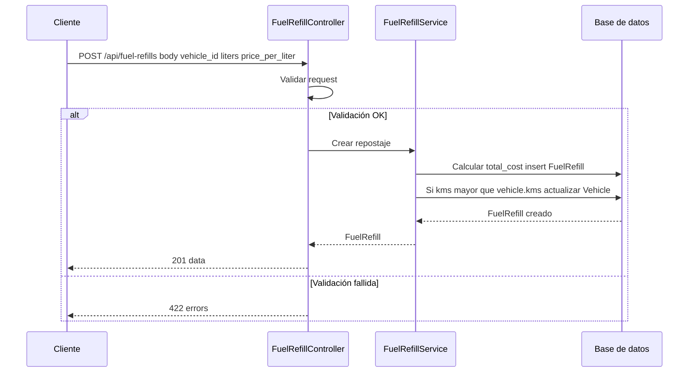

# T6 — API: CRUD fuel-refills y cálculo consumo

| Campo | Valor |
|-------|--------|
| **ID** | T6 |
| **Título** | API: CRUD fuel-refills y cálculo consumo |
| **Historia(s)** | [MH3](../historias-usuario/MH3.md) |
| **Área** | API |

## Descripción

Exponer CRUD de repostajes (fuel-refills) y garantizar que al crear un repostaje se calcule el coste total y se actualice el km del vehículo cuando corresponda. Exponer o usar en el informe la lógica de consumo (L/100 km) y coste por km (comparando con el repostaje anterior).

## Criterios de aceptación

- **AC1**: `GET /api/fuel-refills` lista repostajes de la empresa con paginación y filtro por `vehicle_id`.
- **AC2**: `POST /api/fuel-refills` crea repostaje con validación (vehicle_id, refill_date, liters, price_per_liter, fuel_type; kms opcional). Se asigna `company_id` y `created_by` desde el contexto.
- **AC3**: Al crear un repostaje, el backend calcula `total_cost` (liters * price_per_liter) si no se envía; si `kms` del repostaje es mayor que `vehicle.kms`, se actualiza `vehicle.kms`.
- **AC4**: `PUT /api/fuel-refills/{id}` y `DELETE /api/fuel-refills/{id}` permiten editar y eliminar solo repostajes de la empresa.
- **AC5**: La lógica de cálculo (total_cost, actualización de vehicle.kms) está en un servicio o en eventos del modelo (FuelRefillService / model events); hay tests unitarios que lo verifican.
- **AC6**: El consumo (L/100 km) y coste por km se calculan en backend y se usan en el endpoint de reporte del vehículo (T8).

## Request / Response (ejemplo)

Especificación OpenAPI completa disponible en el repositorio del backend cuando se publique.

**POST** `/api/fuel-refills` (crear repostaje). Header: `Authorization: Bearer {api_key}`.

Request (body):

```json
{
  "vehicle_id": 1,
  "refill_date": "2024-03-15",
  "liters": 45.5,
  "price_per_liter": 1.45,
  "fuel_type_id": 1,
  "kms": 45200,
  "gas_station_name": "Repsol A-2"
}
```

Response **201** (backend calcula `total_cost` si no se envía; puede actualizar `vehicle.kms`):

```json
{
  "data": {
    "id": 10,
    "vehicle_id": 1,
    "refill_date": "2024-03-15",
    "liters": 45.5,
    "price_per_liter": 1.45,
    "total_cost": 65.98,
    "kms": 45200,
    "company_id": 1,
    "created_by": 1
  }
}
```

Response **422** (validación, p. ej. `vehicle_id` obligatorio faltante):

```json
{
  "message": "The given data was invalid.",
  "errors": {
    "vehicle_id": ["The vehicle id field is required."]
  }
}
```

## Secuencia



## Notas técnicas

- Controlador: `FuelRefillController`. Servicio: `FuelRefillService`. Modelo: `FuelRefill` con eventos `creating`/`created`. Tests: `FuelRefillFeatureTest`, `FuelRefillServiceTest`.

---

[Índice de tickets](../tickets.md)
