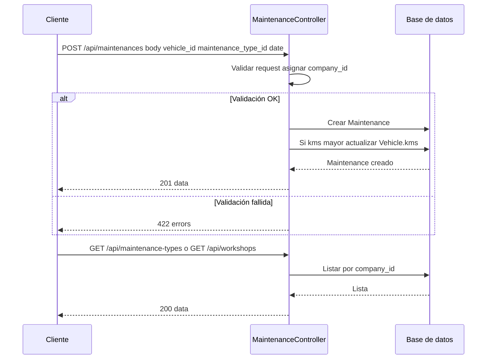

# T7 — API: CRUD maintenances, maintenance-types y workshops

| Campo | Valor |
|-------|--------|
| **ID** | T7 |
| **Título** | API: CRUD maintenances y maintenance-types, workshops |
| **Historia(s)** | [MH4](../historias-usuario/MH4.md) |
| **Área** | API |

## Descripción

Exponer CRUD de mantenimientos (maintenances), tipos de mantenimiento (maintenance-types) y talleres (workshops). Al crear un mantenimiento se debe asignar company_id y, si aplica, actualizar los km del vehículo. Los listados de tipos y talleres se usan en el frontend para rellenar formularios.

## Criterios de aceptación

- **AC1**: `GET /api/maintenance-types` y `GET /api/workshops` devuelven listas de la empresa para usar en desplegables.
- **AC2**: CRUD completo para maintenance-types y workshops (GET by id, POST, PUT, DELETE) con filtro por empresa.
- **AC3**: `GET /api/maintenances` lista mantenimientos con filtro por empresa y opcionalmente por `vehicle_id`; paginación.
- **AC4**: `POST /api/maintenances` crea mantenimiento con validación (vehicle_id, maintenance_type_id, date; workshop_id, kms, cost, next_maintenance_date/km opcionales). Se asigna company_id.
- **AC5**: Si el mantenimiento tiene `kms` mayor que el vehículo, se actualiza `vehicle.kms`. Reglas de negocio (completado, in_workshop) según modelo existente.
- **AC6**: PUT y DELETE de maintenances restringidos a registros de la empresa.

## Request / Response (ejemplo)

Especificación completa: [api-spec.yml](../../flotiko_backend/ai-specs/specs/api-spec.yml).

**POST** `/api/maintenances` (crear mantenimiento). Header: `Authorization: Bearer {api_key}`.

Request (body):

```json
{
  "vehicle_id": 1,
  "maintenance_type_id": 1,
  "date": "2024-03-10",
  "workshop_id": 2,
  "kms": 44000,
  "cost": 180.50,
  "notes": "Cambio de aceite y filtros"
}
```

Response **201**:

```json
{
  "data": {
    "id": 5,
    "vehicle_id": 1,
    "maintenance_type_id": 1,
    "date": "2024-03-10",
    "workshop_id": 2,
    "kms": 44000,
    "cost": 180.50,
    "company_id": 1
  }
}
```

**GET** `/api/maintenance-types` y **GET** `/api/workshops`: listas para desplegables (sin paginación o con paginación según implementación).

Response **422** si faltan campos obligatorios (p. ej. `vehicle_id`, `maintenance_type_id`, `date`).

## Secuencia



## Notas técnicas

- Controladores: `MaintenanceController`, `MaintenanceTypeController`, `WorkshopController`. Modelos: `Maintenance`, `MaintenanceType`, `Workshop`. Rutas en `api.php`.

---

[Índice de tickets](../tickets.md)
