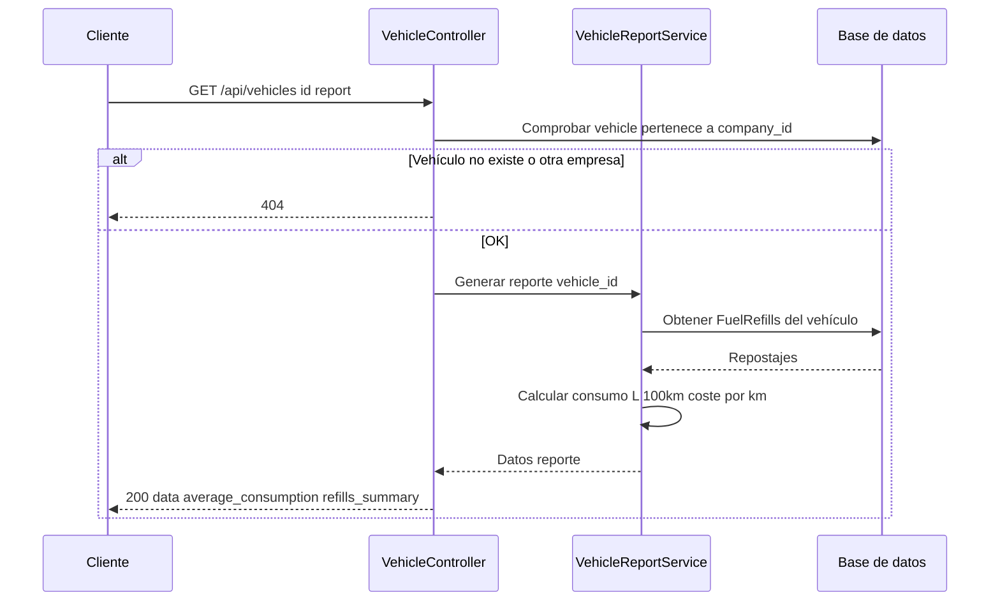

# T8 — API: Reporte vehículo (consumo, costes)

| Campo | Valor |
|-------|--------|
| **ID** | T8 |
| **Título** | API: Reporte vehículo (consumo, costes) |
| **Historia(s)** | [MH5](../historias-usuario/MH5.md) |
| **Área** | API |

## Descripción

Exponer un endpoint que devuelva los datos agregados del vehículo para la vista "Informe": consumo medio (L/100 km), coste por km, y opcionalmente desglose por repostajes o periodo. El cálculo debe basarse en los repostajes existentes (comparando repostaje N con N-1 para consumo y coste).

## Criterios de aceptación

- **AC1**: `GET /api/vehicles/{id}/report` devuelve un JSON con al menos: consumo medio (L/100 km), coste por km, y datos suficientes para que el frontend muestre el informe (lista de repostajes con consumo/coste por tramo si aplica).
- **AC2**: El vehículo debe pertenecer a la empresa del usuario; si no, 404.
- **AC3**: Los cálculos de consumo y coste por km se realizan en backend (VehicleReportService o equivalente) usando la lógica ya existente en FuelRefill (calculateConsumption, calculateCostPerKm).
- **AC4**: Si no hay repostajes suficientes (menos de 2 para consumo entre tramos), el endpoint indica valores nulos o mensaje claro para mostrar "N/A" en frontend.
- **AC5**: Respuesta documentada en OpenAPI o en el recurso VehicleReportResource.

## Request / Response (ejemplo)

Especificación OpenAPI completa disponible en el repositorio del backend cuando se publique.

**GET** `/api/vehicles/{id}/report` (informe del vehículo). Header: `Authorization: Bearer {api_key}`.

Response **200** (vehículo con repostajes suficientes):

```json
{
  "data": {
    "vehicle_id": 1,
    "average_consumption_l_per_100km": 6.2,
    "average_cost_per_km": 0.09,
    "refills_count": 12,
    "period": {
      "from": "2023-01-15",
      "to": "2024-03-15"
    },
    "refills_summary": [
      {
        "refill_date": "2024-03-15",
        "liters": 45.5,
        "consumption_l_per_100km": 6.1,
        "cost_per_km": 0.089
      }
    ]
  }
}
```

Response **200** (sin repostajes suficientes para consumo):

```json
{
  "data": {
    "vehicle_id": 1,
    "average_consumption_l_per_100km": null,
    "average_cost_per_km": null,
    "refills_count": 1,
    "message": "Insufficient refills to calculate consumption"
  }
}
```

**GET** `/api/vehicles/999/report` (ID inexistente o de otra empresa): Response **404**.

## Secuencia



## Notas técnicas

- Controlador: `VehicleController::report`. Servicio: `VehicleReportService`. Recurso: `VehicleReportResource`.

---

[Índice de tickets](../tickets.md)
