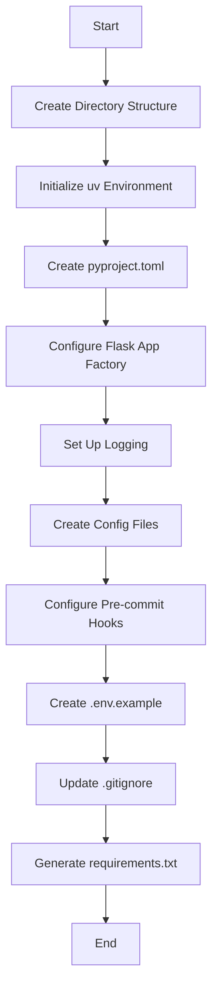

# US-001: Backend Project Setup and Configuration

## Description
As a **developer**, I want to set up the backend project structure with all necessary configurations, so that the development team can start implementing features with a consistent and well-organized codebase.

## Priority
🔴 **Critical** - Must be completed first as all other features depend on it.

## Difficulty
⭐⭐ Medium

## Acceptance Criteria
- [ ] Project directory structure follows IAM-gateway reference pattern
- [ ] Python virtual environment is configured using `uv` package manager
- [ ] `pyproject.toml` is created with all required dependencies and fixed versions
- [ ] `requirements.txt` is generated from `pyproject.toml`
- [ ] Environment variables are managed via `.env` file
- [ ] `.env.example` file is provided with all required variables
- [ ] `.gitignore` properly excludes sensitive files and directories
- [ ] Logging configuration is implemented with logs stored in `logs/` directory
- [ ] Flask application factory pattern is implemented in `core/__init__.py`
- [ ] Configuration files for different environments (dev, staging, production) are created
- [ ] Pre-commit hooks are configured in `.pre-commit-config.yaml`

## Technical Notes
- Use Flask 3.x for the web framework
- Use SQLModel for ORM (combines SQLAlchemy + Pydantic)
- Configure pybreaker for circuit breaker pattern
- Configure tenacity for retry logic
- Implement async support with aiohttp/httpx

## Dependencies
None - This is the foundational user story.

## Estimated Effort
8 hours

## Completion Status
- [ ] 0% - Not Started

## Workflow Diagram

## Related Tasks
- TASK-US-001-01-create-directory-structure.md
- TASK-US-001-02-configure-dependencies.md
- TASK-US-001-03-implement-flask-factory.md
- TASK-US-001-04-setup-logging.md
- TASK-US-001-05-create-config-files.md
- TASK-US-001-06-setup-precommit.md
