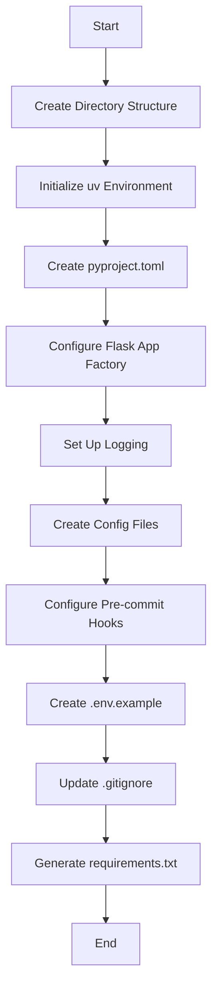

# US-001: Backend Project Setup and Configuration

[Trello Card](https://trello.com/c/AymPQTiG)

## Description
As a **developer**, I want to set up the backend project structure with all necessary configurations, so that the development team can start implementing features with a consistent and well-organized codebase.

## Priority
🔴 **Critical** - Must be completed first as all other features depend on it.

## Difficulty
⭐⭐ Medium

## Acceptance Criteria
- [x] Project directory structure follows IAM-gateway reference pattern
- [x] Python virtual environment is configured using `uv` package manager
- [x] `pyproject.toml` is created with all required dependencies and fixed versions
- [x] `requirements.txt` is generated from `pyproject.toml`
- [x] Environment variables are managed via `.env` file
- [x] `.env.example` file is provided with all required variables
- [x] `.gitignore` properly excludes sensitive files and directories
- [x] Logging configuration is implemented with logs stored in `logs/` directory
- [x] Flask application factory pattern is implemented in `core/__init__.py`
- [x] Configuration files for different environments (dev, staging, production) are created
- [x] Pre-commit hooks are configured in `.pre-commit-config.yaml`

## Technical Notes
- Use Flask 3.x for the web framework
- Use SQLModel for ORM (combines SQLAlchemy + Pydantic)
- Configure pybreaker for circuit breaker pattern
- Configure tenacity for retry logic
- Implement async support with aiohttp/httpx

## Dependencies
None - This is the foundational user story.

## Estimated Effort
8 hours

## Completion Status
- [x] 100% - Completed on feature branch `feature/US-001-project-setup-configuration-czo`

## Implementation Notes
- Backend scaffold created under `backend/` with app factory, config modules, logging, and package placeholders.
- Unit test suite added under `tests/backend/` using `unittest`.
- Dependencies defined in `backend/pyproject.toml` and mirrored in `backend/requirements.txt`.

## Workflow Diagram

```mermaid
flowchart TD
    A[Start] --> B[Create Directory Structure]
    B --> C[Initialize uv Environment]
    C --> D[Create pyproject.toml]
    D --> E[Configure Flask App Factory]
    E --> F[Set Up Logging]
    F --> G[Create Config Files]
    G --> H[Configure Pre-commit Hooks]
    H --> I[Create .env.example]
    I --> J[Update .gitignore]
    J --> K[Generate requirements.txt]
    K --> L[End]
```

## Related Tasks
- TASK-US-001-01-create-directory-structure.md
- TASK-US-001-02-configure-dependencies.md
- TASK-US-001-03-implement-flask-factory.md
- TASK-US-001-04-setup-logging.md
- TASK-US-001-05-create-config-files.md
- TASK-US-001-06-setup-precommit.md
