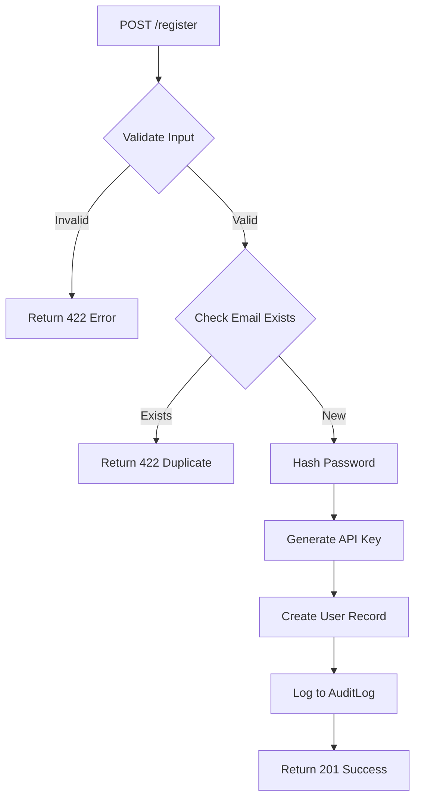

# US-003: User Registration and Authentication

## Description
As a **user**, I want to register for the IPFS gateway service using my email address, so that I can receive an API key to access the platform's features.

## Priority
🔴 **Critical** - Core functionality for user access.

## Difficulty
⭐⭐⭐ Medium-High

## Acceptance Criteria
- [ ] `POST /register` endpoint accepts email and password
- [ ] Email validation is performed (format and uniqueness)
- [ ] Password is securely hashed using bcrypt
- [ ] Unique API key is generated upon successful registration
- [ ] API key is returned in the response
- [ ] User is created with `is_active=True` by default
- [ ] Registration is logged in AuditLog
- [ ] Proper error responses for invalid input, duplicate email
- [ ] Rate limiting is applied to prevent abuse
- [ ] Input sanitization prevents injection attacks

## API Specification
```
POST /register
Content-Type: application/json

Request:
{
    "email": "user@example.com",
    "password": "securePassword123!"
}

Response (201 Created):
{
    "status": 201,
    "message": "Registration successful",
    "data": {
        "email": "user@example.com",
        "api_key": "ipfs_gw_xxxxxxxxxxxxx"
    }
}

Error Response (422 Unprocessable Entity):
{
    "status": 422,
    "message": "Email already registered"
}
```

## Technical Notes
- Use passlib with bcrypt for password hashing
- Generate API keys with secure random bytes (32 bytes, hex encoded)
- Prefix API keys with `ipfs_gw_` for easy identification
- Implement email validation using email-validator library
- Apply rate limiting: 5 registrations per hour per IP

## Dependencies
- US-001: Project Setup and Configuration
- US-002: Database Models and Migrations

## Estimated Effort
6 hours

## Completion Status
- [ ] 0% - Not Started

## Workflow Diagram


## Related Tasks
- TASK-US-003-01-create-registration-endpoint.md
- TASK-US-003-02-implement-password-hashing.md
- TASK-US-003-03-implement-apikey-generation.md
- TASK-US-003-04-add-input-validation.md
- TASK-US-003-05-add-rate-limiting.md
