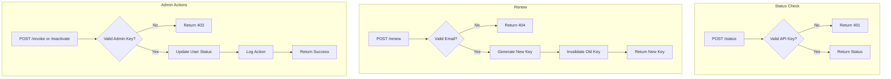

# US-004: API Key Management

## Description
As a **user**, I want to manage my API key (check status, renew, revoke), so that I can maintain secure access to the IPFS gateway services.

As an **administrator**, I want to revoke or reactivate user API keys, so that I can manage platform access and security.

## Priority
🟠 **High** - Essential for security and access control.

## Difficulty
⭐⭐⭐ Medium-High

## Acceptance Criteria
- [ ] `POST /status` endpoint returns API key status (active, inactive, revoked)
- [ ] `POST /renew` endpoint generates a new API key for the user
- [ ] `POST /revoke` endpoint allows admin to revoke any API key
- [ ] `POST /reactivate` endpoint allows admin to reactivate revoked keys
- [ ] All endpoints require valid API key authentication (except renew which uses email)
- [ ] Admin-only endpoints validate admin privileges
- [ ] All actions are logged in AuditLog
- [ ] Email notification is sent on key renewal (future enhancement)
- [ ] Old API key is invalidated upon renewal

## API Specifications

### Check API Key Status
```
POST /status
X-API-Key: ipfs_gw_xxxxxxxxxxxxx

Response (200 OK):
{
    "status": 200,
    "data": {
        "api_key_status": "active",
        "created_at": "2026-01-15T10:30:00Z",
        "last_renewed_at": "2026-01-20T14:00:00Z",
        "usage_count": 150
    }
}
```

### Renew API Key
```
POST /renew
Content-Type: application/json

Request:
{
    "email": "user@example.com"
}

Response (200 OK):
{
    "status": 200,
    "message": "New API key generated",
    "data": {
        "api_key": "ipfs_gw_new_xxxxxxxxxxxxx"
    }
}
```

### Revoke API Key (Admin Only)
```
POST /revoke
X-API-Key: admin_api_key
Content-Type: application/json

Request:
{
    "user_email": "user@example.com"
}

Response (200 OK):
{
    "status": 200,
    "message": "API key revoked successfully"
}
```

### Reactivate API Key (Admin Only)
```
POST /reactivate
X-API-Key: admin_api_key
Content-Type: application/json

Request:
{
    "user_email": "user@example.com"
}

Response (200 OK):
{
    "status": 200,
    "message": "API key reactivated successfully"
}
```

## Technical Notes
- Implement API key authentication as a decorator
- Admin validation through `is_admin` flag on User model
- Use secure token generation for new API keys
- Implement proper authorization checks

## Dependencies
- US-001: Project Setup and Configuration
- US-002: Database Models and Migrations
- US-003: User Registration and Authentication

## Estimated Effort
8 hours

## Completion Status
- [ ] 0% - Not Started

## Workflow Diagram


## Related Tasks
- TASK-US-004-01-create-status-endpoint.md
- TASK-US-004-02-create-renew-endpoint.md
- TASK-US-004-03-create-revoke-endpoint.md
- TASK-US-004-04-create-reactivate-endpoint.md
- TASK-US-004-05-implement-auth-decorator.md
- TASK-US-004-06-implement-admin-decorator.md
