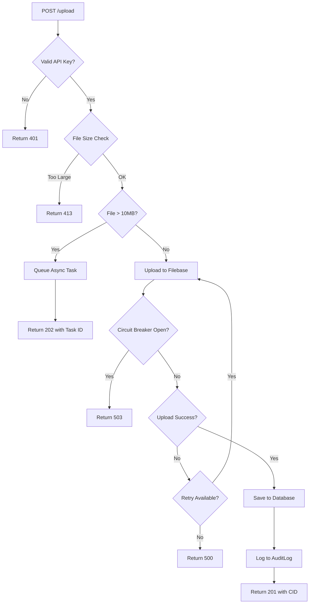

# US-005: File Upload to IPFS

## Description
As a **user**, I want to upload files to the IPFS network through the gateway, so that I can store my content in a decentralized manner and receive a unique CID for retrieval.

## Priority
🔴 **Critical** - Core functionality of the IPFS gateway.

## Difficulty
⭐⭐⭐⭐ High

## Acceptance Criteria
- [ ] `POST /upload` endpoint accepts file uploads (multipart/form-data)
- [ ] Valid API key is required for upload
- [ ] File is uploaded to Filebase S3-compatible API
- [ ] CID (Content Identifier) is returned upon successful upload
- [ ] File metadata is stored in the database (cid, original_filename, safe_filename, size)
- [ ] File is automatically pinned on upload
- [ ] Upload is processed asynchronously using Celery for large files
- [ ] Progress tracking is available for async uploads
- [ ] File size limits are enforced
- [ ] Circuit breaker pattern protects against Filebase API failures
- [ ] Retry logic handles transient errors
- [ ] Upload is logged in AuditLog

## API Specification
```
POST /upload
X-API-Key: ipfs_gw_xxxxxxxxxxxxx
Content-Type: multipart/form-data

Request:
- file: <binary file data>

Response (201 Created):
{
    "status": 201,
    "message": "File uploaded successfully",
    "data": {
        "cid": "QmXxxxxxxxxxxxxxxxxxxxxxxxxxxxxxxxxxx",
        "original_filename": "document.pdf",
        "size": 1048576,
        "pinned": true,
        "uploaded_at": "2026-01-29T10:30:00Z"
    }
}

Response (202 Accepted - Async Upload):
{
    "status": 202,
    "message": "File upload queued",
    "data": {
        "task_id": "uuid-task-id",
        "status_url": "/upload/status/uuid-task-id"
    }
}
```

## Technical Notes
- Use boto3 for S3-compatible Filebase API
- Implement circuit breaker with pybreaker (fail_max=5, reset_timeout=60)
- Implement retry with tenacity (max 3 retries, exponential backoff)
- Use Celery for async processing of files > 10MB
- Sanitize filenames to prevent path traversal attacks
- Generate safe filenames with UUID prefix
- Maximum file size: 100MB (configurable)

## Dependencies
- US-001: Project Setup and Configuration
- US-002: Database Models and Migrations
- US-003: User Registration and Authentication
- US-004: API Key Management
- US-007: Celery Task Queue Setup

## Estimated Effort
12 hours

## Completion Status
- [ ] 0% - Not Started

## Workflow Diagram


## Related Tasks
- TASK-US-005-01-create-upload-endpoint.md
- TASK-US-005-02-implement-filebase-service.md
- TASK-US-005-03-implement-circuit-breaker.md
- TASK-US-005-04-implement-retry-logic.md
- TASK-US-005-05-create-async-upload-task.md
- TASK-US-005-06-implement-file-validation.md
