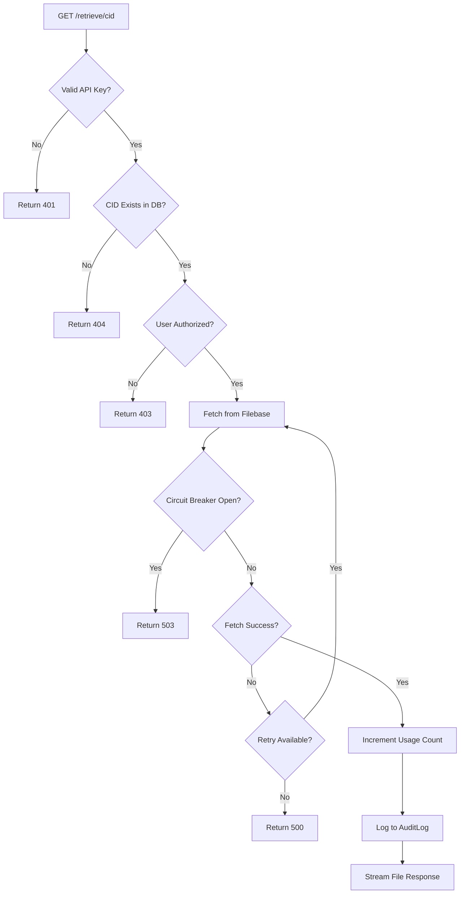

# US-006: File Retrieval from IPFS

## Description
As a **user**, I want to retrieve files from the IPFS network using their CID, so that I can access my stored content whenever needed.

## Priority
🔴 **Critical** - Core functionality of the IPFS gateway.

## Difficulty
⭐⭐⭐ Medium-High

## Acceptance Criteria
- [ ] `GET /retrieve/<cid>` endpoint returns file content
- [ ] Valid API key is required for retrieval
- [ ] File is fetched from Filebase/IPFS network
- [ ] Original filename is preserved in Content-Disposition header
- [ ] Proper MIME type is set in Content-Type header
- [ ] Caching headers are set for performance
- [ ] Circuit breaker pattern protects against Filebase API failures
- [ ] Retry logic handles transient errors
- [ ] 404 is returned for non-existent CIDs
- [ ] User can only retrieve their own files (authorization check)
- [ ] Retrieval is logged in AuditLog
- [ ] Usage count is incremented for the user

## API Specification
```
GET /retrieve/QmXxxxxxxxxxxxxxxxxxxxxxxxxxxxxxxxxxx
X-API-Key: ipfs_gw_xxxxxxxxxxxxx

Response (200 OK):
Content-Type: application/pdf
Content-Disposition: attachment; filename="document.pdf"
Content-Length: 1048576
Cache-Control: public, max-age=31536000

<binary file content>

Error Response (404 Not Found):
{
    "status": 404,
    "message": "File not found"
}

Error Response (403 Forbidden):
{
    "status": 403,
    "message": "Access denied to this file"
}
```

## Technical Notes
- Use boto3 for S3-compatible Filebase API
- Stream large files to avoid memory issues
- Implement proper content-type detection
- Cache frequently accessed files (consider Redis cache)
- Implement circuit breaker with pybreaker
- Implement retry with tenacity
- Consider implementing public/private file access levels (future)

## Dependencies
- US-001: Project Setup and Configuration
- US-002: Database Models and Migrations
- US-004: API Key Management
- US-005: File Upload to IPFS

## Estimated Effort
8 hours

## Completion Status
- [ ] 0% - Not Started

## Workflow Diagram


## Related Tasks
- TASK-US-006-01-create-retrieve-endpoint.md
- TASK-US-006-02-implement-file-streaming.md
- TASK-US-006-03-implement-authorization-check.md
- TASK-US-006-04-add-caching-headers.md
- TASK-US-006-05-implement-content-type-detection.md
