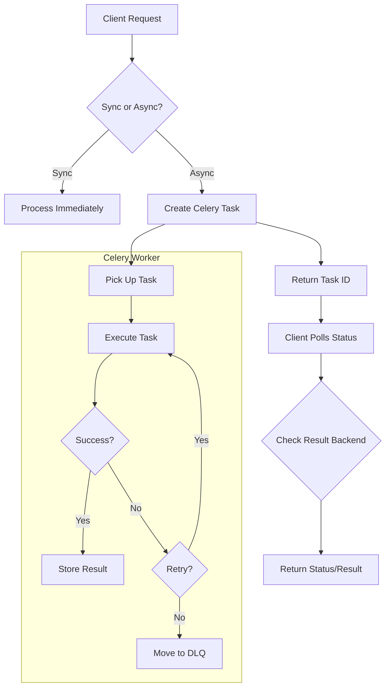

# US-007: Celery Task Queue Setup

## Description
As a **developer**, I want to configure Celery with Redis as the message broker, so that the application can handle asynchronous tasks like large file uploads and content pinning operations.

## Priority
🟠 **High** - Required for async operations.

## Difficulty
⭐⭐⭐ Medium-High

## Acceptance Criteria
- [ ] Celery is configured with Redis as message broker
- [ ] Celery worker can be started independently
- [ ] Task results are stored in Redis
- [ ] Async file upload task is implemented
- [ ] Async pinning/unpinning tasks are implemented
- [ ] Task status can be queried via API
- [ ] Failed tasks are retried with exponential backoff
- [ ] Dead letter queue is configured for failed tasks
- [ ] Task monitoring is available (Flower or similar)
- [ ] Celery beat is configured for scheduled tasks (future)

## Configuration
```python
# Celery Configuration
CELERY_BROKER_URL = "redis://localhost:6379/0"
CELERY_RESULT_BACKEND = "redis://localhost:6379/0"
CELERY_TASK_SERIALIZER = "json"
CELERY_RESULT_SERIALIZER = "json"
CELERY_ACCEPT_CONTENT = ["json"]
CELERY_TIMEZONE = "UTC"
CELERY_TASK_TRACK_STARTED = True
CELERY_TASK_TIME_LIMIT = 300  # 5 minutes
```

## API Specification (Task Status)
```
GET /tasks/<task_id>/status
X-API-Key: ipfs_gw_xxxxxxxxxxxxx

Response (200 OK):
{
    "status": 200,
    "data": {
        "task_id": "uuid-task-id",
        "state": "SUCCESS",
        "result": {
            "cid": "QmXxxxxxxxxxx",
            "filename": "document.pdf"
        },
        "progress": 100
    }
}

Response (200 OK - In Progress):
{
    "status": 200,
    "data": {
        "task_id": "uuid-task-id",
        "state": "PROGRESS",
        "progress": 65,
        "message": "Uploading to IPFS..."
    }
}
```

## Technical Notes
- Use Redis as both broker and result backend
- Implement custom task base class for common error handling
- Use task_id to track and query task status
- Implement progress reporting for long-running tasks
- Configure task routes for different queues (upload, pinning)

## Dependencies
- US-001: Project Setup and Configuration

## Estimated Effort
6 hours

## Completion Status
- [ ] 0% - Not Started

## Workflow Diagram


## Related Tasks
- TASK-US-007-01-configure-celery.md
- TASK-US-007-02-create-upload-task.md
- TASK-US-007-03-create-pinning-tasks.md
- TASK-US-007-04-implement-task-status-endpoint.md
- TASK-US-007-05-configure-monitoring.md
