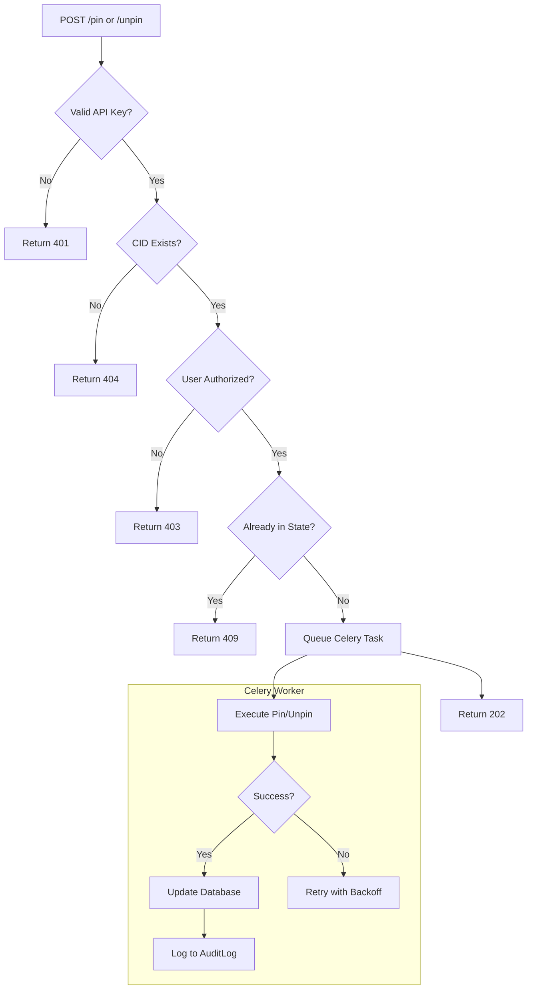

# US-008: Content Pinning Management

## Description
As a **user**, I want to pin and unpin my content on the IPFS network, so that I can ensure important files remain available or remove files I no longer need.

## Priority
🟠 **High** - Important feature for content persistence.

## Difficulty
⭐⭐⭐ Medium-High

## Acceptance Criteria
- [ ] `POST /pin/<cid>` endpoint pins content to IPFS
- [ ] `POST /unpin/<cid>` endpoint unpins content from IPFS
- [ ] Valid API key is required for all operations
- [ ] User can only pin/unpin their own content
- [ ] Pin status is updated in the database
- [ ] Operations are processed asynchronously for reliability
- [ ] Circuit breaker pattern protects against Filebase API failures
- [ ] Retry logic handles transient errors
- [ ] Actions are logged in AuditLog
- [ ] Unpinning does not delete the file record (soft operation)

## API Specifications

### Pin Content
```
POST /pin/QmXxxxxxxxxxxxxxxxxxxxxxxxxxxxxxxxxxx
X-API-Key: ipfs_gw_xxxxxxxxxxxxx

Response (200 OK):
{
    "status": 200,
    "message": "Content pinned successfully",
    "data": {
        "cid": "QmXxxxxxxxxxxxxxxxxxxxxxxxxxxxxxxxxxx",
        "pinned": true,
        "pinned_at": "2026-01-29T10:30:00Z"
    }
}

Response (202 Accepted - Async):
{
    "status": 202,
    "message": "Pinning request queued",
    "data": {
        "task_id": "uuid-task-id"
    }
}
```

### Unpin Content
```
POST /unpin/QmXxxxxxxxxxxxxxxxxxxxxxxxxxxxxxxxxxx
X-API-Key: ipfs_gw_xxxxxxxxxxxxx

Response (200 OK):
{
    "status": 200,
    "message": "Content unpinned successfully",
    "data": {
        "cid": "QmXxxxxxxxxxxxxxxxxxxxxxxxxxxxxxxxxxx",
        "pinned": false,
        "unpinned_at": "2026-01-29T10:30:00Z"
    }
}
```

### Error Responses
```
Response (404 Not Found):
{
    "status": 404,
    "message": "Content not found"
}

Response (403 Forbidden):
{
    "status": 403,
    "message": "Access denied to this content"
}

Response (409 Conflict):
{
    "status": 409,
    "message": "Content is already pinned/unpinned"
}
```

## Technical Notes
- Use Filebase API for pin/unpin operations
- Implement as Celery tasks for reliability
- Update File model's `pinned` field
- Consider batch pin/unpin operations (future enhancement)
- Implement pin status verification

## Dependencies
- US-001: Project Setup and Configuration
- US-002: Database Models and Migrations
- US-004: API Key Management
- US-005: File Upload to IPFS
- US-007: Celery Task Queue Setup

## Estimated Effort
6 hours

## Completion Status
- [ ] 0% - Not Started

## Workflow Diagram


## Related Tasks
- TASK-US-008-01-create-pin-endpoint.md
- TASK-US-008-02-create-unpin-endpoint.md
- TASK-US-008-03-implement-pin-celery-task.md
- TASK-US-008-04-implement-unpin-celery-task.md
- TASK-US-008-05-add-authorization-checks.md
