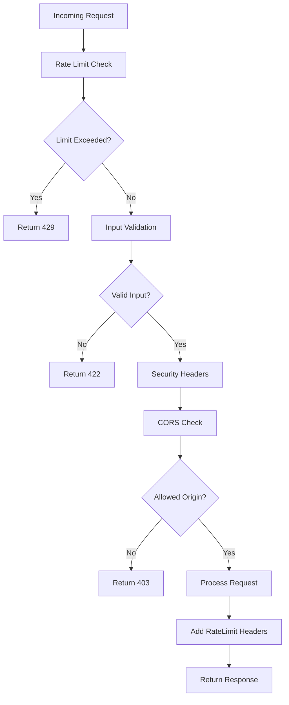

# US-009: Rate Limiting and Security

## Description
As a **system administrator**, I want to implement rate limiting and security measures, so that the API is protected from abuse and malicious attacks.

## Priority
🟠 **High** - Essential for production security.

## Difficulty
⭐⭐⭐ Medium-High

## Acceptance Criteria
- [ ] Rate limiting is applied to all API endpoints
- [ ] Different rate limits for different endpoint types
- [ ] Rate limit headers are included in responses (X-RateLimit-*)
- [ ] 429 Too Many Requests returned when limit exceeded
- [ ] Rate limits are configurable via environment variables
- [ ] Input validation is applied to all endpoints
- [ ] SQL injection prevention is verified
- [ ] XSS prevention headers are set
- [ ] CORS is properly configured
- [ ] Request payload size limits are enforced
- [ ] API key validation prevents timing attacks

## Rate Limit Configuration
| Endpoint Type | Rate Limit |
|---------------|------------|
| Registration | 5/hour per IP |
| Upload | 20/hour per API key |
| Retrieve | 100/hour per API key |
| Pin/Unpin | 50/hour per API key |
| Status/Renew | 10/hour per API key |
| Admin Actions | 100/hour per API key |

## Response Headers
```
X-RateLimit-Limit: 100
X-RateLimit-Remaining: 95
X-RateLimit-Reset: 1706529600
Retry-After: 3600 (when limit exceeded)
```

## Technical Notes
- Use Flask-Limiter for rate limiting
- Store rate limit counters in Redis
- Implement decorator-based rate limiting
- Use secure comparison for API key validation
- Configure CORS with flask-cors
- Set security headers (X-Content-Type-Options, X-Frame-Options, etc.)
- Implement request ID for tracing

## Dependencies
- US-001: Project Setup and Configuration
- US-003: User Registration and Authentication

## Estimated Effort
6 hours

## Completion Status
- [ ] 0% - Not Started

## Workflow Diagram


## Related Tasks
- TASK-US-009-01-configure-rate-limiting.md
- TASK-US-009-02-implement-input-validation.md
- TASK-US-009-03-configure-cors.md
- TASK-US-009-04-add-security-headers.md
- TASK-US-009-05-implement-request-tracing.md
