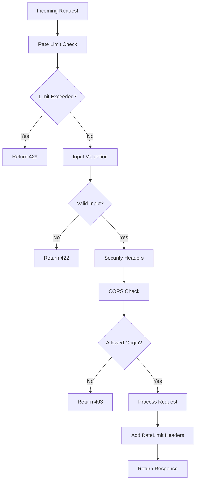

# US-009: Rate Limiting and Security

[Trello Card](https://trello.com/c/codfrkjn)

## Pull Request
[PR #9](https://github.com/mentally-gamez-soft/ipfs-saas-ai4devs/pull/9)


## Description
As a **system administrator**, I want to implement rate limiting and security measures, so that the API is protected from abuse and malicious attacks.

## Priority
🟠 **High** - Essential for production security.

## Difficulty
⭐⭐⭐ Medium-High

## Acceptance Criteria
- [x] Rate limiting is applied to all API endpoints
- [x] Different rate limits for different endpoint types
- [x] Rate limit headers are included in responses (X-RateLimit-*)
- [x] 429 Too Many Requests returned when limit exceeded
- [x] Rate limits are configurable via environment variables
- [x] Input validation is applied to all endpoints
- [x] SQL injection prevention is verified
- [x] XSS prevention headers are set
- [x] CORS is properly configured
- [x] Request payload size limits are enforced
- [x] API key validation prevents timing attacks

## Rate Limit Configuration
| Endpoint Type | Rate Limit |
|---------------|------------|
| Registration | 5/hour per IP |
| Upload | 20/hour per API key |
| Retrieve | 100/hour per API key |
| Pin/Unpin | 50/hour per API key |
| Status/Renew | 10/hour per API key |
| Admin Actions | 100/hour per API key |

## Response Headers
```
X-RateLimit-Limit: 100
X-RateLimit-Remaining: 95
X-RateLimit-Reset: 1706529600
Retry-After: 3600 (when limit exceeded)
```

## Technical Notes
- Use Flask-Limiter for rate limiting
- Store rate limit counters in Redis
- Implement decorator-based rate limiting
- Use secure comparison for API key validation
- Configure CORS with flask-cors
- Set security headers (X-Content-Type-Options, X-Frame-Options, etc.)
- Implement request ID for tracing

## Implementation Summary
- Added centralized limiter configuration, API-key-aware limit keys, and environment-driven rate limit settings.
- Hardened request handling with CID and verification-code validation, payload size enforcement, and timing-safe API key comparison via `hmac.compare_digest`.
- Added centralized request tracing and response hardening for request IDs, security headers, and consistent error payloads.
- Added regression coverage for security headers, CORS behavior, request tracing, 413 handling, and rate limiting.

## Verification
- `source backend/.venv/bin/activate && python -m unittest discover -s tests/backend -p "test_*.py" -v`

## Dependencies
- US-001: Project Setup and Configuration
- US-003: User Registration and Authentication

## Estimated Effort
6 hours

## Completion Status
- [x] 100% - Completed

## Workflow Diagram

```mermaid
flowchart TD
    A[Incoming Request] --> B[Rate Limit Check]
    B --> C{Limit Exceeded?}
    C -->|Yes| D[Return 429]
    C -->|No| E[Input Validation]
    E --> F{Valid Input?}
    F -->|No| G[Return 422]
    F -->|Yes| H[Security Headers]
    H --> I[CORS Check]
    I --> J{Allowed Origin?}
    J -->|No| K[Return 403]
    J -->|Yes| L[Process Request]
    L --> M[Add RateLimit Headers]
    M --> N[Return Response]
```

## Related Tasks
- [TASK-US-009-01: Configure Rate Limiting](../../tasks/backend/TASK-US-009-01-configure-rate-limiting.md)
- [TASK-US-009-02: Implement Input Validation](../../tasks/backend/TASK-US-009-02-implement-input-validation.md)
- [TASK-US-009-03: Configure CORS](../../tasks/backend/TASK-US-009-03-configure-cors.md)
- [TASK-US-009-04: Add Security Headers](../../tasks/backend/TASK-US-009-04-add-security-headers.md)
- [TASK-US-009-05: Implement Request Tracing](../../tasks/backend/TASK-US-009-05-implement-request-tracing.md)
