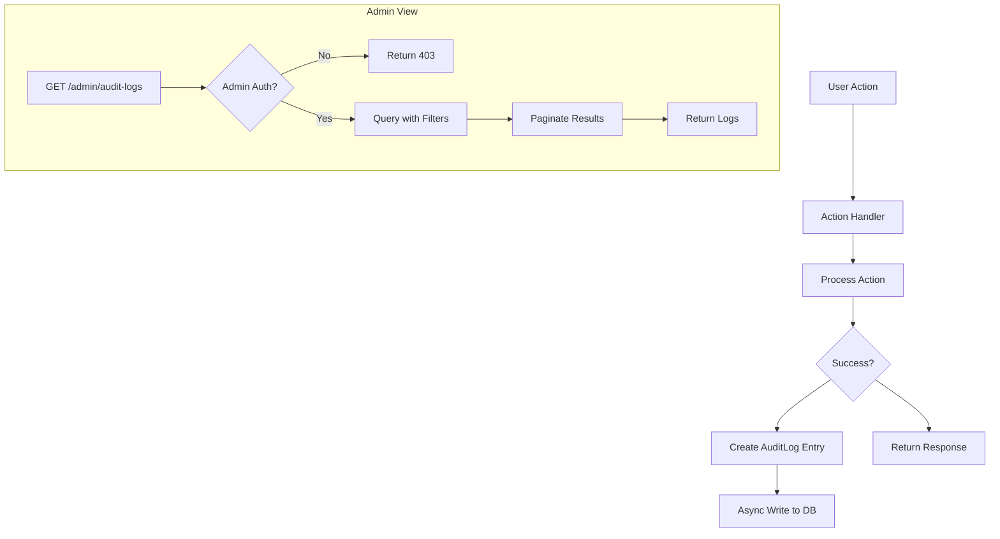

# US-010: Audit Logging System

## Description
As a **system administrator**, I want all significant actions to be logged in an audit trail, so that I can track user activities and investigate issues.

## Priority
🟡 **Medium** - Important for compliance and debugging.

## Difficulty
⭐⭐ Medium

## Acceptance Criteria
- [ ] All user actions are logged (register, upload, retrieve, pin, unpin)
- [ ] All admin actions are logged (revoke, reactivate)
- [ ] AuditLog entries include user_id, action, timestamp, details
- [ ] Details field captures relevant context (CID, file size, IP address)
- [ ] Audit logs are accessible only by administrators
- [ ] `GET /admin/audit-logs` endpoint returns paginated logs
- [ ] Logs can be filtered by user, action type, date range
- [ ] Audit logs are never deleted (append-only)
- [ ] Performance impact is minimized (async logging)

## API Specification (Admin Only)
```
GET /admin/audit-logs?page=1&per_page=50&user_id=123&action=upload&from=2026-01-01&to=2026-01-31
X-API-Key: admin_api_key

Response (200 OK):
{
    "status": 200,
    "data": {
        "logs": [
            {
                "id": 1,
                "user_id": 123,
                "user_email": "user@example.com",
                "action": "upload",
                "timestamp": "2026-01-29T10:30:00Z",
                "details": {
                    "cid": "QmXxxxxxxxxxx",
                    "filename": "document.pdf",
                    "size": 1048576,
                    "ip_address": "192.168.1.100"
                }
            }
        ],
        "pagination": {
            "page": 1,
            "per_page": 50,
            "total": 1250,
            "pages": 25
        }
    }
}
```

## Action Types
| Action | Description |
|--------|-------------|
| register | User registration |
| login | User login attempt |
| upload | File upload |
| retrieve | File retrieval |
| pin | Content pinning |
| unpin | Content unpinning |
| renew | API key renewal |
| revoke | API key revocation |
| reactivate | API key reactivation |
| delete | File deletion |

## Technical Notes
- Use async logging to minimize performance impact
- Store IP addresses for security analysis
- Include request ID for correlation
- Consider log rotation/archival for large datasets
- Implement proper indexing for efficient queries

## Dependencies
- US-001: Project Setup and Configuration
- US-002: Database Models and Migrations
- US-004: API Key Management

## Estimated Effort
4 hours

## Completion Status
- [ ] 0% - Not Started

## Workflow Diagram


## Related Tasks
- TASK-US-010-01-create-audit-service.md
- TASK-US-010-02-implement-async-logging.md
- TASK-US-010-03-create-admin-logs-endpoint.md
- TASK-US-010-04-add-log-filtering.md
