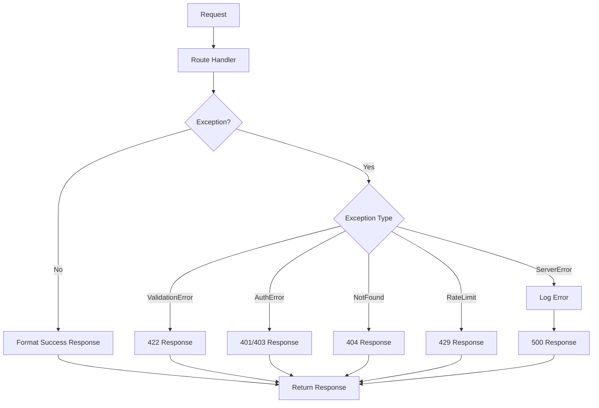

# US-011: Error Handling and Standardized Responses

## Description
As a **developer**, I want consistent error handling and standardized API responses, so that clients can easily understand and handle all API interactions.

## Priority
🟡 **Medium** - Important for API usability.

## Difficulty
⭐⭐ Medium

## Acceptance Criteria
- [ ] All responses follow a consistent JSON structure
- [ ] Error responses include status code, message, and optional details
- [ ] HTTP status codes are used correctly (200, 201, 400, 401, 403, 404, 409, 422, 429, 500, 503)
- [ ] Validation errors include field-level details
- [ ] Internal errors are logged but sanitized in response
- [ ] Custom exception classes are implemented
- [ ] Global error handlers are registered
- [ ] Request/response logging is implemented
- [ ] Stack traces are hidden in production

## Response Structure
```python
# Success Response
{
    "status": 200,
    "message": "Operation successful",
    "data": { ... }
}

# Error Response
{
    "status": 422,
    "message": "Validation failed",
    "errors": [
        {
            "field": "email",
            "message": "Invalid email format"
        }
    ]
}

# Server Error (Production)
{
    "status": 500,
    "message": "Internal server error",
    "request_id": "uuid-request-id"
}
```

## HTTP Status Codes
| Code | Usage |
|------|-------|
| 200 | Success |
| 201 | Resource created |
| 202 | Accepted (async) |
| 400 | Bad request |
| 401 | Unauthorized |
| 403 | Forbidden |
| 404 | Not found |
| 409 | Conflict |
| 413 | Payload too large |
| 422 | Validation error |
| 429 | Rate limit exceeded |
| 500 | Internal error |
| 503 | Service unavailable |

## Technical Notes
- Create custom exception hierarchy
- Use Flask error handlers for global handling
- Implement response wrapper utility
- Log all errors with full context
- Use request IDs for error tracking

## Dependencies
- US-001: Project Setup and Configuration

## Estimated Effort
4 hours

## Completion Status
- [ ] 0% - Not Started

## Workflow Diagram


## Related Tasks
- TASK-US-011-01-create-exception-classes.md
- TASK-US-011-02-create-response-wrapper.md
- TASK-US-011-03-implement-error-handlers.md
- TASK-US-011-04-add-request-logging.md
