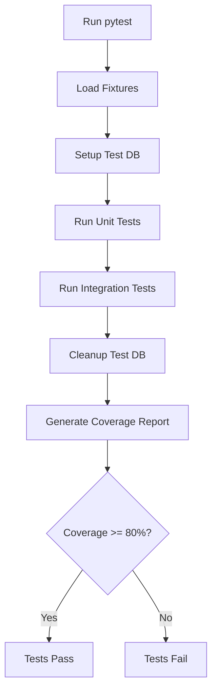

# US-013: Backend Testing Suite

## Description
As a **developer**, I want a comprehensive testing suite for the backend, so that code quality is maintained and regressions are prevented.

## Priority
🟠 **High** - Essential for code quality.

## Difficulty
⭐⭐⭐ Medium-High

## Acceptance Criteria
- [ ] Unit tests cover all service functions
- [ ] Integration tests cover all API endpoints
- [ ] Test fixtures are created using Faker
- [ ] HTTP interactions are recorded with VCR
- [ ] Test database is isolated from development
- [ ] Code coverage is measured with coverage.py
- [ ] Minimum 80% code coverage target
- [ ] Tests run in CI/CD pipeline
- [ ] Test configuration is in pytest.ini/pyproject.toml
- [ ] Async tests are properly handled

## Test Categories
| Category | Description | Target Coverage |
|----------|-------------|-----------------|
| Unit Tests | Individual functions | 90% |
| Integration Tests | API endpoints | 80% |
| Service Tests | Business logic | 85% |
| Model Tests | Database models | 80% |

## Test Structure
```
backend/tests/
├── __init__.py
├── conftest.py              # Shared fixtures
├── factories/               # Test data factories
│   ├── __init__.py
│   ├── user_factory.py
│   └── file_factory.py
├── cassettes/               # VCR recordings
│   └── .gitkeep
├── unit/
│   ├── __init__.py
│   ├── test_services.py
│   └── test_utils.py
├── integration/
│   ├── __init__.py
│   ├── test_auth_endpoints.py
│   ├── test_file_endpoints.py
│   └── test_admin_endpoints.py
└── test_models.py
```

## Technical Notes
- Use pytest as the test framework
- Use pytest-asyncio for async tests
- Use Factory Boy for test data generation
- Use VCRpy to record/replay HTTP interactions
- Configure separate test database
- Use pytest-cov for coverage reporting

## Dependencies
- US-001: Project Setup and Configuration
- All other backend user stories

## Estimated Effort
12 hours

## Completion Status
- [ ] 0% - Not Started

## Workflow Diagram


## Related Tasks
- TASK-US-013-01-setup-pytest-config.md
- TASK-US-013-02-create-test-fixtures.md
- TASK-US-013-03-create-factories.md
- TASK-US-013-04-write-unit-tests.md
- TASK-US-013-05-write-integration-tests.md
- TASK-US-013-06-configure-vcr.md
- TASK-US-013-07-setup-coverage.md
