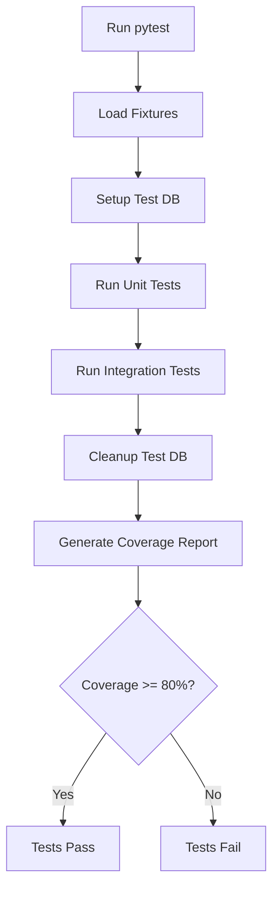

# US-013: Backend Testing Suite

[Trello Card](https://trello.com/c/ilKJm2EM)


## Description
As a **developer**, I want a comprehensive testing suite for the backend, so that code quality is maintained and regressions are prevented.
The unit tests suite is already present. All the unit tests should be moved into the directory `tests/backend/unit/` 

## Priority
🟠 **High** - Essential for code quality.

## Difficulty
⭐⭐⭐ Medium-High

## Acceptance Criteria
- [x] Unit tests cover all service functions
- [x] Integration tests (e2e) cover all API endpoints - using real calls and .env file to filebase
- [x] Test fixtures are created using Faker
- [x] HTTP interactions are recorded with VCR
- [x] Test database is isolated from development
- [x] Code coverage is measured with coverage.py
- [x] Minimum 80% code coverage target
- [x] Tests run in CI/CD pipeline
- [x] Test configuration is in pytest.ini/pyproject.toml
- [x] Async tests are properly handled

## Test Categories
| Category | Description | Target Coverage |
|----------|-------------|-----------------|
| Unit Tests | Individual functions | 90% |
| Integration Tests | API endpoints | 80% |
| Service Tests | Business logic | 85% |
| Model Tests | Database models | 80% |

## Test Structure
```
tests/backend/
├── __init__.py
├── conftest.py              # Shared fixtures
├── factories/               # Test data factories
│   ├── __init__.py
│   ├── user_factory.py
│   └── file_factory.py
├── cassettes/               # VCR recordings
│   └── .gitkeep
├── unit/
│   ├── __init__.py
│   └── test_*.py            # Existing + new unit tests (services, models, routes)
├── e2e/                     
│   ├── __init__.py
│   ├── test_auth_endpoints.py
│   ├── test_file_endpoints.py
│   └── test_admin_endpoints.py
```

## Technical Notes
- Use unittest as the test framework
- Use Factory Boy for test data generation
- Use VCRpy to record/replay HTTP interactions
- Configure separate test database
- Use coverage.py for coverage reporting
- e2e tests should use the .env file to do real calls to filebase through its S3 api
- e2e tests should use the .env file to use real redis instance

## Dependencies
- US-001: Project Setup and Configuration
- All other backend user stories

## Estimated Effort
12 hours

## Completion Status
- [x] 100% - Completed

## Workflow Diagram

```mermaid
flowchart TD
    A[Run pytest] --> B[Load Fixtures]
    B --> C[Setup Test DB]
    C --> D[Run Unit Tests]
    D --> E[Run Integration Tests]
    E --> F[Cleanup Test DB]
    F --> G[Generate Coverage Report]
    G --> H{Coverage >= 80%?}
    H -->|Yes| I[Tests Pass]
    H -->|No| J[Tests Fail]
```

## Related Tasks
- [TASK-US-013-01: Setup pytest configuration](../../tasks/backend/TASK-US-013-01-setup-pytest-config.md)
- [TASK-US-013-02: Create test fixtures (conftest.py)](../../tasks/backend/TASK-US-013-02-create-test-fixtures.md)
- [TASK-US-013-03: Create test data factories](../../tasks/backend/TASK-US-013-03-create-factories.md)
- [TASK-US-013-04: Write unit tests (move existing + add new)](../../tasks/backend/TASK-US-013-04-write-unit-tests.md)
- [TASK-US-013-05: Write e2e integration tests](../../tasks/backend/TASK-US-013-05-write-integration-tests.md)
- [TASK-US-013-06: Configure VCRpy for HTTP recording](../../tasks/backend/TASK-US-013-06-configure-vcr.md)
- [TASK-US-013-07: Setup code coverage reporting](../../tasks/backend/TASK-US-013-07-setup-coverage.md)
