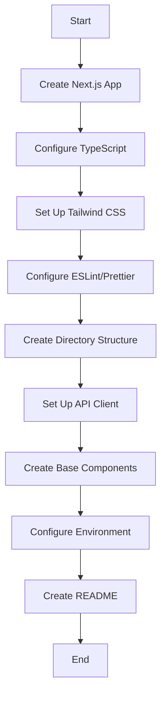

# US-101: Frontend Project Setup

## Description
As a **developer**, I want to set up the Next.js frontend project with proper structure and configurations, so that the team can develop the user interface efficiently.

## Priority
🔴 **Critical** - Foundation for all frontend work.

## Difficulty
⭐⭐ Medium

## Acceptance Criteria
- [ ] Next.js 14+ project is initialized in `frontend/` directory
- [ ] TypeScript is configured for type safety
- [ ] Tailwind CSS is set up for styling
- [ ] ESLint and Prettier are configured
- [ ] Environment variables are managed via `.env.local`
- [ ] Project structure follows Next.js best practices (App Router)
- [ ] API client/service layer is created for backend communication
- [ ] Global state management is set up (React Context or Zustand)
- [ ] Error boundary components are implemented
- [ ] Loading states and skeletons are prepared
- [ ] README with setup instructions is created

## Project Structure
```
frontend/
├── app/
│   ├── layout.tsx
│   ├── page.tsx
│   ├── globals.css
│   ├── (auth)/
│   │   ├── login/
│   │   ├── register/
│   │   └── dashboard/
│   ├── upload/
│   ├── retrieve/
│   ├── files/
│   └── docs/
├── components/
│   ├── ui/
│   ├── forms/
│   └── layout/
├── lib/
│   ├── api.ts
│   ├── utils.ts
│   └── constants.ts
├── hooks/
├── types/
├── public/
├── tests/
├── .env.example
├── next.config.js
├── tailwind.config.js
├── tsconfig.json
└── package.json
```

## Technical Notes
- Use Next.js 14+ with App Router
- Configure TypeScript strict mode
- Set up path aliases (@/components, @/lib, etc.)
- Configure Tailwind with custom theme
- Set up next/font for optimized fonts
- Configure Image optimization

## Dependencies
None - This is the foundation for frontend.

## Estimated Effort
6 hours

## Completion Status
- [ ] 0% - Not Started

## Workflow Diagram


## Related Tasks
- TASK-US-101-01-init-nextjs-project.md
- TASK-US-101-02-configure-typescript.md
- TASK-US-101-03-setup-tailwind.md
- TASK-US-101-04-create-api-client.md
- TASK-US-101-05-setup-base-components.md
