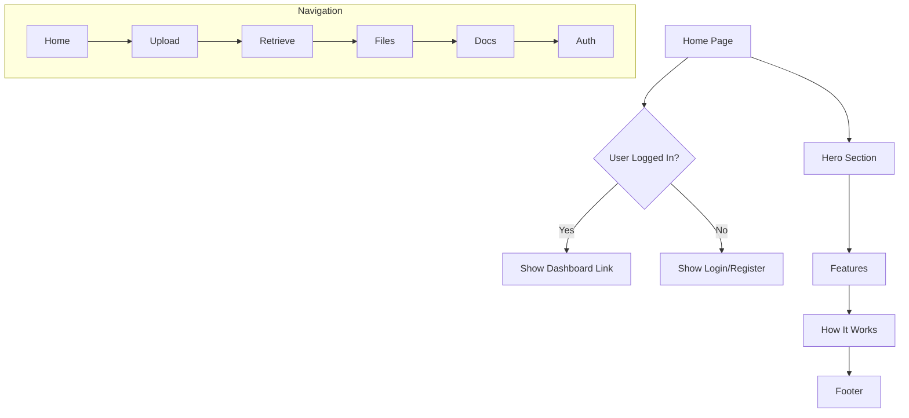

# US-102: Home Page and Navigation

## Description
As a **visitor**, I want to see a welcoming home page with clear navigation, so that I can understand what the IPFS gateway offers and easily access different sections.

## Priority
🟠 **High** - First impression for users.

## Difficulty
⭐⭐ Medium

## Acceptance Criteria
- [ ] Home page displays service overview and value proposition
- [ ] Navigation menu is accessible from all pages
- [ ] Navigation includes: Home, Upload, Retrieve, Files, Docs, Login/Register
- [ ] Responsive design works on desktop, tablet, and mobile
- [ ] Call-to-action buttons for registration and getting started
- [ ] Feature highlights section showcasing IPFS benefits
- [ ] Footer with links and copyright information
- [ ] Loading states are smooth and user-friendly
- [ ] SEO meta tags are properly set

## Page Sections
1. **Hero Section**: Main headline, description, CTA buttons
2. **Features Section**: Key benefits (decentralized, secure, permanent)
3. **How It Works**: Step-by-step guide
4. **Pricing/Plans**: Free tier information
5. **Documentation Links**: Quick access to docs
6. **Footer**: Links, social, copyright

## Technical Notes
- Use Next.js App Router for routing
- Implement responsive navigation with mobile hamburger menu
- Use Tailwind CSS for styling
- Optimize images with next/image
- Implement smooth scroll for anchor links

## Dependencies
- US-101: Frontend Project Setup

## Estimated Effort
6 hours

## Completion Status
- [ ] 0% - Not Started

## Workflow Diagram


## Wireframe
```
+--------------------------------------------------+
|  Logo    Home  Upload  Retrieve  Files  Docs  🔐 |
+--------------------------------------------------+
|                                                  |
|           Store Files on IPFS                    |
|     Decentralized. Secure. Permanent.            |
|                                                  |
|     [Get Started]  [Learn More]                  |
|                                                  |
+--------------------------------------------------+
|  🌐 Decentralized  |  🔒 Secure  |  ♾️ Permanent  |
+--------------------------------------------------+
|                                                  |
|            How It Works                          |
|   1. Register  →  2. Upload  →  3. Share        |
|                                                  |
+--------------------------------------------------+
|  Footer: Links | Docs | Social | Copyright       |
+--------------------------------------------------+
```

## Related Tasks
- TASK-US-102-01-create-layout-component.md
- TASK-US-102-02-create-navigation.md
- TASK-US-102-03-create-home-page.md
- TASK-US-102-04-create-footer.md
- TASK-US-102-05-implement-responsive-design.md
