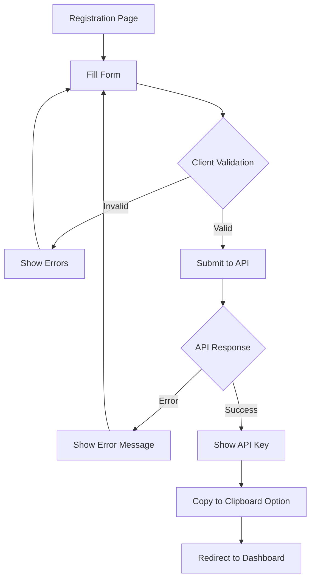

# US-103: User Registration Page

## Description
As a **new user**, I want to register for the IPFS gateway service, so that I can receive an API key and start using the platform.

## Priority
🔴 **Critical** - Required for user onboarding.

## Difficulty
⭐⭐ Medium

## Acceptance Criteria
- [ ] Registration form with email and password fields
- [ ] Client-side validation for email format and password strength
- [ ] Real-time validation feedback
- [ ] Submit button with loading state
- [ ] Success message displays API key prominently
- [ ] Copy-to-clipboard functionality for API key
- [ ] Link to login page for existing users
- [ ] Error messages are user-friendly and actionable
- [ ] Form is accessible (ARIA labels, keyboard navigation)
- [ ] Redirect to dashboard after successful registration

## Form Fields
| Field | Type | Validation |
|-------|------|------------|
| Email | email | Required, valid format, max 255 chars |
| Password | password | Required, min 8 chars, 1 uppercase, 1 number |
| Confirm Password | password | Must match password |

## Technical Notes
- Use React Hook Form for form management
- Use Zod for schema validation
- Implement password strength indicator
- Show/hide password toggle
- Store API key securely (consider secure storage)
- Use toast notifications for feedback

## Dependencies
- US-101: Frontend Project Setup
- US-102: Home Page and Navigation
- US-003: User Registration (Backend)

## Estimated Effort
5 hours

## Completion Status
- [ ] 0% - Not Started

## Workflow Diagram


## Wireframe
```
+--------------------------------------------------+
|                Create Account                     |
+--------------------------------------------------+
|                                                  |
|  Email:                                          |
|  +--------------------------------------------+  |
|  | user@example.com                           |  |
|  +--------------------------------------------+  |
|                                                  |
|  Password:                                       |
|  +--------------------------------------------+  |
|  | ••••••••••••                          👁️   |  |
|  +--------------------------------------------+  |
|  Strength: ████████░░ Strong                     |
|                                                  |
|  Confirm Password:                               |
|  +--------------------------------------------+  |
|  | ••••••••••••                          👁️   |  |
|  +--------------------------------------------+  |
|                                                  |
|  [        Create Account        ]                |
|                                                  |
|  Already have an account? Login                  |
|                                                  |
+--------------------------------------------------+
```

## Success Modal
```
+--------------------------------------------------+
|            🎉 Registration Successful!            |
+--------------------------------------------------+
|                                                  |
|  Your API Key:                                   |
|  +--------------------------------------------+  |
|  | ipfs_gw_abc123xyz789...             [📋]  |  |
|  +--------------------------------------------+  |
|                                                  |
|  ⚠️ Save this key securely. You won't be able   |
|  to see it again!                                |
|                                                  |
|  [        Go to Dashboard        ]               |
|                                                  |
+--------------------------------------------------+
```

## Related Tasks
- TASK-US-103-01-create-registration-form.md
- TASK-US-103-02-implement-validation.md
- TASK-US-103-03-create-success-modal.md
- TASK-US-103-04-add-accessibility.md
