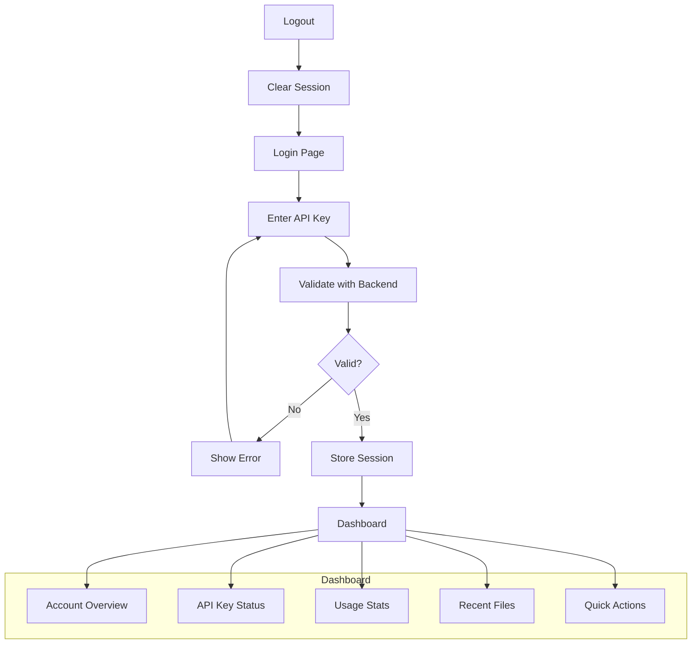

# US-104: User Login and Dashboard

## Description
As a **registered user**, I want to log in to my account and access a dashboard, so that I can view my API key status, usage statistics, and manage my account.

## Priority
🔴 **Critical** - Core user experience.

## Difficulty
⭐⭐⭐ Medium-High

## Acceptance Criteria
- [ ] Login form accepts API key for authentication
- [ ] Dashboard displays user email and account status
- [ ] API key status is shown (active, inactive, revoked)
- [ ] Usage statistics are displayed (file count, storage used)
- [ ] Option to renew API key is available
- [ ] Option to revoke own API key (with confirmation)
- [ ] List of recently uploaded files
- [ ] Session persistence with secure storage
- [ ] Logout functionality clears session
- [ ] Protected routes redirect to login if not authenticated

## Dashboard Sections
1. **Account Overview**: Email, status, created date
2. **API Key Status**: Current status, last renewed, actions
3. **Usage Statistics**: Files uploaded, storage used, requests made
4. **Recent Files**: Last 5-10 uploaded files with quick actions
5. **Quick Actions**: Upload, Retrieve, View All Files

## Technical Notes
- Store API key in secure HTTP-only context or encrypted localStorage
- Implement auth context/provider for state management
- Use React Query or SWR for data fetching and caching
- Implement optimistic UI updates
- Add session timeout handling

## Dependencies
- US-101: Frontend Project Setup
- US-102: Home Page and Navigation
- US-004: API Key Management (Backend)

## Estimated Effort
8 hours

## Completion Status
- [ ] 0% - Not Started

## Workflow Diagram


## Wireframe
```
+--------------------------------------------------+
|  Dashboard                           [Logout]    |
+--------------------------------------------------+
|                                                  |
|  Welcome, user@example.com                       |
|                                                  |
|  +----------------+  +-------------------------+ |
|  | API Key Status |  | Usage Statistics        | |
|  | ✅ Active      |  | Files: 42               | |
|  | Last renewed:  |  | Storage: 256 MB         | |
|  | 2026-01-15     |  | Requests: 1,250         | |
|  | [Renew] [Revoke]|  +-------------------------+ |
|  +----------------+                              |
|                                                  |
|  Recent Files                      [View All →] |
|  +--------------------------------------------+ |
|  | document.pdf    | Qm... | 2026-01-29 | 📥  | |
|  | image.png       | Qm... | 2026-01-28 | 📥  | |
|  | data.json       | Qm... | 2026-01-27 | 📥  | |
|  +--------------------------------------------+ |
|                                                  |
|  Quick Actions                                   |
|  [Upload File]  [Retrieve by CID]  [Manage Pins]|
|                                                  |
+--------------------------------------------------+
```

## Related Tasks
- TASK-US-104-01-create-login-form.md
- TASK-US-104-02-implement-auth-context.md
- TASK-US-104-03-create-dashboard-layout.md
- TASK-US-104-04-create-stats-components.md
- TASK-US-104-05-implement-session-management.md
