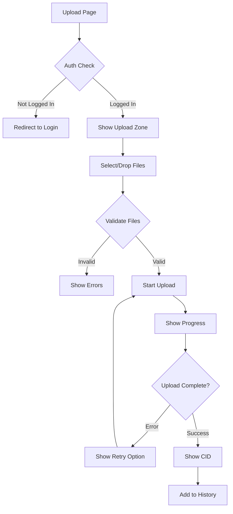

# US-105: File Upload Interface

## Description
As a **user**, I want to upload files through a user-friendly interface, so that I can easily store my content on the IPFS network.

## Priority
🔴 **Critical** - Core functionality.

## Difficulty
⭐⭐⭐ Medium-High

## Acceptance Criteria
- [ ] Drag-and-drop file upload zone
- [ ] Click to browse file selection
- [ ] File type and size validation before upload
- [ ] Upload progress indicator
- [ ] Multiple file upload support
- [ ] Cancel upload functionality
- [ ] Success message with CID and copy button
- [ ] Error handling with retry option
- [ ] File preview for images
- [ ] Upload history on the page
- [ ] Responsive design for mobile uploads

## Upload Constraints
| Constraint | Value |
|------------|-------|
| Max file size | 100 MB |
| Allowed types | All (with optional filtering) |
| Max concurrent | 3 files |

## Technical Notes
- Use react-dropzone for drag-and-drop
- Implement chunked upload for large files (future)
- Show upload speed and ETA
- Handle network interruptions gracefully
- Use FormData for multipart uploads
- Implement retry logic on failure

## Dependencies
- US-101: Frontend Project Setup
- US-104: User Login and Dashboard
- US-005: File Upload to IPFS (Backend)

## Estimated Effort
8 hours

## Completion Status
- [ ] 0% - Not Started

## Workflow Diagram


## Wireframe
```
+--------------------------------------------------+
|  Upload Files                                    |
+--------------------------------------------------+
|                                                  |
|  +--------------------------------------------+  |
|  |                                            |  |
|  |     📁 Drag & Drop files here             |  |
|  |          or click to browse                |  |
|  |                                            |  |
|  |     Max size: 100MB                        |  |
|  |                                            |  |
|  +--------------------------------------------+  |
|                                                  |
|  Uploading:                                      |
|  +--------------------------------------------+  |
|  | document.pdf        ████████░░ 80%    [✕]  |  |
|  | image.png           ██████████ ✓ Done      |  |
|  +--------------------------------------------+  |
|                                                  |
|  Completed:                                      |
|  +--------------------------------------------+  |
|  | image.png                                  |  |
|  | CID: QmXxxxxx...  [📋 Copy] [🔗 View]      |  |
|  +--------------------------------------------+  |
|                                                  |
+--------------------------------------------------+
```

## Related Tasks
- TASK-US-105-01-create-dropzone-component.md
- TASK-US-105-02-implement-file-validation.md
- TASK-US-105-03-create-progress-component.md
- TASK-US-105-04-implement-upload-logic.md
- TASK-US-105-05-create-success-display.md
