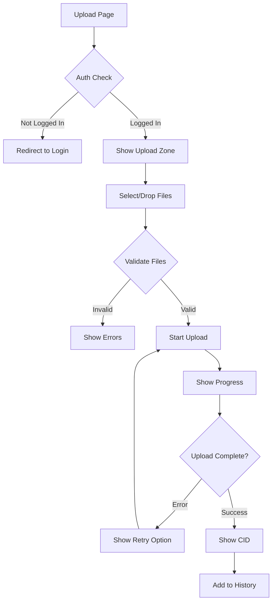

# US-105: File Upload Interface

[Trello Card](https://trello.com/c/iOfiRRgx)


## Description
As a **user**, I want to upload files through a user-friendly interface, so that I can easily store my content on the IPFS network.

## Priority
🔴 **Critical** - Core functionality.

## Difficulty
⭐⭐⭐ Medium-High

## Acceptance Criteria
- [x] Drag-and-drop file upload zone
- [x] Click to browse file selection
- [x] File type and size validation before upload
- [x] Upload progress indicator
- [x] Multiple file upload support
- [x] Cancel upload functionality
- [x] Success message with CID and copy button
- [x] Error handling with retry option
- [x] File preview for images
- [x] Upload history on the page
- [x] Responsive design for mobile uploads

## Upload Constraints
| Constraint | Value |
|------------|-------|
| Max file size | 100 MB |
| Allowed types | **Whitelist only**: Images (`image/jpeg`, `image/png`, `image/webp`, `image/gif` → `.jpg,.jpeg,.png,.webp,.gif`), Documents (`application/pdf`, `text/plain`, `application/json` → `.pdf,.txt,.json`), Video (`video/mp4`, `video/webm` → `.mp4,.webm`) |
| Max concurrent | 3 files |

**Type validation policy:** Frontend file-type filtering is **UX-only** (early feedback). Backend validation is the source of truth and must enforce the exact same MIME/extension whitelist server-side.
**Sync requirement:** Any whitelist change in frontend must be mirrored in backend validation rules in the same change set to prevent drift.

## Technical Notes
- Use react-dropzone for drag-and-drop
- Configure react-dropzone `accept` to the same MIME/extension whitelist above
- Implement chunked upload for large files (future)
- Show upload speed and ETA
- Handle network interruptions gracefully
- Use FormData for multipart uploads
- Implement retry logic on failure

## Dependencies
- US-101: Frontend Project Setup
- US-104: User Login and Dashboard
- US-005: File Upload to IPFS (Backend)

## Estimated Effort
8 hours

## Completion Status
- [x] 100% - Implemented (frontend scope)

## Implementation Notes
- The upload page is protected by the existing secure session flow from US-104 and uses a server-side Next.js proxy (`/api/upload`, `/api/upload/status/[taskId]`) so the API key never leaves the server-held session cookie.
- The UI implements drag-and-drop browsing, per-file progress, retry/cancel controls, image previews, and in-session upload history with CID copy / external view actions.
- Large uploads are normalized through async task polling so both synchronous (`201`) and queued (`202`) backend uploads land in the same queue/history UI.
- The backend MIME whitelist was aligned with the exact US-105 contract to prevent frontend/backend drift.

## Workflow Diagram

```mermaid
flowchart TD
    A[Upload Page] --> B{Auth Check}
    B -->|Not Logged In| C[Redirect to Login]
    B -->|Logged In| D[Show Upload Zone]
    D --> E[Select/Drop Files]
    E --> F{Validate Files}
    F -->|Invalid| G[Show Errors]
    F -->|Valid| H[Start Upload]
    H --> I[Show Progress]
    I --> J{Upload Complete?}
    J -->|Error| K[Show Retry Option]
    K --> H
    J -->|Success| L[Show CID]
    L --> M[Add to History]
```

## Wireframe
```
+--------------------------------------------------+
|  Upload Files                                    |
+--------------------------------------------------+
|                                                  |
|  +--------------------------------------------+  |
|  |                                            |  |
|  |     📁 Drag & Drop files here             |  |
|  |          or click to browse                |  |
|  |                                            |  |
|  |     Max size: 100MB                        |  |
|  |                                            |  |
|  +--------------------------------------------+  |
|                                                  |
|  Uploading:                                      |
|  +--------------------------------------------+  |
|  | document.pdf        ████████░░ 80%    [✕]  |  |
|  | image.png           ██████████ ✓ Done      |  |
|  +--------------------------------------------+  |
|                                                  |
|  Completed:                                      |
|  +--------------------------------------------+  |
|  | image.png                                  |  |
|  | CID: QmXxxxxx...  [📋 Copy] [🔗 View]      |  |
|  +--------------------------------------------+  |
|                                                  |
+--------------------------------------------------+
```

## Related Tasks
- [TASK-US-105-01: Create Dropzone Component](../../tasks/frontend/TASK-US-105-01-create-dropzone-component.md)
- [TASK-US-105-02: Implement File Validation](../../tasks/frontend/TASK-US-105-02-implement-file-validation.md)
- [TASK-US-105-03: Create Upload Progress Component](../../tasks/frontend/TASK-US-105-03-create-progress-component.md)
- [TASK-US-105-04: Implement Upload Logic](../../tasks/frontend/TASK-US-105-04-implement-upload-logic.md)
- [TASK-US-105-05: Create Success Display and Upload History](../../tasks/frontend/TASK-US-105-05-create-success-display.md)
