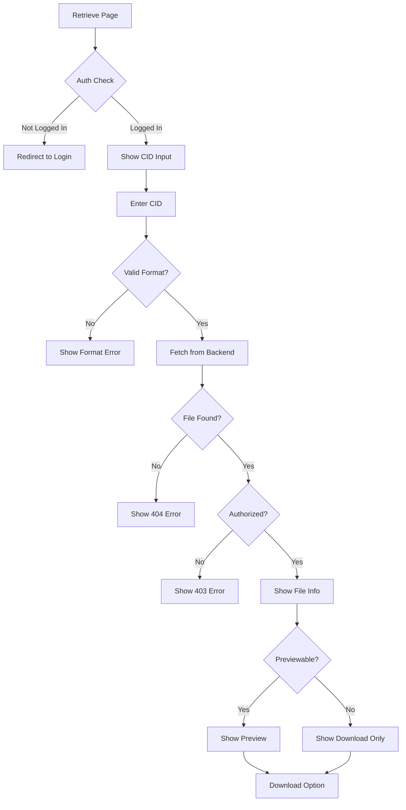

# US-106: File Retrieval Interface

## Description
As a **user**, I want to retrieve files from IPFS using their CID, so that I can access my stored content or content shared with me.

## Priority
🔴 **Critical** - Core functionality.

## Difficulty
⭐⭐ Medium

## Acceptance Criteria
- [ ] Input field for entering CID
- [ ] CID format validation
- [ ] Search/retrieve button with loading state
- [ ] File preview for supported types (images, text, PDF)
- [ ] Download button for file
- [ ] File metadata display (name, size, type, upload date)
- [ ] Error handling for invalid/non-existent CIDs
- [ ] Recent retrievals history
- [ ] Share link generation
- [ ] Responsive design

## Supported Preview Types
| Type | Preview |
|------|---------|
| Images (png, jpg, gif, webp) | Inline image |
| Text (txt, md, json, xml) | Formatted text |
| PDF | Embedded viewer |
| Others | Download only |

## Technical Notes
- Validate CID format (Qm... or bafy...)
- Use streaming for large file downloads
- Implement proper MIME type handling
- Cache retrieved file metadata
- Consider integrating public IPFS gateway fallback

## Dependencies
- US-101: Frontend Project Setup
- US-104: User Login and Dashboard
- US-006: File Retrieval from IPFS (Backend)

## Estimated Effort
6 hours

## Completion Status
- [ ] 0% - Not Started

## Workflow Diagram


## Wireframe
```
+--------------------------------------------------+
|  Retrieve File                                   |
+--------------------------------------------------+
|                                                  |
|  Enter CID:                                      |
|  +----------------------------------------+      |
|  | QmXxxxxxxxxxxxxxxxxxxxxxxxxxxxxxxxxxx  |      |
|  +----------------------------------------+      |
|  [Retrieve]                                      |
|                                                  |
|  +--------------------------------------------+  |
|  |                                            |  |
|  |            📄 File Preview                 |  |
|  |                                            |  |
|  |     [Image/Text/PDF content here]          |  |
|  |                                            |  |
|  +--------------------------------------------+  |
|                                                  |
|  File Information:                               |
|  • Name: document.pdf                            |
|  • Size: 2.5 MB                                  |
|  • Type: application/pdf                         |
|  • Uploaded: 2026-01-29                          |
|                                                  |
|  [📥 Download]  [🔗 Share Link]  [📌 Pin]        |
|                                                  |
|  Recent Retrievals:                              |
|  • QmAbc... - image.png - 2 hours ago           |
|  • QmDef... - data.json - 1 day ago             |
|                                                  |
+--------------------------------------------------+
```

## Related Tasks
- TASK-US-106-01-create-cid-input.md
- TASK-US-106-02-implement-file-preview.md
- TASK-US-106-03-create-download-handler.md
- TASK-US-106-04-create-file-info-display.md
- TASK-US-106-05-implement-retrieval-history.md
