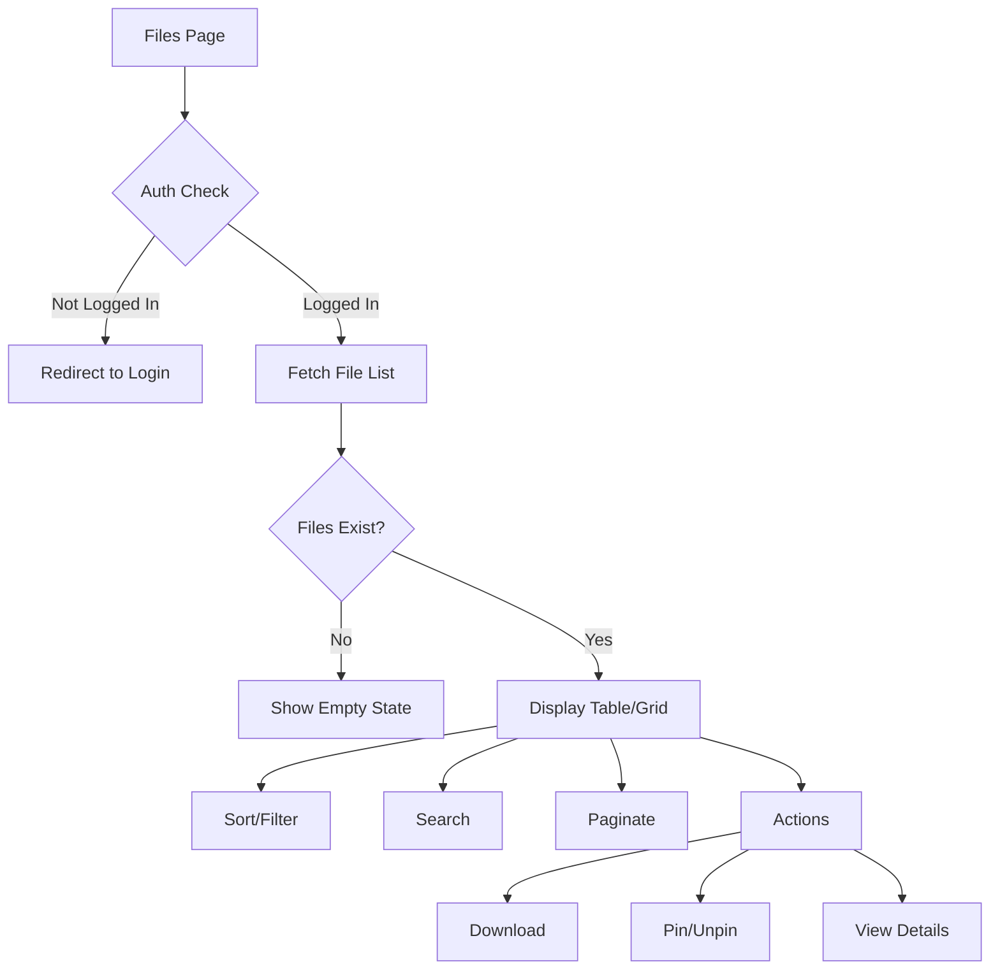

# US-107: Files Management Page

[Trello Card](https://trello.com/c/jcHvRCSm)

[Pull Request](https://github.com/mentally-gamez-soft/ipfs-saas-ai4devs/pull/22)


## Description
As a **user**, I want to view and manage all my uploaded files in one place, so that I can easily organize, pin/unpin, and access my content.

## Priority
🟠 **High** - Important for user experience.

## Difficulty
⭐⭐⭐ Medium-High

## Acceptance Criteria
- [x] List view of all user's uploaded files
- [x] Grid view option with thumbnails
- [x] Sortable columns (name, date, size, status)
- [x] Search and filter functionality
- [x] Pagination for large file lists
- [x] Pin/unpin toggle for each file
- [x] Download action for each file
- [x] Delete action with confirmation
- [x] Bulk actions (pin/unpin multiple)
- [x] File details modal/drawer
- [x] Empty state for new users
- [x] Responsive table/grid

## Table Columns
| Column | Sortable | Description |
|--------|----------|-------------|
| Name | Yes | Original filename |
| CID | No | Truncated with copy |
| Size | Yes | Human-readable size |
| Pinned | Yes | Pin status toggle |
| Uploaded | Yes | Upload date |
| Actions | No | Download, View, Pin |

## Technical Notes
- Implement virtual scrolling for large lists
- Use server-side pagination
- Debounce search input
- Cache file list with SWR/React Query
- Optimistic updates for pin/unpin

## Dependencies
- US-101: Frontend Project Setup
- US-104: User Login and Dashboard
- US-005: File Upload to IPFS (Backend)
- US-008: Content Pinning Management (Backend)

## Estimated Effort
8 hours

## Completion Status
- [x] 100% - Completed

## Workflow Diagram

```mermaid
flowchart TD
    A[Files Page] --> B{Auth Check}
    B -->|Not Logged In| C[Redirect to Login]
    B -->|Logged In| D[Fetch File List]
    D --> E{Files Exist?}
    E -->|No| F[Show Empty State]
    E -->|Yes| G[Display Table/Grid]
    
    G --> H[Sort/Filter]
    G --> I[Search]
    G --> J[Paginate]
    G --> K[Actions]
    
    K --> L[Download]
    K --> M[Pin/Unpin]
    K --> N[View Details]
```

## Wireframe
```
+--------------------------------------------------+
|  My Files                        [List] [Grid]   |
+--------------------------------------------------+
|                                                  |
|  [Search files...]  Filter: [All ▼]  Sort: [Date ▼]
|                                                  |
|  +--------------------------------------------+  |
|  | ☐ | Name          | CID      | Size | 📌 | ⋮|  |
|  +--------------------------------------------+  |
|  | ☐ | document.pdf  | QmXx..📋 | 2 MB | ✓  | ⋮|  |
|  | ☐ | image.png     | QmYy..📋 | 500KB| ✓  | ⋮|  |
|  | ☐ | data.json     | QmZz..📋 | 10KB | ○  | ⋮|  |
|  | ☐ | video.mp4     | QmAa..📋 | 50MB | ✓  | ⋮|  |
|  +--------------------------------------------+  |
|                                                  |
|  [Pin Selected] [Unpin Selected]                 |
|                                                  |
|  Showing 1-10 of 42 files   [< 1 2 3 4 5 >]     |
|                                                  |
+--------------------------------------------------+
```

## Related Tasks
- [TASK-US-107-01-create-file-table.md](../../tasks/frontend/TASK-US-107-01-create-file-table.md)
- [TASK-US-107-02-implement-grid-view.md](../../tasks/frontend/TASK-US-107-02-implement-grid-view.md)
- [TASK-US-107-03-add-sorting-filtering.md](../../tasks/frontend/TASK-US-107-03-add-sorting-filtering.md)
- [TASK-US-107-04-implement-pagination.md](../../tasks/frontend/TASK-US-107-04-implement-pagination.md)
- [TASK-US-107-05-add-bulk-actions.md](../../tasks/frontend/TASK-US-107-05-add-bulk-actions.md)
- [TASK-US-107-06-create-file-details-modal.md](../../tasks/frontend/TASK-US-107-06-create-file-details-modal.md)
- [TASK-US-107-07-delete-files-with-confirmation.md](../../tasks/frontend/TASK-US-107-07-delete-files-with-confirmation.md)
