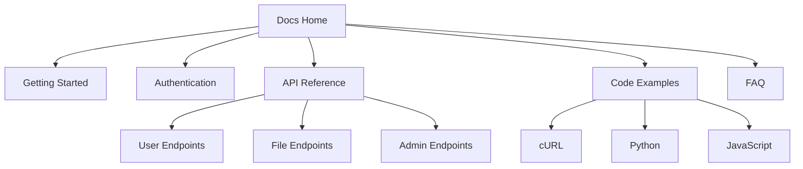

# US-108: Documentation Pages

## Description
As a **user or developer**, I want comprehensive documentation pages, so that I can learn how to use the IPFS gateway effectively and integrate it into my applications.

## Priority
🟡 **Medium** - Important for adoption and support.

## Difficulty
⭐⭐ Medium

## Acceptance Criteria
- [ ] Getting Started guide with step-by-step instructions
- [ ] API Reference with all endpoints documented
- [ ] Code examples in multiple languages (cURL, Python, JavaScript)
- [ ] Authentication guide explaining API key usage
- [ ] Error codes reference
- [ ] FAQ section
- [ ] Search functionality within documentation
- [ ] Table of contents navigation
- [ ] Copy-to-clipboard for code examples
- [ ] Responsive layout for reading
- [ ] Syntax highlighting for code blocks

## Documentation Sections
1. **Getting Started**
   - Quick start guide
   - Registration walkthrough
   - First upload tutorial

2. **Authentication**
   - API key management
   - Request headers
   - Security best practices

3. **API Reference**
   - All endpoints with examples
   - Request/response formats
   - Error handling

4. **Code Examples**
   - cURL examples
   - Python examples
   - JavaScript/Node.js examples
   - SDK usage (future)

5. **FAQ**
   - Common questions
   - Troubleshooting

## Technical Notes
- Use MDX for rich documentation content
- Implement sidebar navigation
- Add copy button to code blocks
- Consider using Nextra or similar docs framework
- Implement search with client-side indexing

## Dependencies
- US-101: Frontend Project Setup
- US-102: Home Page and Navigation

## Estimated Effort
8 hours

## Completion Status
- [ ] 0% - Not Started

## Workflow Diagram


## Wireframe
```
+--------------------------------------------------+
|  Documentation                      [Search 🔍]  |
+--------------------------------------------------+
|          |                                       |
|  📚 Docs |  # Getting Started                    |
|          |                                       |
| Getting  |  Welcome to the IPFS Gateway! This    |
| Started  |  guide will help you get up and       |
|          |  running in minutes.                  |
| Auth     |                                       |
|          |  ## Quick Start                       |
| API Ref  |                                       |
|  └ User  |  1. Register for an account           |
|  └ Files |  2. Get your API key                  |
|  └ Admin |  3. Upload your first file            |
|          |                                       |
| Examples |  ```bash                              |
|  └ cURL  |  curl -X POST \                       |
|  └ Python|    -H "X-API-Key: your_key" \         |
|  └ JS    |    -F "file=@myfile.pdf" \            |
|          |    https://api.ipfs-gw.com/upload     |
| FAQ      |  ```                    [📋 Copy]     |
|          |                                       |
+--------------------------------------------------+
```

## Related Tasks
- TASK-US-108-01-setup-docs-structure.md
- TASK-US-108-02-write-getting-started.md
- TASK-US-108-03-write-api-reference.md
- TASK-US-108-04-create-code-examples.md
- TASK-US-108-05-implement-search.md
