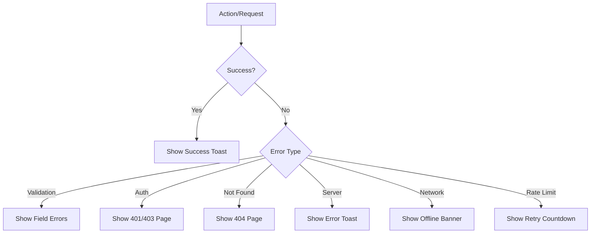

# US-109: Error Handling and Feedback UI

## Description
As a **user**, I want clear and helpful error messages and feedback throughout the application, so that I can understand what went wrong and how to fix it.

## Priority
🟡 **Medium** - Important for user experience.

## Difficulty
⭐⭐ Medium

## Acceptance Criteria
- [ ] Toast notifications for success, error, warning, info
- [ ] Custom 404 Not Found page
- [ ] Custom 500 Server Error page
- [ ] Custom 403 Forbidden page
- [ ] Loading skeletons for data fetching
- [ ] Empty states with helpful guidance
- [ ] Form validation error display
- [ ] Network error handling with retry option
- [ ] Session timeout notification
- [ ] Rate limit exceeded message with countdown
- [ ] Modal confirmations for destructive actions

## Error Pages
| Page | Trigger | Content |
|------|---------|---------|
| 404 | Unknown route | "Page not found" + navigation |
| 403 | Unauthorized access | "Access denied" + login link |
| 500 | Server error | "Something went wrong" + retry |
| Offline | Network loss | "You're offline" + cached data |

## Toast Types
- **Success**: Green, auto-dismiss after 3s
- **Error**: Red, requires manual dismiss
- **Warning**: Yellow, auto-dismiss after 5s
- **Info**: Blue, auto-dismiss after 3s

## Technical Notes
- Use react-hot-toast or similar library
- Implement error boundary for React errors
- Create reusable error components
- Handle API errors consistently
- Log errors for debugging (consider error tracking service)

## Dependencies
- US-101: Frontend Project Setup

## Estimated Effort
5 hours

## Completion Status
- [ ] 0% - Not Started

## Workflow Diagram


## Wireframe - Toast Notifications
```
+--------------------------------------------------+
|                                    +------------+|
|                                    | ✓ Success! ||
|                                    | File up... ||
|                                    +------------+|
|  Main Content                                    |
|                                                  |
+--------------------------------------------------+
```

## Wireframe - 404 Page
```
+--------------------------------------------------+
|                                                  |
|                      🔍                          |
|                                                  |
|              Page Not Found                      |
|                                                  |
|    The page you're looking for doesn't exist    |
|    or has been moved.                           |
|                                                  |
|    [Go Home]  [Go Back]                         |
|                                                  |
+--------------------------------------------------+
```

## Related Tasks
- TASK-US-109-01-setup-toast-system.md
- TASK-US-109-02-create-error-pages.md
- TASK-US-109-03-create-loading-skeletons.md
- TASK-US-109-04-create-empty-states.md
- TASK-US-109-05-implement-error-boundary.md
