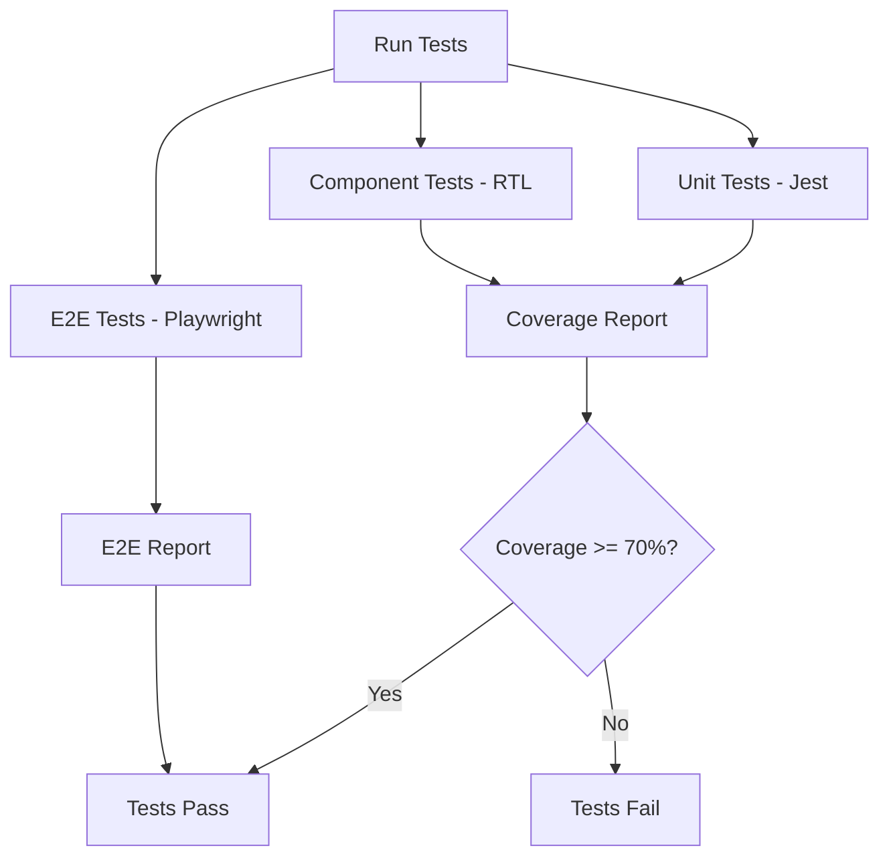

# US-110: Frontend Testing Suite

## Description
As a **developer**, I want a comprehensive testing suite for the frontend, so that code quality is maintained and user experience is consistent.

## Priority
🟠 **High** - Essential for code quality.

## Difficulty
⭐⭐⭐ Medium-High

## Acceptance Criteria
- [ ] Unit tests for utility functions using Jest
- [ ] Component tests using React Testing Library
- [ ] End-to-end tests using Playwright
- [ ] API mocking for isolated testing
- [ ] Test fixtures and factories
- [ ] Visual regression tests (optional)
- [ ] Accessibility tests
- [ ] Test coverage reporting
- [ ] Tests run in CI/CD pipeline
- [ ] Minimum 70% code coverage target

## Test Categories
| Category | Tool | Target |
|----------|------|--------|
| Unit Tests | Jest | 80% |
| Component Tests | RTL | 75% |
| E2E Tests | Playwright | Critical paths |
| A11y Tests | axe-core | All pages |

## Test Structure
```
frontend/tests/
├── unit/
│   ├── utils.test.ts
│   └── hooks.test.ts
├── components/
│   ├── Button.test.tsx
│   ├── FileUpload.test.tsx
│   └── Navigation.test.tsx
├── e2e/
│   ├── auth.spec.ts
│   ├── upload.spec.ts
│   ├── retrieve.spec.ts
│   └── files.spec.ts
├── fixtures/
│   └── mockData.ts
└── setup.ts
```

## E2E Test Scenarios
1. **Authentication Flow**: Register → Login → Dashboard → Logout
2. **Upload Flow**: Login → Upload File → Verify in Files List
3. **Retrieve Flow**: Login → Enter CID → Download File
4. **Pin Management**: Login → Files → Pin/Unpin → Verify Status

## Technical Notes
- Configure Jest with Next.js
- Use MSW (Mock Service Worker) for API mocking
- Configure Playwright for cross-browser testing
- Integrate axe-core for accessibility testing
- Set up visual regression with Percy (optional)

## Dependencies
- US-101: Frontend Project Setup
- All other frontend user stories

## Estimated Effort
10 hours

## Completion Status
- [ ] 0% - Not Started

## Workflow Diagram


## Related Tasks
- TASK-US-110-01-setup-jest-config.md
- TASK-US-110-02-setup-playwright.md
- TASK-US-110-03-create-test-utilities.md
- TASK-US-110-04-write-unit-tests.md
- TASK-US-110-05-write-component-tests.md
- TASK-US-110-06-write-e2e-tests.md
- TASK-US-110-07-setup-coverage.md
