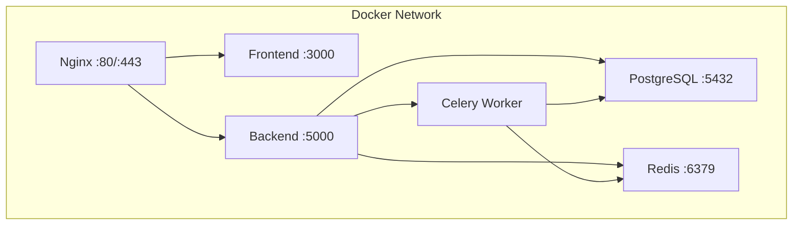
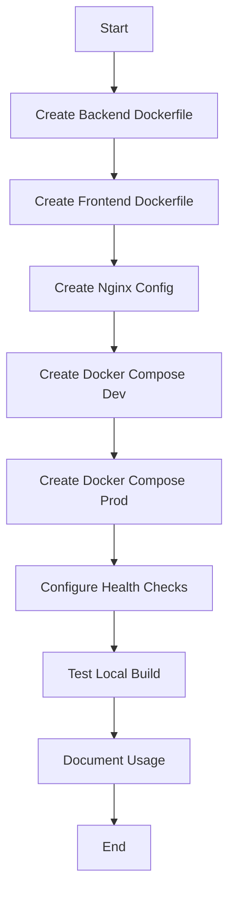

# US-201: Docker Configuration

## Description
As a **DevOps engineer**, I want to containerize the backend and frontend applications using Docker, so that the application can be deployed consistently across different environments.

## Priority
🟠 **High** - Required for deployment.

## Difficulty
⭐⭐⭐ Medium-High

## Acceptance Criteria
- [ ] Dockerfile for backend (Python/Flask) with multi-stage build
- [ ] Dockerfile for frontend (Next.js) with multi-stage build
- [ ] Docker Compose for local development
- [ ] Docker Compose for production deployment
- [ ] PostgreSQL container configuration
- [ ] Redis container configuration
- [ ] Nginx container for reverse proxy
- [ ] Celery worker container
- [ ] Health checks for all services
- [ ] Volume mounts for persistent data
- [ ] Network configuration for inter-service communication
- [ ] Environment variable management
- [ ] Documentation in deployment/README.md

## Container Architecture


## Files to Create
```
deployment/
├── docker/
│   ├── backend/
│   │   └── Dockerfile
│   ├── frontend/
│   │   └── Dockerfile
│   ├── nginx/
│   │   ├── Dockerfile
│   │   └── nginx.conf
│   └── celery/
│       └── Dockerfile
├── docker-compose.yml
├── docker-compose.dev.yml
├── docker-compose.prod.yml
├── .env.example
└── README.md
```

## Technical Notes
- Use Python 3.11-slim as base for backend
- Use Node 20-alpine as base for frontend
- Implement multi-stage builds to reduce image size
- Use non-root users in containers
- Configure proper logging drivers
- Set resource limits in compose files

## Dependencies
- US-001: Backend Project Setup
- US-101: Frontend Project Setup

## Estimated Effort
10 hours

## Completion Status
- [ ] 0% - Not Started

## Workflow Diagram


## Related Tasks
- TASK-US-201-01-create-backend-dockerfile.md
- TASK-US-201-02-create-frontend-dockerfile.md
- TASK-US-201-03-create-nginx-config.md
- TASK-US-201-04-create-compose-dev.md
- TASK-US-201-05-create-compose-prod.md
- TASK-US-201-06-create-deployment-scripts.md
