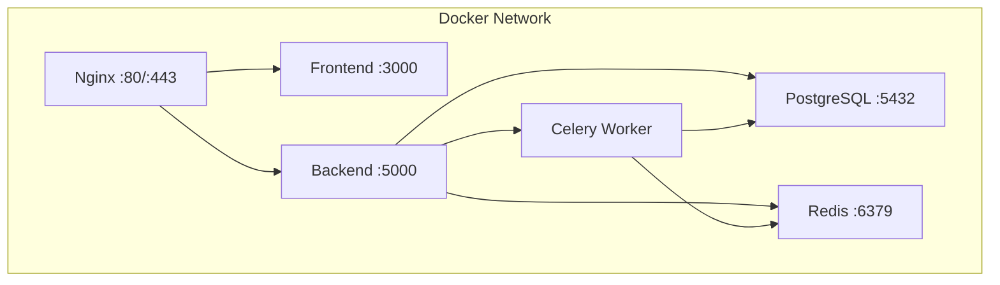
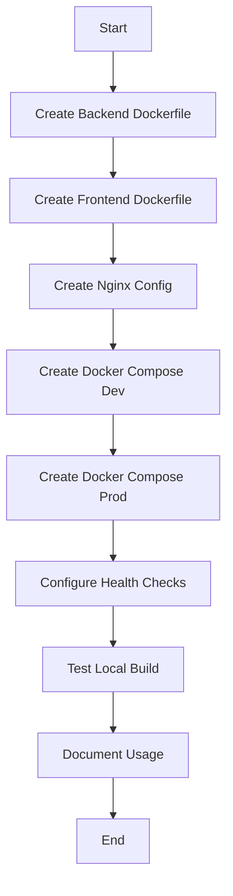

# US-201: Docker Configuration

[Trello Card](https://trello.com/c/nBZgdrNU)

[Pull Request](https://github.com/mentally-gamez-soft/ipfs-saas-ai4devs/pull/29)


## Description
As a **DevOps engineer**, I want to containerize the backend and frontend applications using Docker, so that the application can be deployed consistently across different environments.

## Priority
🟠 **High** - Required for deployment.

## Difficulty
⭐⭐⭐ Medium-High

## Acceptance Criteria
- [x] Dockerfile for backend (Python/Flask) with multi-stage build
- [x] Dockerfile for frontend (Next.js) with multi-stage build
- [x] Docker Compose for local development
- [x] Docker Compose for production deployment
- [x] PostgreSQL container configuration
- [x] Redis container configuration
- [x] Nginx container for reverse proxy
- [x] Celery worker container
- [x] Health checks for all services
- [x] Volume mounts for persistent data
- [x] Network configuration for inter-service communication
- [x] Environment variable management
- [x] Documentation in deployment/README.md

## Container Architecture

```mermaid
graph TB
    subgraph Docker Network
        A[Nginx :80/:443] --> B[Frontend :3000]
        A --> C[Backend :5000]
        C --> D[PostgreSQL :5432]
        C --> E[Redis :6379]
        C --> F[Celery Worker]
        F --> E
        F --> D
    end
```

## Files to Create
```
deployment/
├── docker/
│   ├── backend/
│   │   └── Dockerfile
│   ├── frontend/
│   │   └── Dockerfile
│   ├── nginx/
│   │   ├── Dockerfile
│   │   └── nginx.conf
│   └── celery/
│       └── Dockerfile
├── docker-compose.yml
├── docker-compose.dev.yml
├── docker-compose.prod.yml
├── .env.example
└── README.md
```

## Technical Notes
- Use Python 3.11-slim as base for backend
- Use Node 20-alpine as base for frontend
- Implement multi-stage builds to reduce image size
- Use non-root users in containers
- Configure proper logging drivers
- Set resource limits in compose files

## Dependencies
- US-001: Backend Project Setup
- US-101: Frontend Project Setup

## Estimated Effort
10 hours

## Completion Status
- [ ] 90% - Implemented; pending end-to-end runtime validation after Docker Hub pull timeout issue

## Workflow Diagram

```mermaid
flowchart TD
    A[Start] --> B[Create Backend Dockerfile]
    B --> C[Create Frontend Dockerfile]
    C --> D[Create Nginx Config]
    D --> E[Create Docker Compose Dev]
    E --> F[Create Docker Compose Prod]
    F --> G[Configure Health Checks]
    G --> H[Test Local Build]
    H --> I[Document Usage]
    I --> J[End]
```

## Related Tasks
- [TASK-US-201-01: Create Backend Dockerfile](../../tasks/infrastructure/TASK-US-201-01-create-backend-dockerfile.md)
- [TASK-US-201-02: Create Frontend Dockerfile](../../tasks/infrastructure/TASK-US-201-02-create-frontend-dockerfile.md)
- [TASK-US-201-03: Create Nginx Config](../../tasks/infrastructure/TASK-US-201-03-create-nginx-config.md)
- [TASK-US-201-04: Create Compose Dev](../../tasks/infrastructure/TASK-US-201-04-create-compose-dev.md)
- [TASK-US-201-05: Create Compose Prod](../../tasks/infrastructure/TASK-US-201-05-create-compose-prod.md)
- [TASK-US-201-06: Create Deployment Scripts](../../tasks/infrastructure/TASK-US-201-06-create-deployment-scripts.md)
