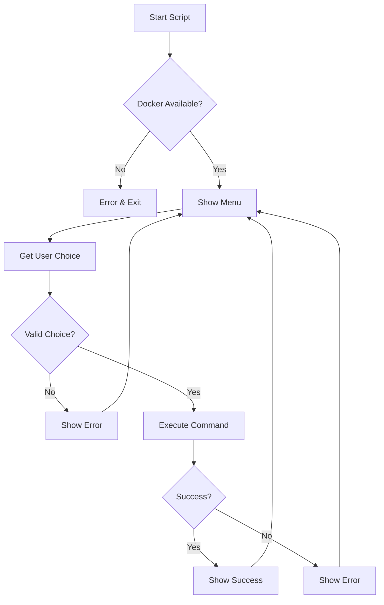

# US-202: Deployment Scripts

## Description
As a **DevOps engineer**, I want CLI scripts (Bash and PowerShell) for managing Docker deployments, so that deployments can be automated and consistent across different platforms.

## Priority
🟡 **Medium** - Important for operations.

## Difficulty
⭐⭐⭐ Medium-High

## Acceptance Criteria
- [ ] Bash script (`deploy.sh`) for Linux/macOS
- [ ] PowerShell script (`deploy.ps1`) for Windows
- [ ] Interactive menu with numbered options
- [ ] Environment selection (development, staging, production)
- [ ] List existing Docker images
- [ ] Build images with version tagging
- [ ] Rename/retag images
- [ ] Push images to Docker registry
- [ ] Deploy using docker-compose
- [ ] Run individual containers in detached mode
- [ ] View container logs
- [ ] Stop/restart services
- [ ] Input validation and error handling
- [ ] Colored output for better UX

## Menu Options
```
===========================================
  IPFS Gateway Deployment CLI
===========================================

Current Environment: development

1. Select Environment
2. List Images
3. Build Images
4. Tag/Rename Image
5. Push to Registry
6. Deploy Application
7. Run Single Container
8. View Logs
9. Stop Services
10. Restart Services
0. Exit

Enter choice:
```

## Technical Notes
- Use consistent exit codes
- Implement logging to deployment/logs/
- Support dry-run mode
- Handle interrupts gracefully (Ctrl+C)
- Validate Docker/docker-compose availability
- Support custom registry configuration

## Dependencies
- US-201: Docker Configuration

## Estimated Effort
8 hours

## Completion Status
- [ ] 0% - Not Started

## Workflow Diagram


## Related Tasks
- TASK-US-202-01-create-bash-script.md
- TASK-US-202-02-create-powershell-script.md
- TASK-US-202-03-implement-build-commands.md
- TASK-US-202-04-implement-deploy-commands.md
- TASK-US-202-05-add-logging.md
