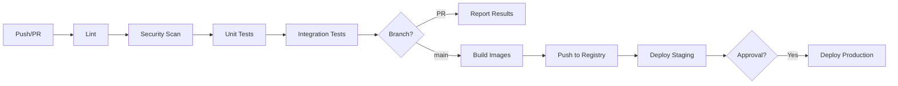

# US-203: CI/CD Pipeline

## Description
As a **DevOps engineer**, I want to set up a CI/CD pipeline using GitHub Actions, so that code is automatically tested and deployed upon merging to main branches.

## Priority
🟠 **High** - Essential for development workflow.

## Difficulty
⭐⭐⭐ Medium-High

## Acceptance Criteria
- [ ] GitHub Actions workflow for backend tests
- [ ] GitHub Actions workflow for frontend tests
- [ ] Lint and security checks on pull requests
- [ ] Test coverage reporting
- [ ] Docker image building on main branch
- [ ] Automatic deployment to staging on merge
- [ ] Manual approval for production deployment
- [ ] Secrets management for credentials
- [ ] Caching for faster builds
- [ ] Status badges in README
- [ ] Slack/Discord notifications (optional)

## Workflow Files
```
.github/
└── workflows/
    ├── backend-ci.yml
    ├── frontend-ci.yml
    ├── docker-build.yml
    ├── deploy-staging.yml
    └── deploy-production.yml
```

## Pipeline Stages


## Technical Notes
- Use matrix strategy for multiple Python/Node versions
- Cache pip/npm dependencies
- Use Docker layer caching
- Store test results as artifacts
- Use environment secrets for sensitive data
- Implement concurrency control

## Dependencies
- US-001: Backend Project Setup
- US-101: Frontend Project Setup
- US-201: Docker Configuration

## Estimated Effort
8 hours

## Completion Status
- [ ] 0% - Not Started

## Workflow Diagram

```mermaid
flowchart TD
    subgraph PR Workflow
        A[Open PR] --> B[Run Linters]
        B --> C[Run Tests]
        C --> D[Post Results]
    end
    
    subgraph Main Workflow
        E[Merge to Main] --> F[Run All Tests]
        F --> G[Build Docker Images]
        G --> H[Push to Registry]
        H --> I[Deploy to Staging]
    end
    
    subgraph Production
        J[Manual Trigger] --> K[Approval Required]
        K --> L[Deploy to Production]
    end
```


## Related Tasks
- TASK-US-203-01-create-backend-ci.md
- TASK-US-203-02-create-frontend-ci.md
- TASK-US-203-03-create-docker-build.md
- TASK-US-203-04-create-deploy-staging.md
- TASK-US-203-05-create-deploy-production.md
- TASK-US-203-06-configure-secrets.md
