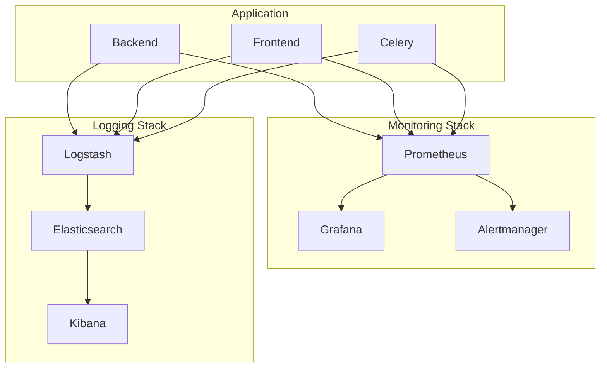
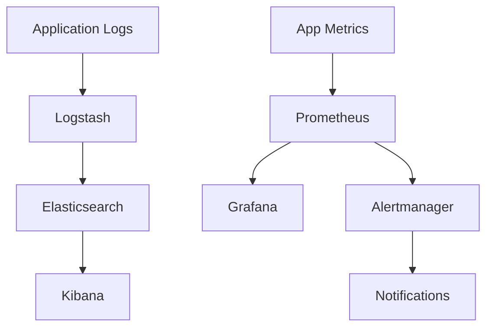

# US-204: Monitoring and Logging

## Description
As a **system administrator**, I want monitoring and logging tools configured, so that I can track application performance and troubleshoot issues effectively.

## Priority
🟡 **Medium** - Important for production operations.

## Difficulty
⭐⭐⭐⭐ High

## Acceptance Criteria
- [ ] Prometheus configured for metrics collection
- [ ] Grafana dashboards for visualization
- [ ] ELK Stack (Elasticsearch, Logstash, Kibana) for centralized logging
- [ ] Application metrics exposed (request count, latency, errors)
- [ ] System metrics collected (CPU, memory, disk)
- [ ] Database metrics collected
- [ ] Redis metrics collected
- [ ] Alert rules for critical conditions
- [ ] Log aggregation from all containers
- [ ] Docker Compose integration for monitoring stack
- [ ] Documentation for accessing dashboards

## Monitoring Architecture

## Key Metrics
| Metric | Type | Description |
|--------|------|-------------|
| http_requests_total | Counter | Total HTTP requests |
| http_request_duration | Histogram | Request latency |
| upload_size_bytes | Histogram | Upload file sizes |
| active_users | Gauge | Current active users |
| celery_tasks_total | Counter | Celery task count |
| error_rate | Gauge | Error percentage |

## Technical Notes
- Use prometheus-flask-exporter for Flask metrics
- Configure Prometheus scrape intervals
- Create Grafana dashboards as code (JSON)
- Set up Logstash pipelines for log parsing
- Implement log rotation policies
- Configure alerting thresholds

## Dependencies
- US-201: Docker Configuration

## Estimated Effort
12 hours

## Completion Status
- [ ] 0% - Not Started

## Workflow Diagram

## Related Tasks
- TASK-US-204-01-configure-prometheus.md
- TASK-US-204-02-create-grafana-dashboards.md
- TASK-US-204-03-setup-elk-stack.md
- TASK-US-204-04-expose-app-metrics.md
- TASK-US-204-05-configure-alerts.md
- TASK-US-204-06-create-compose-monitoring.md
