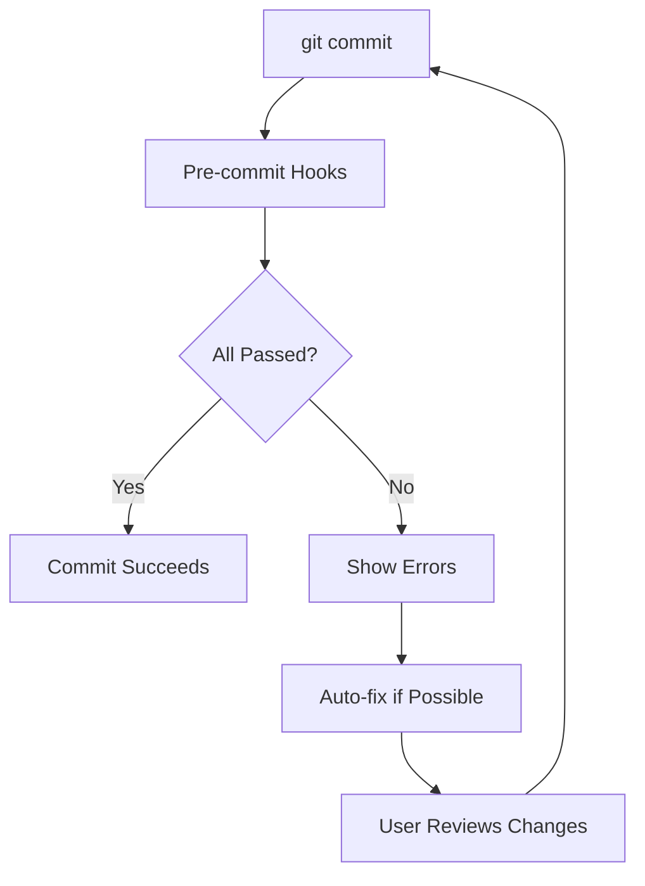

# US-205: Pre-commit Hooks Configuration

## Description
As a **developer**, I want pre-commit hooks configured for code quality enforcement, so that code standards are maintained automatically before commits.

## Priority
🟠 **High** - Important for code quality.

## Difficulty
⭐⭐ Medium

## Acceptance Criteria
- [ ] `.pre-commit-config.yaml` created at project root
- [ ] Python linting with flake8
- [ ] Python formatting with black
- [ ] Import sorting with isort
- [ ] Type checking with mypy
- [ ] Security scanning with bandit
- [ ] YAML/JSON validation
- [ ] Trailing whitespace removal
- [ ] End of file fixer
- [ ] Large file prevention
- [ ] Secrets detection
- [ ] Frontend ESLint integration
- [ ] Frontend Prettier integration
- [ ] Documentation in README

## Pre-commit Hooks
| Hook | Purpose | Language |
|------|---------|----------|
| black | Code formatting | Python |
| isort | Import sorting | Python |
| flake8 | Linting | Python |
| mypy | Type checking | Python |
| bandit | Security | Python |
| eslint | Linting | JavaScript |
| prettier | Formatting | JavaScript |
| detect-secrets | Security | All |
| trailing-whitespace | Cleanup | All |
| check-yaml | Validation | YAML |
| check-json | Validation | JSON |

## Technical Notes
- Install pre-commit with pip/uv
- Run `pre-commit install` after clone
- Consider pre-commit CI for GitHub
- Configure local-only hooks for sensitive checks
- Document how to skip hooks when necessary

## Dependencies
- US-001: Backend Project Setup
- US-101: Frontend Project Setup

## Estimated Effort
4 hours

## Completion Status
- [ ] 0% - Not Started

## Workflow Diagram

## Related Tasks
- TASK-US-205-01-create-precommit-config.md
- TASK-US-205-02-configure-python-hooks.md
- TASK-US-205-03-configure-js-hooks.md
- TASK-US-205-04-add-security-hooks.md
- TASK-US-205-05-document-usage.md
